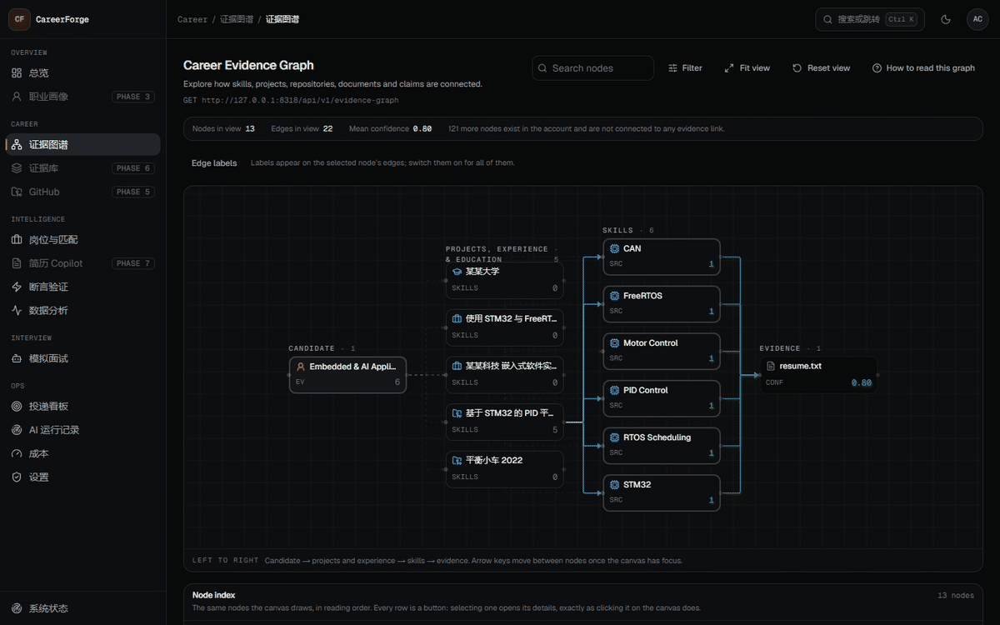

# CareerForge AI

> **Most resumes describe what you claim to know. CareerForge shows the evidence.**
> Your resume, projects and repositories become an **evidence graph**; job matching, claim
> validation and interviews are built on it.

<p align="center">
  <b>把经历变成证据，把证据变成竞争力。</b>
</p>

<!-- Badges: the CI/coverage badges activate in PHASE 15 with the remote repository; the phase
     badge below is updated by hand and must match docs/ROADMAP.md. -->


**[→ Three-minute demo script](./docs/DEMO.md)** · **[→ Quality & evaluation](./docs/QUALITY.md)** ·
**[→ The numbers](./reports/README.md)** · **[→ Why it is built this way](./docs/ARCHITECTURE.md)**



_Clicking a skill focuses its node and opens the evidence behind it — the chain from a résumé claim to the file that proves it. ([1440px still](./docs/assets/screenshots/evidence-graph-1440.png).)_

_The Evidence Graph: a claim is not a string in a database — it is connected to the project that
used it, the repository that contains it, and the files that prove it, each with a confidence
computed from five weighted factors. (Screenshot from the running app, demo account.)_

---

## Why CareerForge

Every AI résumé tool can rewrite a bullet. The hard part is knowing whether the rewritten bullet is
**true** — and a language model asked "is this supported?" will reason its way to "plausibly yes".

So this project inverts the usual order. Nothing is generated until the candidate's own material has
been assembled into an evidence graph, and every generated sentence is gated:

```
Claim  →  deterministic rules  →  hybrid retrieval over your evidence  →  model verdict  →  arithmetic
         (free, catches the         (BM25 + pgvector, RRF fusion)          (may only judge     (confidence
          fabricated number)                                                support)            + status)
```

The model never produces a number, never sets a confidence, and never decides alone. The result is a
system that can say **"we could not confirm this"** — and that is measured: the evaluation reports an
**unsafe support rate** (unsupported claims wrongly accepted) of **0.0500**, down from 0.10 before the
evaluation found two real defects in the decision policy.

> 🚧 **Project status: actively under development (PHASE 13 / 15 complete).**
> The AI core, the API and the product surfaces are built and tested: 1,025 automated tests, four
> evaluation suites (242 cases), confidence calibration, 11 browser end-to-end flows and 91.9%
> core-domain coverage. Every number in this README comes from a real build/test/eval artifact —
> never from an estimate.
> See [ROADMAP.md](./docs/ROADMAP.md) for the live phase tracker.

---

## The problem

Large language models made **writing a beautiful resume free**. That destroyed the value of writing well and created a new scarcity: **being able to prove it**.

Most AI resume tools happily generate:

> "Proficient in Redis"
> "Improved system performance by 50%"
> "Designed high-concurrency architecture"

…for candidates who never did any of it. In an interview, that is not an asset — it is a liability.

## The idea

CareerForge AI is not another resume generator. It is a **career operating system built on an evidence graph**:

```
Candidate → Experience → Project → Skill → Evidence
```

Every claim that lands on your resume must be traceable to something real — a file, a commit, a README, a document, an internship record. If it cannot be traced, the system **refuses to write it**.

> Most resumes describe what you **claim** to know.
> CareerForge shows the **evidence**.

---

## Core capabilities

| #   | Capability                                 | What it actually does                                                                                                                                                                     |
| --- | ------------------------------------------ | ----------------------------------------------------------------------------------------------------------------------------------------------------------------------------------------- |
| 01  | **Career Evidence Graph**                  | Interactive heterogeneous graph linking claims → skills → projects → repositories → files → commits, with a **deterministic confidence score** per evidence node                          |
| 02  | **JD Intelligence**                        | Structured JD parsing into a required / preferred / bonus skill tree, with the original JD sentence attached to every extracted skill                                                     |
| 03  | **Explainable Job Match**                  | 5-dimension weighted score (Skill 40 / Experience 25 / Project 20 / Education 5 / Evidence 10) with a `Why 86?` breakdown of formulas and contributing evidence — reproducible, not vibes |
| 04  | **AI Resume Copilot + Hallucination Gate** | Bullet-level resume diff where **every generated sentence passes a claim validator**; unsupported claims are rejected, weak ones get a safer rewrite                                      |
| 05  | **Adaptive Interview Simulator**           | Six interview modes; questions generated from _your_ JD, resume and evidence graph; difficulty escalates L1 concept → L2 engineering → L3 debugging                                       |
| 06  | **Career Analytics & Pipeline**            | Application kanban, funnel/response/offer rates, and skill ↔ interview-success correlation with honest sample-size labelling                                                              |
| 07  | **Recruiter View**                         | A public, login-free candidate page where a recruiter can click any skill and see the underlying evidence — an interactive resume instead of a PDF                                        |
| 08  | **AI Observability**                       | Every agent run, token, latency, cost and prompt version recorded; three-level caching with visible hit rates and budget guardrails                                                       |

### What makes it different

|                                           | Typical AI resume tool | Generic LLM chat | **CareerForge AI**                      |
| ----------------------------------------- | ---------------------- | ---------------- | --------------------------------------- |
| Generated content is traceable to sources | ❌                     | ❌               | ✅ **claim → evidence provenance**      |
| Defends against fabricated claims         | ❌                     | ❌               | ✅ **validator + confidence gate**      |
| Match score is explainable                | ❌ single %            | ⚠️ prose         | ✅ **5-dim weighted + `Why?`**          |
| Reads real code evidence                  | ❌                     | ⚠️ manual paste  | ✅ **file- and commit-level**           |
| Interview prep uses your own data         | ❌ generic bank        | ⚠️ stateless     | ✅ **JD + evidence graph driven**       |
| Works with **zero** API keys              | ❌                     | ❌               | ✅ **deterministic heuristic provider** |

---

## Architecture

```
Frontend            Next.js 15 · App Router · TypeScript strict · Tailwind v4 · React Flow · Recharts
    │  REST + SSE
API                 FastAPI · Pydantic v2 · SQLAlchemy 2.0 async · Alembic
    │
AI Core             Agent Orchestrator · 9 Agents · Hybrid RAG · Evidence Graph Engine · Scoring Engine
    │               (zero web-framework dependencies — independently testable & evaluable)
Ports               LLMProvider · VectorStore · Queue · GitHub · Storage
    │
Infrastructure      PostgreSQL + pgvector · Redis · Worker · Object storage
```

| Component  | Choice                                         | Why                                                                                   |
| ---------- | ---------------------------------------------- | ------------------------------------------------------------------------------------- |
| Frontend   | Next.js 15 + RSC                               | SSR performance, no theme flash, data-dense dashboards                                |
| Backend    | FastAPI + Pydantic v2                          | One schema definition constrains both the HTTP contract **and** LLM structured output |
| Database   | PostgreSQL 16 + pgvector                       | Relational + vector + full-text in a single transaction                               |
| Retrieval  | Hybrid (dense + FTS) with **RRF**              | Technical nouns (`STM32F407`, `heap_4`) need lexical recall; intent needs semantics   |
| Agents     | **Custom orchestrator**                        | Explicit, testable, observable DAG — no framework magic                               |
| Scoring    | **Deterministic**                              | Reproducible, explainable, regression-testable; LLM never produces numbers            |
| Local mode | SQLite + in-process queue + heuristic provider | The whole product runs and demos with **no Docker, no Redis, no API key**             |

Full design: [`docs/ARCHITECTURE.md`](./docs/ARCHITECTURE.md) · Decisions: [`docs/DECISIONS.md`](./docs/DECISIONS.md)

---

## Documentation

| Document                                  | Contents                                                             |
| ----------------------------------------- | -------------------------------------------------------------------- |
| [PRD.md](./docs/PRD.md)                   | Product definition, personas, requirements, non-goals, risks         |
| [ARCHITECTURE.md](./docs/ARCHITECTURE.md) | System design, agent orchestration, RAG pipeline, security           |
| [DATABASE.md](./docs/DATABASE.md)         | 32-table schema, indexes, pgvector config, local parity layer        |
| [API.md](./docs/API.md)                   | REST surface, error codes, SSE contracts, rate limits                |
| [UI.md](./docs/UI.md)                     | Design system, tokens, sitemap, page specs, a11y, responsiveness     |
| [ROADMAP.md](./docs/ROADMAP.md)           | 16 phases with exit criteria and progress tracker                    |
| [DECISIONS.md](./docs/DECISIONS.md)       | 22 ADRs with rejected alternatives                                   |
| INTERVIEW.md                              | How to present this project (60s / 3min / 5min deep dive) — PHASE 14 |

---

## The evidence-confidence formula

Confidence is not an LLM opinion — it is a weighted, auditable formula:

```
confidence = 0.30 · source_authority     # commit/file 1.00 · README 0.85 · doc 0.80 · self-report 0.55
           + 0.15 · recency              # exp(-age_days / 540)
           + 0.20 · specificity          # line-level 1.00 · repo-level 0.75 · prose 0.45
           + 0.20 · corroboration        # min(1, 0.4 + 0.2 × independent_sources)
           + 0.15 · extraction_quality   # deterministic parser 1.00 · LLM 0.70 · heuristic 0.50
```

This formula is enforced **at the database level**:

```sql
CONSTRAINT ck_evidence_confidence_formula CHECK (
  abs(confidence - (0.30*source_authority + 0.15*recency_score + 0.20*specificity
                  + 0.20*least(1.0, 0.4 + 0.2*corroboration_count)
                  + 0.15*extraction_quality)) < 0.002
)
```

A claim is only allowed onto a resume when `confidence ≥ 0.75` **and** it is backed by ≥ 2 independent sources. Quantified claims (`"improved performance by 70%"`) with no quantitative evidence are rejected **by deterministic rules before the LLM is ever consulted**.

---

## Repository layout

```
careerforge-ai/
├── apps/
│   ├── web/                 # Next.js 15 frontend
│   └── api/                 # FastAPI backend
├── packages/
│   ├── ai/                  # careerforge_ai — agents, RAG, graph, scoring (framework-free)
│   ├── shared/              # shared TS types + generated API client
│   ├── ui/                  # shared UI primitives
│   └── config/              # eslint / tsconfig / tailwind presets
├── prompts/                 # versioned prompt registry (markdown + front-matter)
├── evals/                   # evaluation framework + labeled datasets
├── tests/                   # integration, e2e, fixtures
├── infra/                   # Dockerfiles, DB init, deployment
├── docs/                    # design documents + screenshots/GIFs
├── scripts/                 # seed, bench, dev helpers
└── docker-compose.yml
```

---

## Quick start

> ⚠️ Available from PHASE 1. Two supported paths:

**With Docker (full stack)**

```bash
git clone <repo> && cd careerforge-ai
cp .env.example .env
docker compose up --build
# web → http://localhost:3000 · api → http://localhost:8000/docs
```

**Without Docker (SQLite + in-process queue + heuristic provider — no API key needed)**

```bash
pnpm install
pnpm --filter api dev            # FastAPI on :8000
pnpm --filter web dev            # Next.js on :3000
```

**Demo account**

```
email:    demo@careerforge.ai
password: (demo login button — no password required)
```

The demo account exists so the login flow is one click. On a **fresh database it is empty**:
the seed creates the account, the prompt registry mirror and the skill taxonomy, and nothing
else. The rich dataset (projects, evidence, jobs, applications, interviews) is a separate,
self-consistent seed script that asserts its own consistency — each `resume_claim`'s evidence
must really exist, and each `evidence.confidence` must satisfy the database's CHECK formula —
and it lands with the phase that completes the surfaces it fills. Until then every page has an
honest empty state rather than placeholder rows.

---

## Testing & evaluation

```bash
pytest packages/ai/tests apps/api/tests evals/tests -q   # 871 Python tests
pnpm --filter @careerforge/web test                      # 143 component & guard tests
pnpm --filter @careerforge/web test:e2e                  # 11 Playwright flows (installed Chrome)
python evals/run.py                                      # 4 labelled suites → reports/
python scripts/coverage_report.py                        # core-domain coverage
python evals/compare.py reports/baseline-eval-report.json reports/eval-report.json
pnpm typecheck && pnpm lint                              # TypeScript strict + ESLint
python scripts/check_layering.py                         # architecture guard
python scripts/check_file_length.py                      # the 500-line rule
python scripts/check_design_tokens.py                    # no raw colours in components
```

**1,025 tests, and none of them need an API key** — the default provider is a deterministic rule
engine, so CI, every suite and every end-to-end flow run for free.

### Quality & Evaluation

Traditional AI apps stop at "it seems to work". CareerForge evaluates retrieval quality, evidence
grounding, confidence calibration, interview relevance, and the deterministic application flows —
and publishes the numbers with the gaps still visible.

|                                          | measured (commit `c147180`, zero-key provider)                                                        |
| ---------------------------------------- | ----------------------------------------------------------------------------------------------------- |
| API / AI core / web / E2E / metric tests | 348 · 504 · 143 · 11 · 19                                                                             |
| JD extraction                            | required-skill **F1 0.883** · quoted-evidence grounding **1.000** · distractor leakage **0.000**      |
| Evidence validation                      | accuracy **0.883** · macro F1 **0.831** · unsupported recall **0.903**                                |
| **Unsafe support rate**                  | **0.050** — the share of unsupported claims wrongly accepted · fabricated-number acceptance **0.000** |
| RAG retrieval                            | **Hit@1 0.848 · Hit@3 0.966 · Hit@5 0.966 · MRR 0.901** (59 queries, 3 arms)                          |
| Interview relevance                      | required-skill coverage **0.833** · duplicate questions **0.000** · cross-role leakage **0.000**      |
| Confidence calibration                   | **ECE 0.017** · Brier **0.103** (0.8–0.9 bucket calibrated to ±0.001)                                 |
| Coverage                                 | core domain **91.9%** of 1,649 statements                                                             |

**Why `unsafe_support_rate` gets its own row.** For a résumé system the two error directions are
not symmetric: refusing to confirm an honest bullet costs the candidate a review, while accepting
an invented achievement writes fiction onto their CV in their own voice. So the report carries a
full confusion matrix, and the fabricated-measurement rate is gated at exactly zero.

**Measuring it changed the product.** The first run of the hand-authored claim corpus reported
`support_recall 0.0000`; the investigation found the evaluation was driving a caller contract the
product never uses, and — after fixing that — that the gate was accepting **10%** of unsupported
claims. Two real defects came out of it (scope-inflated claims were granted _supported_; a
model-reported blocker was softened by the mere presence of retrieval hits) and both are fixed:
unsupported recall went 0.350 → 0.903 and unsafe support 0.100 → 0.050. The same suite drove the
interview planner's skill coverage from 0.333 to 0.833. The story is written up in
[`docs/QUALITY.md`](docs/QUALITY.md) §5.

Numbers live in [`reports/README.md`](reports/README.md) and are regenerated by the commands above;
the datasets are versioned (`fixture_version`) so a benchmark change is traceable to the cases that
caused it, and a committed baseline makes regressions diffable rather than arguable.

### Known weaknesses, measured rather than omitted

| Weakness                          | Value          | Cause                                                                                                                                               |
| --------------------------------- | -------------- | --------------------------------------------------------------------------------------------------------------------------------------------------- |
| Unsafe support rate               | 0.050          | Two scope-inflation cases (`吞吐提升明显`, `整机调试`) with no keyword to hang a rule on; fixing them needs entailment on the action, not the nouns |
| Required-skill precision          | 0.791          | Residual over-extraction when a technology appears outside any recognised section                                                                   |
| Bonus-skill F1                    | 0.776          | Bonus skills are sparse and their phrasing is the most varied of the three levels                                                                   |
| Hybrid vs keyword retrieval       | 0.966 vs 0.983 | Equal RRF weights lose one query the lexical arm finds; tuning on 59 queries would be overfitting                                                   |
| Safer-rewrite rate                | 0.375          | A rewrite is only offered when a clause can be dropped without leaving an unsupported noun behind                                                   |
| Interview coverage                | 0.833          | Two required skills in the fixtures still have no topic mapping                                                                                     |
| Top-bucket calibration            | +0.063         | Above 0.9 the gate is over-confident by six points (7 cases wrong at ≥ 0.75)                                                                        |
| Run tokens on the structured path | 0              | The core returns the parsed schema and drops the usage envelope, so a paid deployment would not see real spend                                      |

The measurement loop is the point. Earlier runs of these suites reported **100% distractor
leakage**, a **13.3% false-support rate** and a **0.675 Recall@5**; each was investigated, and two
were found to be bugs in the code rather than in the corpus (the third was a bug in my dataset —
the query `vTaskDelayUntil` did not appear anywhere in it).

### Not yet measured

A real-provider evaluation (`python evals/run.py --provider deepseek`) needs a key and is therefore
manual: calibration currently describes the zero-key path. PostgreSQL-specific behaviour is covered
by the CI matrix but not locally. There is no load test — the API's limits are reasoned from the
rate-limit middleware, not measured.

---

## Security & privacy

- **Prompt injection:** untrusted documents are wrapped as declared _data_, never spliced into instruction positions; all LLM output is schema-validated
- **File uploads:** MIME + magic-number validation, size caps, parser timeouts, sandboxed execution
- **Auth:** JWT with resource-level authorization; cross-tenant access returns `404`, not `403`
- **Secrets:** environment-only, validated at startup, redacted in logs
- **Privacy-first:** Local Mode keeps raw resume text off the server; public profiles are opt-in per section; PII scanning before any export or publish; full data export and hard delete
- **Rate limiting:** per-IP and per-user token buckets, stricter on AI endpoints

Details: [ARCHITECTURE.md § Security](./docs/ARCHITECTURE.md#10-安全架构)

---

## Limitations (honest list)

CareerForge AI is a portfolio-grade system, not a production SaaS. Known boundaries:

- Single-tenant auth is intentionally minimal (no email verification, no SSO, no org accounts)
- The local SQLite vector path performs exact search — fine below ~50k vectors, not a distributed index
- Confidence weights are hand-tuned from design reasoning, not fitted on a large labeled corpus
- `GitHub App` / browser extension / VS Code extension are **not** implemented (listed as P2 in the PRD)
- Interview scores are heuristic-assisted and advisory, not a validated psychometric instrument

---

## Roadmap

See [ROADMAP.md](./docs/ROADMAP.md). Current: **PHASE 0 ✅ → PHASE 1 ✅ → PHASE 2 ✅ (incl. 2b) → PHASE 3 ✅ → PHASE 4 ✅ →
PHASE 5 ✅ → PHASE 6 ✅ (the claim gate) → PHASE 7 ✅ (interview simulator) → PHASE 8 ✅ (application tracker)
→ PHASE 9 ✅ (career analytics) → PHASE 10 ✅ (Recruiter View) → PHASE 11 (AI observability)**.

---

## Contributing

See [CONTRIBUTING.md](./CONTRIBUTING.md) and [CODE_OF_CONDUCT.md](./CODE_OF_CONDUCT.md).

## License

[MIT](./LICENSE)

---

<p align="center">
  <i>Most resumes describe what you claim to know.<br/>CareerForge shows the evidence.</i><br/>
  <sub>大多数简历告诉别人你会什么，CareerForge 告诉别人你凭什么这么写。</sub>
</p>
