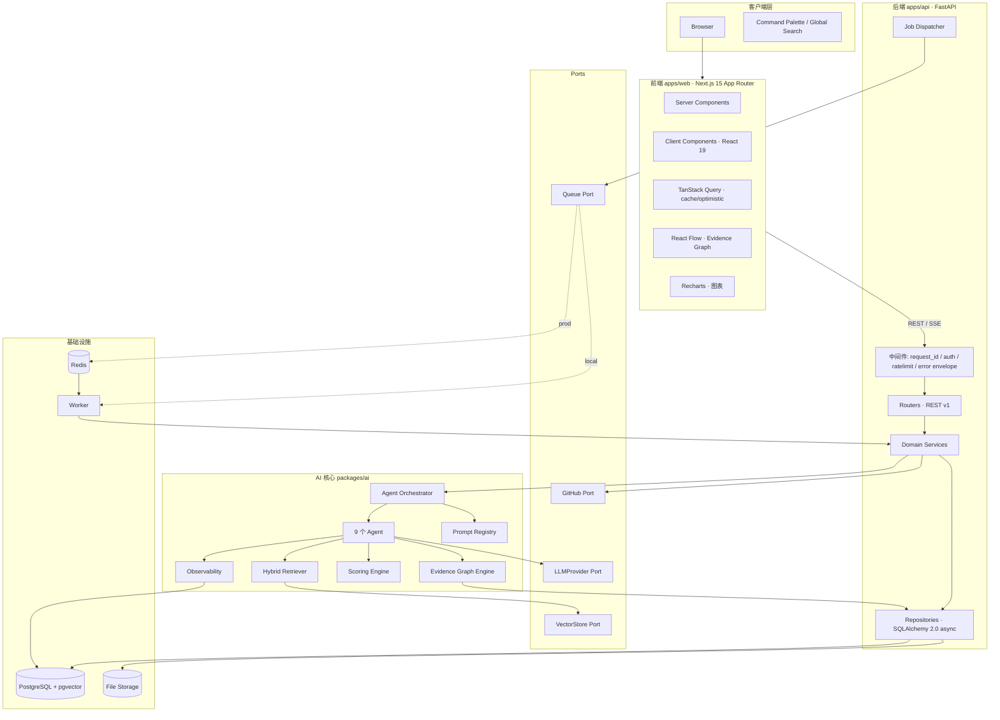
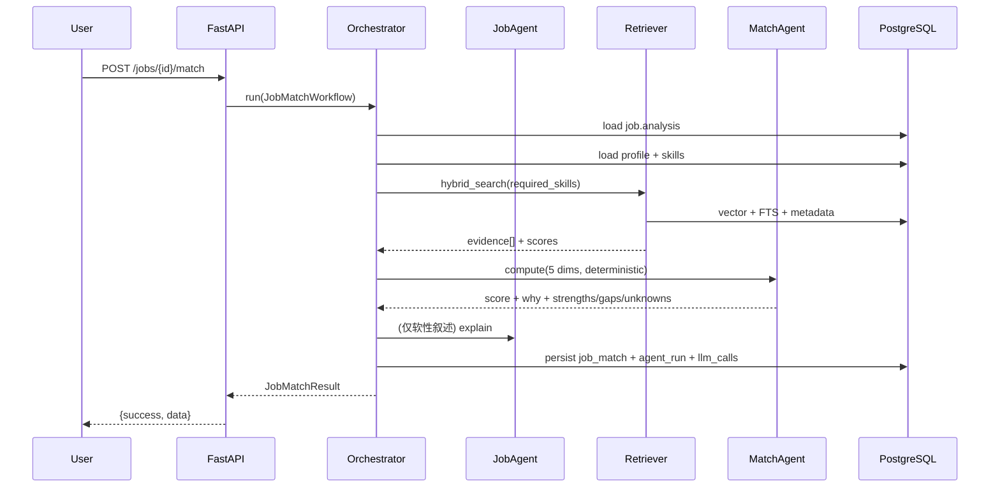
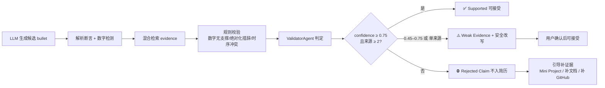
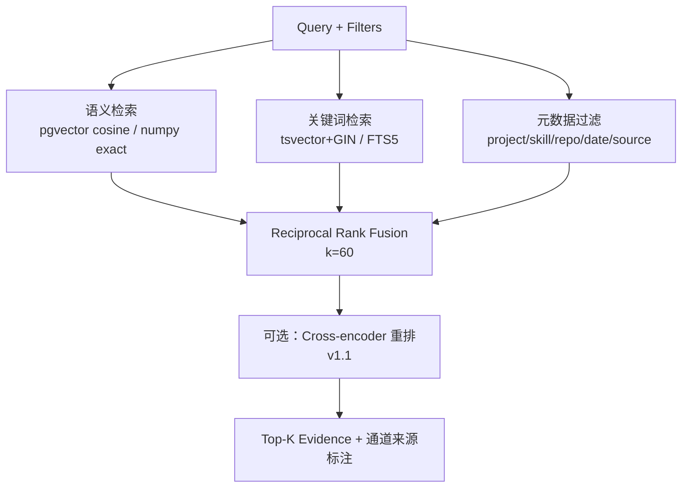
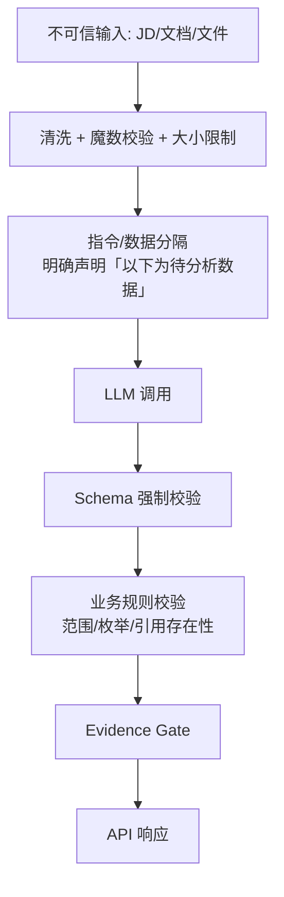

# CareerForge AI · 系统架构

| 字段     | 值                                                                                                      |
| -------- | ------------------------------------------------------------------------------------------------------- |
| 文档版本 | v1.0                                                                                                    |
| 状态     | ✅ Frozen for v1.0.0                                                                                    |
| 关联     | [PRD.md](./PRD.md) · [DATABASE.md](./DATABASE.md) · [API.md](./API.md) · [DECISIONS.md](./DECISIONS.md) |

---

## 1. 架构总览

### 1.1 设计原则

| 原则                           | 落地方式                                                                                |
| ------------------------------ | --------------------------------------------------------------------------------------- |
| **Ports & Adapters（六边形）** | 外部依赖（LLM / Vector / Queue / GitHub / Storage）均为 Port 接口，本地与生产实现可互换 |
| **Evidence 优先**              | 领域模型以 `evidence` 与 `evidence_links` 为一等公民，而非 AI 输出的附庸                |
| **数值确定性**                 | 所有分数（match / confidence / gap priority）由确定性算法计算；LLM 只负责叙述与抽取     |
| **可观测内建**                 | Agent 编排器强制落库 `agent_runs` + `llm_calls`，不是事后补埋点                         |
| **优雅降级**                   | 任一外部服务不可用 → 降级路径可用，绝不 500                                             |
| **小文件**                     | 单文件 ≤ 500 行；按域切分模块，禁止 God File                                            |
| **契约先行**                   | Pydantic Schema 即契约；前端类型从 OpenAPI 生成，避免手写漂移                           |

### 1.2 分层视图



### 1.3 运行时拓扑

**生产（Docker Compose）**

| 服务       | 镜像/构建                | 端口 | 职责                                  |
| ---------- | ------------------------ | ---- | ------------------------------------- |
| `web`      | `apps/web/Dockerfile`    | 3000 | Next.js SSR + 静态                    |
| `api`      | `apps/api/Dockerfile`    | 8000 | FastAPI（uvicorn, 2 workers）         |
| `worker`   | `apps/api/Dockerfile`    | —    | 异步任务（解析/嵌入/GitHub/面试报告） |
| `postgres` | `pgvector/pgvector:pg16` | 5432 | 主库 + 向量 + 全文检索                |
| `redis`    | `redis:7-alpine`         | 6379 | 队列 + 限流 + 缓存                    |
| `migrate`  | `apps/api`               | —    | 一次性 Alembic 升级 + 种子数据        |

**本地（零依赖，用于开发与无 Docker 环境）**

| 组件       | 本地实现                                           | 说明                             |
| ---------- | -------------------------------------------------- | -------------------------------- |
| 数据库     | SQLite (aiosqlite)                                 | 兼容类型层自动转换               |
| 向量检索   | `SqliteVectorStore`（numpy 精确余弦）              | 数据集规模 < 10 万向量时性能足够 |
| 关键词检索 | SQLite **FTS5**                                    | 对应生产 tsvector/GIN            |
| 队列       | `InProcessQueue`（asyncio + `background_jobs` 表） | 进程内执行，状态仍落库可观测     |
| LLM        | `HeuristicProvider`（确定性）                      | 零 API Key 全功能可跑            |
| Redis      | 内存实现（限流/缓存）                              | 单进程语义等价                   |

> 两条路径共享**同一套领域服务与 Schema**，仅替换 Port 实现 —— 这是「Docker 不可用时项目仍然完整可演示」的结构性保证（见 ADR-004、ADR-010）。

---

## 2. 代码结构

```
epan/                                  # 仓库根（remote: careerforge-ai）
├── apps/
│   ├── web/                           # Next.js 15 · App Router · TS strict
│   │   └── src/
│   │       ├── app/                   # 路由：landing / app / candidate / architecture / system
│   │       ├── components/            # 自有组件（按域分子目录）
│   │       ├── features/              # 领域前端逻辑（hooks + api + types）
│   │       ├── lib/                   # api client / query keys / utils
│   │       └── styles/                # tokens.css / globals.css
│   └── api/                           # FastAPI
│       └── src/careerforge_api/
│           ├── main.py                # app factory
│           ├── core/                  # config / security / errors / logging / ratelimit
│           ├── middleware/            # request_id / envelope / exception handlers
│           ├── routers/               # 每个域一个 router
│           ├── services/              # 领域服务（编排 AI 与 Repo）
│           ├── repositories/          # 数据访问
│           ├── models/                # SQLAlchemy ORM
│           ├── schemas/               # Pydantic 请求/响应
│           ├── db/                    # session / base / compat types
│           ├── workers/               # 任务处理器
│           └── seeds/                 # 种子数据（Alex Chen）
├── packages/
│   ├── ai/                            # careerforge_ai（Python 包）
│   │   └── careerforge_ai/
│   │       ├── orchestrator/          # Agent 编排器（DAG + 步骤契约 + 追踪）
│   │       ├── agents/                # 9 个 Agent
│   │       ├── providers/             # LLM Port + 4 实现 + 路由 + 缓存装饰器
│   │       ├── rag/                   # 分块 / 嵌入 / 混合检索 / RRF / 重排
│   │       ├── graph/                 # Evidence Graph 构建 / 查询 / 置信度
│   │       ├── scoring/               # match / confidence / gap / profile strength
│   │       ├── parsing/               # PDF/DOCX/MD/TXT + GitHub 解析
│   │       ├── schemas/               # 所有 AI 结构化输出契约
│   │       ├── observability/         # token/成本/延迟记录 + 价格表
│   │       └── prompting/             # Prompt Registry（加载 + 版本 + 渲染 + 校验）
│   ├── shared/                        # TS：API 类型 + zod + 生成的 client
│   ├── ui/                            # TS：共享 UI 原子组件
│   └── config/                        # TS：eslint / tsconfig / tailwind preset
├── prompts/                           # versioned prompt markdown（运行时加载）
├── evals/                             # 评测框架 + 数据集
├── tests/                             # 跨包集成测试 + e2e + fixtures
├── infra/                             # Dockerfile / init SQL / 部署配置
├── docs/                              # 本套文档
└── scripts/                           # seed / bench / dev / release
```

**依赖方向（强制）**：`apps/* → packages/ai →（无反向依赖）`；`packages/ai` **不得** import FastAPI 或 SQLAlchemy ORM（通过参数接收纯数据对象），保证 AI 核心可独立测试。

---

## 3. Agent Orchestrator（自研，不引入 LangGraph）

### 3.1 为什么自研

| 考量   | 说明                                                   |
| ------ | ------------------------------------------------------ |
| 可测试 | 每个步骤是纯函数 `(Input) -> Output`，可单测、可快照   |
| 可观测 | 步骤天然是追踪单元，直接映射 `agent_runs.steps`        |
| 可控   | 重试/降级/缓存/预算策略显式写在编排器，而非框架黑盒    |
| 依赖轻 | 少一个重依赖，减少版本冲突与调试成本                   |
| 可讲   | 面试中能讲清"每一步的数据契约与失败语义"（见 ADR-007） |

### 3.2 核心抽象

```python
class Step(Generic[In, Out]):
    name: str                      # 步骤名，如 "jd.extract_skills"
    input_schema: type[In]         # Pydantic
    output_schema: type[Out]       # Pydantic
    cache_ttl: int | None          # 结果缓存 TTL（秒）
    timeout_s: float
    max_retries: int
    fallback: Callable | None      # 降级实现（如 heuristic）

    async def run(self, ctx: RunContext, data: In) -> Out: ...
```

`RunContext` 提供：`user_id`、`request_id`、`provider`（已按预算/降级选好）、`retriever`、`repos`、`cache`、`budget`、`logger`。

`Workflow` = 一组 Step 组成的 DAG：

```python
@workflow("job_match")
class JobMatchWorkflow:
    steps = [LoadJob, LoadProfile, RetrieveEvidence, ComputeSkillScore,
             AssessExperience, AssessProjects, ComputeEvidenceStrength, Explain]
    edges = {...}          # 显式依赖
    def output_schema(self): return JobMatchResult
```

### 3.3 执行语义

| 语义       | 规则                                                                                                                         |
| ---------- | ---------------------------------------------------------------------------------------------------------------------------- |
| 并发       | 无依赖步骤并发执行（`asyncio.gather`），有依赖按拓扑序                                                                       |
| 重试       | 仅对可重试错误（429/5xx/超时）；指数退避 + 抖动；`max_retries` 默认 2                                                        |
| 降级       | 步骤声明 `fallback`，主路径失败即降级并标记 run `status=degraded`                                                            |
| 缓存       | `cache_ttl` 命中直接返回；`cache_key = sha256(step_name + 规范化输入)`                                                       |
| 预算       | 执行前检查用户日预算与单次 token 上限，超限强制切 heuristic provider                                                         |
| 超时       | 步骤级 + 工作流级双层超时                                                                                                    |
| 追踪       | 每步记录 `{name, status, latency_ms, tokens, cost, cache_hit, input_digest, output_digest, error}`                           |
| 结构化输出 | 所有 LLM 步骤必须 `structured_output(schema)`；校验失败进入**修复重试**（附校验错误再问一次，最多 1 次），仍失败则降级启发式 |

### 3.4 Agent 目录（9 个）

| Agent              | id          | 输入                                     | 输出                                                     | 依赖                       |
| ------------------ | ----------- | ---------------------------------------- | -------------------------------------------------------- | -------------------------- |
| **ProfileAgent**   | `profile`   | 文档文本 / 结构化导入                    | `CandidateProfile`（edu/exp/project/skill/achievement）  | LLM(结构化) + 确定性解析   |
| **EvidenceAgent**  | `evidence`  | Profile + Repos + Docs                   | `Evidence[]` + `EvidenceLink[]` + confidence             | 确定性公式 + 检索          |
| **JobAgent**       | `job`       | JD 文本                                  | `JDAnalysis`                                             | LLM(结构化) + 技能归一化表 |
| **MatchAgent**     | `match`     | JDAnalysis + Profile + Evidence          | `JobMatchResult`（5 维 + why + strengths/gaps/unknowns） | Scoring Engine（确定性）   |
| **ResumeAgent**    | `resume`    | 简历 + JD + Profile + Evidence           | `ResumeOptimization`（bullet 级 diff）                   | LLM + 检索                 |
| **ValidatorAgent** | `validator` | Claim 文本                               | `ClaimValidation`（判定 + 置信 + 来源 + 安全改写）       | 检索 + 规则 + LLM          |
| **InterviewAgent** | `interview` | JD + Resume + Project + Graph + 历史轮次 | `InterviewTurn` / `InterviewScorecard`                   | LLM(流式) + 难度状态机     |
| **CoachAgent**     | `coach`     | SkillGaps                                | `LearningPlan`（4 周 + mini projects）                   | LLM + 频次统计             |
| **RecruiterAgent** | `recruiter` | 全量证据                                 | `PublicProfileSummary`（工程亮点、面试话题）             | LLM + 确定性统计           |

### 3.5 工作流清单

| ID    | 工作流              | 步骤链                                                                                                                     | 触发            |
| ----- | ------------------- | -------------------------------------------------------------------------------------------------------------------------- | --------------- |
| WF-01 | `resume_ingest`     | parse → chunk → extract_profile → normalize_skills → embed → upsert_graph → compute_strength                               | 上传            |
| WF-02 | `github_ingest`     | fetch_repos → fetch_readme → fetch_files → fetch_commits → detect_tech → build_evidence → embed                            | 绑定账号        |
| WF-03 | `jd_analysis`       | clean_text → extract_structure → extract_skills → normalize → persist → skill_tree                                         | 粘贴/上传       |
| WF-04 | `job_match`         | load_job → load_profile → retrieve_evidence → skill_score → experience → project → education → evidence_strength → explain | 用户点击 / 自动 |
| WF-05 | `resume_optimize`   | load_ctx → generate_bullets → validate_each → gate → build_diff → persist_version                                          | 用户点击        |
| WF-06 | `claim_validate`    | parse_claim → detect_numbers → hybrid_retrieve → rule_check → llm_verdict → confidence → safe_rewrite                      | 任意入口        |
| WF-07 | `interview_session` | build_plan → next_question(loop) → evaluate_turn → adapt_difficulty → scorecard → report                                   | 开始面试        |
| WF-08 | `skill_gap`         | load_job → load_profile_skills → matrix → prioritize → plan → mini_projects                                                | 从匹配页点击    |
| WF-09 | `project_deep_dive` | load_project → gather_evidence → architecture → challenges → decisions → interview_questions                               | 项目页          |
| WF-10 | `recruiter_publish` | pii_scan → select_evidence → summarize → publish                                                                           | 发布公开页      |

**示例：WF-04 数据流**



---

## 4. Evidence Graph Engine

### 4.1 图模型落地

图的**持久化用邻接表**（`evidence` + `evidence_links`），而非图数据库 —— 理由见 ADR-005：当前规模（单用户 ≤ 数千节点）下邻接表 + 索引完全够用，且避免多引入一个存储组件。

```sql
-- 查询：某 Claim 的全部支持路径（2 跳）
WITH sup AS (
  SELECT to_id FROM evidence_links
  WHERE relation='SUPPORTS' AND from_type='evidence' AND to_id = :claim_id
)
SELECT e.*, l.confidence FROM evidence e
JOIN evidence_links l ON l.to_id = e.id
WHERE e.id IN (SELECT to_id FROM sup) OR e.id IN (SELECT ...);
```

实际实现采用**一次拉取 + 内存构图**（单用户图谱上限受控），并提供 `GET /evidence-graph?focus=&depth=2` 的**子图查询**避免全量传输。

### 4.2 置信度计算（确定性）

```
confidence = 0.30·authority + 0.15·recency + 0.20·specificity
           + 0.20·corroboration + 0.15·extraction_quality
```

- 各子项归一化到 `[0,1]`，权重常数集中在 `scoring/weights.py`（可配置、可测试）
- `corroboration = min(1, 0.4 + 0.2 × distinct_sources)`
- 结果按 4 位小数落库，`evidence.confidence` 与 `claim_validations.confidence` 均可复现

### 4.3 断言门禁（Hallucination Gate）



**规则层先于 LLM 层**：数字断言（`70%`、`3 倍`、`10 万 QPS`）若在证据集中检索不到任何量化支撑，直接判 `CONTRADICTED`/`UNSUPPORTED`，不交给 LLM 讨价还价 —— 这是最重要的一条防幻觉规则（有单测与评测集覆盖）。

---

## 5. RAG 管线

### 5.1 数据来源与分块

| 来源     | 分块策略                                 | 元数据                          |
| -------- | ---------------------------------------- | ------------------------------- |
| 简历     | 按 section + bullet（保留语义单元）      | `section`, `order`, `version`   |
| 项目文档 | 按标题层级递归（512 token / 64 overlap） | `heading_path`, `page`          |
| README   | 按标题层级                               | `repo`, `path`                  |
| 代码文件 | 按函数/类边界（启发式，限关键文件）      | `repo`, `path`, `lang`, `lines` |
| Commit   | 一条 commit = 一个单元                   | `sha`, `date`, `files`          |
| JD       | 按段落 + 技能句                          | `job_id`, `section`             |
| 面试记录 | 按 turn                                  | `interview_id`, `topic`         |

### 5.2 混合检索



- **RRF**：`score = Σ 1/(k + rank_i)`，`k=60`；无需跨通道分数归一化，工程上更稳健
- **元数据过滤**：支持 `source_type`、`project_id`、`skill_id`、`repo`、`since`、`user_id`（强制）
- **返回标注**：每条命中标注命中通道（`semantic`/`keyword`/`both`）与各通道原始排名 —— 支撑 UI 的可解释展示
- **Embedding 缓存**：`sha256(model + text)` 为键，落 `ai_caches`，二次运行零成本（对应 FR-15.4）

### 5.3 Provider 与维度

| Provider      | Embedding 模型                                  | 维度                         |
| ------------- | ----------------------------------------------- | ---------------------------- |
| DeepSeek      | 由配置指定（默认走 OpenAI 兼容 embedding 端点） | 1024                         |
| OpenAI        | `text-embedding-3-small`                        | 1536（可 `dimensions` 降维） |
| Local/Ollama  | `nomic-embed-text`                              | 768                          |
| **Heuristic** | 确定性哈希 + 字符 n-gram TF-IDF 投影            | 256                          |

维度在 `embeddings.dim` 记录并在检索时校验，避免混用不同模型的向量（ADR-009）。

---

## 6. Scoring Engine（确定性）

### 6.1 Job Match Score

| 维度              | 权重 | 计算方式（确定性）                                                                                                                     |
| ----------------- | ---- | -------------------------------------------------------------------------------------------------------------------------------------- |
| Skill Match       | 40%  | 岗位技能按 `required=1.0 / preferred=0.6 / bonus=0.3` 加权；命中程度由 `profile_skills.evidence_score` 决定（无证据的"会"只得 0.4 分） |
| Experience        | 25%  | 年限匹配度 × 经历相关性（同域经历加权）× 稳定性                                                                                        |
| Project           | 20%  | 项目技能覆盖度 × 项目证据强度 × 项目规模                                                                                               |
| Education         | 5%   | 学历/专业匹配（缺失不惩罚，仅不加分）                                                                                                  |
| Evidence Strength | 10%  | 命中技能的加权平均置信度（**无证据的技能在此维度被真实惩罚**）                                                                         |

```
score = round(0.40·skill + 0.25·exp + 0.20·proj + 0.05·edu + 0.10·evid, 1)
```

`why` 载荷结构（前端 "Why 86?" 直接消费）：

```json
{
  "total": 86.0,
  "weights": {
    "skill": 0.4,
    "experience": 0.25,
    "project": 0.2,
    "education": 0.05,
    "evidence": 0.1
  },
  "dimensions": [
    {
      "key": "skill",
      "raw": 0.91,
      "weighted": 36.4,
      "matched": ["stm32", "freertos", "c"],
      "missed": ["can", "autosar"],
      "formula": "Σ w_j · min(1, level_ji) / Σ w_j"
    }
  ],
  "evidence_used": [412, 418, 501],
  "confidence": 0.88
}
```

### 6.2 Profile Strength（Dashboard 的 82/100）

```
strength = 0.30·completeness + 0.25·evidence_coverage + 0.20·evidence_quality
         + 0.15·github_signal + 0.10·achievement_bonus
```

同时输出**改进建议**（哪一项拉低了分数、如何提升），配合 `Evidence Coverage = 有证据的技能数 / 声明的技能数`。

### 6.3 Gap Priority

```
priority = 0.5·normalized_requirement_weight
         + 0.3·gap_severity
         + 0.2·market_frequency(job_category)
```

`market_frequency` 来自用户库内同类岗位的技能频次统计（真实数据，非硬编码）。

---

## 7. LLM Provider 抽象

```python
class LLMProvider(Protocol):
    name: str
    async def chat(self, messages, *, temperature, max_tokens, **kw) -> ChatResult: ...
    async def stream(self, messages, **kw) -> AsyncIterator[StreamChunk]: ...
    async def embed(self, texts: list[str], *, model: str | None) -> list[list[float]]: ...
    async def structured_output(self, messages, schema: type[BaseModel], **kw) -> BaseModel: ...
```

| 实现                          | 说明                                                                  |
| ----------------------------- | --------------------------------------------------------------------- |
| `DeepSeekProvider`            | OpenAI 兼容协议，`base_url` 可配                                      |
| `OpenAIProvider`              | 官方 SDK                                                              |
| `OllamaProvider`              | 本地模型，隐私模式默认选项                                            |
| `HeuristicProvider`           | **确定性、零依赖**：规则 + 模板 + TF-IDF 排序，产出**结构合法**的响应 |
| `CachedProvider`（装饰器）    | 结果缓存 + 命中计数                                                   |
| `RoutedProvider`（装饰器）    | 按任务路由（抽取→便宜模型，面试→强模型）+ 预算护栏 + 自动降级         |
| `ResilientProvider`（装饰器） | 超时 / 重试 / 熔断 / 降级链                                           |

**结构化输出协议**：优先使用模型原生 JSON Schema 模式（`response_format`）；不支持时退化为"强约束提示 + JSON 提取 + Pydantic 校验 + 一次修复重试"。

---

## 8. API 层

### 8.1 统一响应信封

```json
{ "success": true,  "data": {...}, "error": null, "requestId": "req_01H..." }
{ "success": false, "data": null, "error": {"code":"VALIDATION_ERROR","message":"...","details":[...]}, "requestId": "req_01H..." }
```

### 8.2 中间件链（顺序）

```
RequestID → 结构化日志 → CORS → 速率限制 → 认证(JWT) → 路由 → 全局异常处理 → 信封包装
```

### 8.3 长任务与流式

| 场景                  | 方案                                                                                                    |
| --------------------- | ------------------------------------------------------------------------------------------------------- |
| 导入/分析等 > 2s 任务 | `202 Accepted` + `background_jobs.id` → 轮询 `GET /jobs/{id}` 或用 SSE `/jobs/{id}/stream` 推送阶段进度 |
| 面试对话 / 简历生成   | SSE 流式（`text/event-stream`），事件类型：`stage` / `delta` / `result` / `error`                       |
| 失败语义              | 每个阶段明确失败态与可恢复点；幂等键（`Idempotency-Key`）避免重复计费                                   |

---

## 9. 可观测性与成本

| 层       | 记录                                                                            |
| -------- | ------------------------------------------------------------------------------- |
| 请求     | `request_id` 贯穿前端 → API → Agent → LLM，响应头回传 `X-Request-Id`            |
| Agent    | `agent_runs`：workflow/agent/status/steps/tokens/cost/latency/cache_hit         |
| LLM 调用 | `llm_calls`：provider/model/operation/tokens/cost/latency/status/error_code     |
| Prompt   | `prompt_versions`：name/version/sha256/content；run 记录引用的 `prompt_version` |
| 评测     | `eval_runs`：suite/provider/model/metrics/git_sha                               |

**成本引擎**：内置价格表（`observability/pricing.py`，CNY/USD 双币，按 provider+model 键），token 用量 × 单价 → `cost_usd`/`cost_cny`；缓存命中不计费但记 `hit_count`。

**成本优化手段**（README 会列为独立章节）：

1. 结果缓存（同输入 0 成本）
2. Embedding 缓存（内容哈希）
3. 任务路由（便宜模型做抽取/分类，强模型只做面试与生成）
4. Prompt 精简（复用系统前缀，利于上游 prefix cache）
5. 上下文裁剪（检索 Top-K 而非全文塞入）
6. 预算护栏（超限自动降级 heuristic）

---

## 10. 安全架构



| 风险             | 对策                                                                  |
| ---------------- | --------------------------------------------------------------------- |
| Prompt Injection | 结构化分隔 + 数据声明 + 输出 Schema 约束 + 不将用户内容拼入系统指令位 |
| 恶意文件         | MIME+魔数双校验、大小上限、解析超时、异常隔离、不落执行路径           |
| 越权             | 资源级 `user_id` 强制过滤，Repo 层统一注入                            |
| 速率滥用         | 令牌桶（IP + 用户双维度），AI 端点独立更严配额                        |
| 密钥泄露         | 环境变量 + 启动校验 + 日志脱敏 + `.env` 忽略                          |
| LLM 输出异常     | Pydantic + 数值范围 + 枚举白名单 + 引用 id 存在性校验                 |
| XSS              | 安全 Markdown 渲染（禁原生 HTML）+ CSP                                |
| SQL 注入         | 全参数化 ORM，禁止拼接                                                |

---

## 11. 性能策略

| 层     | 手段                                                                                                                            |
| ------ | ------------------------------------------------------------------------------------------------------------------------------- |
| 前端   | RSC 优先；路由级 code splitting；图谱/图表懒加载；图片 `next/image`；列表虚拟化；请求防抖 300ms；TanStack Query 缓存 + 乐观更新 |
| API    | 分页（游标）；`select` 精确列；热点聚合结果短期缓存；AI 与非 AI 端点分离（非 AI P95 ≤ 300ms 不被拖累）                          |
| 数据库 | 复合索引（`user_id` 前导）；`agent_runs`/`llm_calls` 按月分区（v1.1）；向量索引 HNSW（`m=16, ef_construction=64`）              |
| AI     | Embedding 批量化；检索 Top-K 收敛；并发步骤 gather；结果与嵌入双缓存                                                            |
| Worker | 任务幂等 + 有限并发 + 退避重试                                                                                                  |

---

## 12. 部署

| 环境                   | 拓扑                                                                                                              |
| ---------------------- | ----------------------------------------------------------------------------------------------------------------- |
| **Local（无 Docker）** | SQLite + 进程内队列 + heuristic provider；`pnpm dev` + `uvicorn --reload`                                         |
| **Docker Compose**     | 6 容器（web/api/worker/postgres/redis/migrate）                                                                   |
| **Cloud**（推荐）      | Web → Vercel；API/Worker → Railway 或 Render；DB → Neon/Supabase（pgvector）；Redis → Upstash；对象存储 → S3 兼容 |
| **隐私模式**           | Ollama 本地推理 + Local Mode，数据不出本机                                                                        |

CI/CD：GitHub Actions 三阶段 —— `lint → test（api/web/e2e）→ build（含 docker build）`；主分支合并后触发部署（可选）。

---

## 13. 关键权衡（摘要，详见 DECISIONS.md）

| 决策                 | 取舍                                                                 |
| -------------------- | -------------------------------------------------------------------- |
| 邻接表而非图数据库   | 少一个组件、事务一致、查询够用；代价是复杂图算法需自研（当前不需要） |
| 数值评分确定性化     | 牺牲"让 LLM 综合判断"的灵活性，换取可复现、可评测、可解释            |
| 自研编排器           | 牺牲开箱即用的生态，换取可控、可测、可讲清楚的追踪模型               |
| SQLite 降级路径      | 维护两套 SQL 方言兼容的成本，换取无 Docker 环境下项目依然完整可跑    |
| Prompt 外置 + 版本化 | 增加加载复杂度，换取可 diff、可回滚、可归因                          |
| 混合检索而非纯向量   | 多一条检索链路，换取对精确技术名词（`STM32F407`、`CAN`）的高召回     |

---

**下一篇**：[DATABASE.md](./DATABASE.md)
