# CareerForge AI · 数据库设计

| 字段     | 值                                                                                         |
| -------- | ------------------------------------------------------------------------------------------ |
| 文档版本 | v1.0                                                                                       |
| 主库     | PostgreSQL 16 + pgvector 0.7                                                               |
| 降级库   | SQLite 3.45（本地开发 / 无 Docker 环境）                                                   |
| ORM      | SQLAlchemy 2.0（async）+ Alembic                                                           |
| 关联     | [ARCHITECTURE.md](./ARCHITECTURE.md) · [API.md](./API.md) · [DECISIONS.md](./DECISIONS.md) |

---

## 1. 设计约定

### 1.1 通用列（所有业务表默认具备）

| 列           | 类型          | 约定                                                    |
| ------------ | ------------- | ------------------------------------------------------- |
| `id`         | `uuid`        | 主键，`default gen_random_uuid()`                       |
| `user_id`    | `uuid`        | 多租户隔离键，**所有查询强制过滤**；`ON DELETE CASCADE` |
| `created_at` | `timestamptz` | `default now()`                                         |
| `updated_at` | `timestamptz` | `default now()`，由触发器/ORM 事件维护                  |

**全局约束**：

1. 所有面向用户的数据表必须有 `user_id`（例外：`skills` 全局词典、`companies` 全局实体、`prompt_versions`、`eval_runs`）。
2. 所有多租户唯一约束必须包含 `user_id`（如 `unique(user_id, slug)`）。
3. **不使用 PostgreSQL 原生 ENUM**，统一 `text` + `CHECK` 约束 —— 迁移更平滑（见 ADR-011）。
4. 所有时间戳 `timestamptz`（UTC 存储，前端本地化）。
5. 软删除仅用于 `applications`（`archived_at`），其余硬删除 + 级联。

### 1.2 命名

- 表名：`snake_case` 复数；关联表：`<entity>_<entity>`（如 `project_skills`）
- 外键：`<ref_table_singular>_id`；索引：`ix_<table>_<cols>`；唯一：`uq_<table>_<cols>`

### 1.3 实体关系总览

```mermaid
erDiagram
  users ||--o| profiles : has
  users ||--o{ educations : has
  users ||--o{ experiences : has
  users ||--o{ projects : has
  users ||--o{ achievements : has
  users ||--o{ documents : uploads
  users ||--o{ repositories : owns
  users ||--o{ jobs : analyzes
  users ||--o{ applications : tracks
  users ||--o{ interviews : attends
  users ||--o{ resume_versions : owns
  users ||--o{ skill_gaps : has
  users ||--o| public_profiles : publishes

  documents ||--o{ document_chunks : split_into
  repositories ||--o{ repo_files : contains
  repositories ||--o{ repo_commits : contains
  projects }o--o| repositories : linked_to
  projects ||--o{ project_skills : demonstrates
  experiences ||--o{ experience_skills : demonstrates
  profiles ||--o{ profile_skills : has
  skills ||--o{ profile_skills : in

  evidence ||--o{ evidence_links : source_of
  evidence }o--o| document_chunks : from
  evidence }o--o| repo_files : from
  evidence }o--o| repo_commits : from
  evidence ||--o{ claim_evidence : supports
  resume_claims ||--o{ claim_evidence : supported_by
  resume_claims ||--o{ claim_validations : validated_by
  resume_versions ||--o{ resume_claims : contains

  companies ||--o{ jobs : offers
  jobs ||--o{ job_skills : requires
  jobs ||--o{ job_matches : scored_as
  jobs ||--o{ applications : applied_to
  applications ||--o{ application_events : history
  interviews ||--o{ interview_messages : contains
  jobs ||--o{ skill_gaps : gaps_for

  agent_runs ||--o{ llm_calls : contains
  users ||--o{ background_jobs : queued_for
  users ||--o{ career_events : timeline
```



---

## 2. 表清单（32 张）

### 2.1 身份与画像（identity）

#### `users`

| 列                 | 类型                            | 说明                                         |
| ------------------ | ------------------------------- | -------------------------------------------- |
| `email`            | `text not null`                 | `unique`（全局）                             |
| `password_hash`    | `text`                          | bcrypt；Demo 账号为 `null`（仅限 `is_demo`） |
| `display_name`     | `text not null`                 |                                              |
| `role`             | `text not null default 'user'`  | CHECK in (`user`,`admin`)                    |
| `is_demo`          | `boolean default false`         | Demo 账号标记                                |
| `storage_scope`    | `text not null default 'cloud'` | CHECK in (`cloud`,`local`) — Local Mode      |
| `privacy_settings` | `jsonb default '{}'`            | 公开页可见项、原文留存开关                   |
| `locale`           | `text default 'zh-CN'`          |                                              |
| `last_login_at`    | `timestamptz`                   |                                              |

#### `profiles`

| 列                     | 类型           | 说明                                                   |
| ---------------------- | -------------- | ------------------------------------------------------ |
| `user_id`              | `uuid`         | `unique`（一对一）                                     |
| `slug`                 | `text`         | `unique`，公开页路径 `/candidate/{slug}`               |
| `headline` / `summary` | `text`         | 一句话定位 / 自我总结                                  |
| `location`             | `text`         |                                                        |
| `github_username`      | `text`         |                                                        |
| `website`              | `text`         |                                                        |
| `target_roles`         | `jsonb`        | `["Embedded Engineer","AI Application Engineer"]`      |
| `years_experience`     | `numeric(3,1)` |                                                        |
| `profile_strength`     | `integer`      | 0–100                                                  |
| `strength_breakdown`   | `jsonb`        | 五维拆解 + 改进建议                                    |
| `stats`                | `jsonb`        | 冗余缓存：证据数/技能数/项目数（读多写少，写入时刷新） |

#### `public_profiles`

| 列                 | 类型                    | 说明                                                                     |
| ------------------ | ----------------------- | ------------------------------------------------------------------------ |
| `user_id`          | `uuid`                  | `unique`                                                                 |
| `slug`             | `text`                  | `unique`                                                                 |
| `is_published`     | `boolean default false` |                                                                          |
| `sections`         | `jsonb`                 | 逐项可见性：`{skills:true, projects:true, evidence:true, contact:false}` |
| `summary`          | `text`                  | RecruiterAgent 生成                                                      |
| `highlights`       | `jsonb`                 | 工程亮点                                                                 |
| `interview_topics` | `jsonb`                 | 可深入讨论的技术话题                                                     |
| `view_count`       | `integer default 0`     |                                                                          |
| `published_at`     | `timestamptz`           |                                                                          |
| `public_payload`   | `jsonb`                 | **PHASE 10 追加**：发布时的完整投影，公开页因此不需要每次访问都调模型 ①  |
| `pii_findings`     | `jsonb`                 | **PHASE 10 追加**：发布时扫到的个人信息，用于告诉候选人「脱敏了什么」    |

> ① 与本节原表的差异（PHASE 10，迁移 `0008`）：为了让公开页的每次访问**不产生模型调用**，
> 发布时把 RecruiterAgent 的完整投影存进 `public_payload`；隐私开关在**读取时**重新套用，
> 因此「我刚关掉」立刻生效，而不是等到下次发布。`pii_findings` 记录发布时脱敏了哪些内容——
> 悄悄删掉一处电话，与本来就没有电话，对候选人是两件完全不同的事。
> 两列都是 `NOT NULL` + server default，迁移对已存在的行安全。

### 2.2 职业实体（career）

> **状态：已实现（PHASE 2b，迁移 `0005`）** — 模型 `apps/api/src/careerforge_api/models/profile_entity.py`。
> 两处与本文档的偏差，均为有意为之：
> ① `origin` 的取值增加了 **`heuristic`**：AI 核心的 `Origin` 枚举用它标注「零 Key 的
> heuristic 提取器」产出的行，而这条路径在本产品里是一等公民（ADR-009）。把它记成 `llm`
> 是对来源的谎报，而这个列存在的意义正是防止这种谎报。
> ② `projects.repository_id` 是**无外键**的裸 uuid：它指向 §2.4 的 `repositories`，该表随
> GitHub Intelligence 一起到来，而指向不存在表的外键无法创建。
> `project_skills` / `experience_skills` 暂缺：唯一消费者是 WF-09 项目深挖，而图谱目前从
> `projects.tech_stack` 文本推导 project→skill 边；加入无人读取的关联表只是脚手架。

#### `educations`

`school`, `degree`, `major`, `start_date`, `end_date`, `gpa numeric(3,2)`, `highlights jsonb`, `evidence_strength numeric(4,3)`, `origin`(CHECK `llm`/`user_corrected`/`import`), `source_document_id uuid`

#### `experiences`

`kind`(CHECK `internship`/`fulltime`/`parttime`/`research`/`campus`), `company`, `title`, `location`, `start_date`, `end_date`, `is_current bool`, `description text`, `highlights jsonb`, `evidence_strength`, `origin`, `source_document_id`

#### `projects`

`name`, `role`, `summary`, `description`, `tech_stack jsonb`, `start_date`, `end_date`, `repository_id uuid null`, `links jsonb`, `architecture_mermaid text`, `key_challenges jsonb`, `technical_decisions jsonb`, `tradeoffs jsonb`, `debugging_stories jsonb`, `deep_dive jsonb`（WF-09 生成结果缓存）, `evidence_strength`, `origin`

#### `achievements`

`kind`(CHECK `award`/`cert`/`competition`/`publication`/`other`), `title`, `issuer`, `date`, `level`, `description`, `evidence_strength`, `origin`

#### `skills`（全局词典，无 user_id）

`canonical_id text unique`（如 `stm32`）, `display_name`, `category`(CHECK `language`/`framework`/`embedded`/`backend`/`frontend`/`ai`/`devops`/`database`/`tool`/`domain`/`soft`), `aliases jsonb`（`["STM32F407","stm32f4"]`）, `is_active bool`

#### `profile_skills`

`user_id`, `skill_id`, `level`(CHECK `none`/`basic`/`moderate`/`strong`/`expert`), `evidence_score numeric(4,3)`, `evidence_count int`, `last_used_at`, `is_target bool`, `origin`

> `unique(user_id, skill_id)`

#### `project_skills` / `experience_skills`

`project_id`/`experience_id`, `skill_id`, `weight numeric(4,3)`, `evidence_count int`, `role text`

> 各自 `unique(project_id, skill_id)` / `unique(experience_id, skill_id)`

### 2.3 材料与解析（documents）

> **状态：已实现（PHASE 2）** — 模型 `apps/api/src/careerforge_api/models/document.py`、
> 迁移 `alembic/versions/0002_documents.py`。`metadata jsonb` 承载解析格式、实际解码
> 编码、摄取警告（如扫描件）与 PII 命中数量；`storage_path` 只在校验与解析之间指向
> 暂存文件，解析完成后立即置空并删除文件。

#### `documents`

| 列                    | 类型              | 说明                                                       |
| --------------------- | ----------------- | ---------------------------------------------------------- |
| `kind`                | `text`            | CHECK `resume`/`project_doc`/`interview_note`/`jd`/`notes` |
| `filename`            | `text`            | 已脱敏文件名                                               |
| `mime` / `size_bytes` | `text` / `bigint` |                                                            |
| `sha256`              | `text`            | 去重 + 缓存键                                              |
| `storage_path`        | `text`            | 对象存储键；Local Mode 下为空                              |
| `raw_text`            | `text`            | Local Mode 下可为空（仅存解析结果）                        |
| `page_count`          | `integer`         |                                                            |
| `parse_status`        | `text`            | CHECK `pending`/`parsing`/`parsed`/`failed`                |
| `parse_error`         | `text`            |                                                            |
| `is_redacted`         | `boolean`         | PII 是否已脱敏                                             |
| `metadata`            | `jsonb`           |                                                            |

#### `document_chunks`

`document_id`, `chunk_index int`, `content text`, `token_count int`, `heading_path text`, `page_no int`, `char_start int`, `char_end int`

> `unique(document_id, chunk_index)`；`ix(user_id, document_id, chunk_index)`

### 2.4 GitHub（github）

#### `repositories`

`provider text default 'github'`, `full_name text`, `name`, `owner`, `description`, `html_url`, `default_branch`, `primary_language`, `languages jsonb`（`{"C":35.2,...}`）, `stars int`, `forks int`, `watchers int`, `open_issues int`, `topics jsonb`, `is_fork bool`, `is_archived bool`, `repo_created_at`, `repo_pushed_at`, `size_kb int`, `readme_text text`, `readme_sha text`, `analysis jsonb`（Project Intelligence Report）, `last_analyzed_at`, `etag text`

> `unique(user_id, provider, full_name)`

#### `repo_files`

`repository_id`, `path text`, `language text`, `size_bytes int`, `sha text`, `is_significant bool`, `significance_reason text`, `content_excerpt text`, `last_commit_sha text`, `last_commit_at`

> `unique(repository_id, path)`；`ix(user_id, repository_id, is_significant)`

#### `repo_commits`

`repository_id`, `sha text`, `message text`, `author_name text`, `author_email_hash text`（脱敏）, `committed_at`, `additions int`, `deletions int`, `files_changed int`, `url text`, `is_significant bool`, `significance_reason text`

> `unique(repository_id, sha)`；`ix(user_id, repository_id, committed_at desc)`

#### `github_snapshots`

`user_id`, `username`, `etag`, `payload jsonb`, `fetched_at`

> 速率限制下的复用缓存；`ix(user_id, username, fetched_at desc)`

### 2.5 证据层（evidence）★ 核心

> **状态：已实现（PHASE 3）** — 模型 `apps/api/src/careerforge_api/models/evidence.py`、
> 迁移 `alembic/versions/0003_evidence.py`。置信度公式是**数据库 CHECK 约束**：
> 落库的 `confidence` 必须等于五个因子按公式计算的结果（容差 0.002，对应引擎的三位
> 小数舍入），因此 UI 上显示的分数可用 SQL 复现。§3 的 DDL 用 PostgreSQL 的 `least()`
> 写上限，实际约束用 `CASE`，因为 SQLite 对应的是两参数 `min()`，而 CI 同时跑两种方言
> （ADR-004）。`repo_file_id` / `repo_commit_id` 暂未建列：它们外键指向 §2.4 尚未存在的
> 表，指向缺失表的外键无法创建，而没有外键的列会接受悬空 id。

#### `evidence`

| 列                                                      | 类型                | 说明                                                                                                               |
| ------------------------------------------------------- | ------------------- | ------------------------------------------------------------------------------------------------------------------ |
| `kind`                                                  | `text not null`     | CHECK `repo_file`/`commit`/`readme`/`document_chunk`/`experience`/`project`/`achievement`/`manual`/`llm_inference` |
| `title`                                                 | `text not null`     | 人类可读标题，如 `motor_control.c`                                                                                 |
| `snippet`                                               | `text`              | 证据片段（≤ 2000 字符）                                                                                            |
| `locator`                                               | `jsonb`             | `{path, line, url, sha, page, char_start, char_end}`                                                               |
| `source_authority`                                      | `numeric(4,3)`      | 0–1，见置信度公式                                                                                                  |
| `specificity`                                           | `numeric(4,3)`      | 0–1                                                                                                                |
| `extraction_quality`                                    | `numeric(4,3)`      | 0–1                                                                                                                |
| `recency_score`                                         | `numeric(4,3)`      | 0–1（由 `occurred_at` 计算并缓存）                                                                                 |
| `corroboration_count`                                   | `integer default 1` | 独立来源计数                                                                                                       |
| `confidence`                                            | `numeric(4,3)`      | **最终置信度（加权结果，落库可复现）**                                                                             |
| `occurred_at`                                           | `timestamptz`       | 证据发生时间（commit 日期等）                                                                                      |
| `document_chunk_id` / `repo_file_id` / `repo_commit_id` | `uuid`              | 多态来源，`ON DELETE SET NULL`                                                                                     |
| `metadata`                                              | `jsonb`             | 语言、行数、topic 等                                                                                               |
| `content_hash`                                          | `text`              | 去重（`unique(user_id, kind, content_hash)`）                                                                      |

**索引**

```sql
CREATE INDEX ix_evidence_user_kind ON evidence (user_id, kind);
CREATE INDEX ix_evidence_user_confidence ON evidence (user_id, confidence DESC);
CREATE INDEX ix_evidence_occurred ON evidence (user_id, occurred_at DESC NULLS LAST);
CREATE INDEX ix_evidence_metadata_gin ON evidence USING gin (metadata jsonb_path_ops);
-- 全文检索（生产）
ALTER TABLE evidence ADD COLUMN search_tsv tsvector
  GENERATED ALWAYS AS (to_tsvector('simple', coalesce(title,'') || ' ' || coalesce(snippet,''))) STORED;
CREATE INDEX ix_evidence_tsv ON evidence USING gin (search_tsv);
```

#### `evidence_links`（图邻接表）

| 列                      | 类型                       | 说明                                                                                           |
| ----------------------- | -------------------------- | ---------------------------------------------------------------------------------------------- |
| `from_type` / `from_id` | `text` / `uuid`            | 多态起点                                                                                       |
| `to_type` / `to_id`     | `text` / `uuid`            | 多态终点                                                                                       |
| `relation`              | `text`                     | CHECK `HAS`/`DEMONSTRATES`/`EVIDENCED_BY`/`SUPPORTS`/`REQUIRES`/`MATCHES`/`GAP`/`DERIVED_FROM` |
| `weight`                | `numeric(4,3) default 1.0` |                                                                                                |
| `confidence`            | `numeric(4,3)`             | 边级置信度                                                                                     |
| `rationale`             | `text`                     | 为什么建立这条边（可解释）                                                                     |

```sql
CREATE UNIQUE INDEX uq_evidence_links_edge
  ON evidence_links (user_id, from_type, from_id, to_type, to_id, relation);
CREATE INDEX ix_evidence_links_from ON evidence_links (user_id, from_type, from_id, relation);
CREATE INDEX ix_evidence_links_to   ON evidence_links (user_id, to_type,   to_id,   relation);
```

> **多态外键的取舍**：不建真实外键约束（多态无法引用），改用应用层完整性校验 + 定期 `integrity_check` 任务。理由与替代方案见 ADR-005。

#### `embeddings`

| 列             | 类型           | 说明                                                              |
| -------------- | -------------- | ----------------------------------------------------------------- |
| `owner_type`   | `text`         | CHECK `evidence`/`document_chunk`/`project`/`skill`/`job`/`claim` |
| `owner_id`     | `uuid`         |                                                                   |
| `model`        | `text`         | 如 `text-embedding-3-small`                                       |
| `dim`          | `integer`      | 维度校验，防混用                                                  |
| `vector`       | `vector(1536)` | pgvector；本地为 `vector_blob BLOB`（float32 小端）               |
| `content_hash` | `text`         | 缓存键                                                            |
| `norm`         | `numeric(8,6)` | 预计算 L2 范数（余弦相似度加速）                                  |

> `unique(user_id, owner_type, owner_id, model)`；`ix(user_id, owner_type, model)`

```sql
-- pgvector HNSW（生产）
CREATE INDEX ix_embeddings_hnsw ON embeddings
  USING hnsw (vector vector_cosine_ops) WITH (m = 16, ef_construction = 64);
```

### 2.6 岗位与匹配（jobs）

> **状态：已实现（PHASE 4）** — 模型 `apps/api/src/careerforge_api/models/job_posting.py`、
> 迁移 `alembic/versions/0004_jobs.py`。两处与本文档的偏差，均为有意为之：
> ① `companies` 表与 `jobs.company_id` 外键暂缺（指向缺失表的外键无法创建），公司身份先
> 由 `company_name_raw` 承载；② `jobs.user_id` 目前为 **NOT NULL**，因为本版本还没有公共
> 岗位库，一个可空的租户键会让每一次读取都更难推理；将来放开只是一行
> `ALTER COLUMN DROP NOT NULL`。
> `job_skills` 额外带一个由应用层生成的 `dedupe_key`（能归一化时是 canonical id，否则是
> 原文）：本文档要求的唯一性落在**可空列**上，而 `NULL` 在两种后端的唯一索引里都不等于
> 自身，约束会对「未归一化的技能」静默失效。

#### `companies`（全局）

`name`, `normalized_name text unique`, `website`, `industry`, `size`, `logo_url`, `notes`

#### `jobs`

`user_id`（可空=公共库）, `company_id`, `company_name_raw`, `role`, `level`, `location`, `remote_type`(CHECK `onsite`/`hybrid`/`remote`), `employment_type`, `salary_min`/`salary_max`/`salary_currency`, `education_requirement`, `years_experience_min`, `description_raw text`, `description_sha256`, `source`(CHECK `paste`/`upload`/`url`/`manual`), `source_url`, `analysis jsonb`（完整 `JDAnalysis`）, `required_skills jsonb`, `preferred_skills jsonb`, `bonus_skills jsonb`, `keywords jsonb`, `responsibilities jsonb`, `parse_status`(CHECK `pending`/`parsed`/`failed`/`heuristic_fallback`), `parse_confidence numeric(4,3)`

> `ix(user_id, created_at desc)`；`unique(user_id, description_sha256)` 防重复导入

#### `job_skills`

`job_id`, `skill_id`（可空：未能归一化的原文技能）, `raw_text`, `requirement`(CHECK `required`/`preferred`/`bonus`), `weight numeric(4,3)`, `jd_evidence text`（JD 原文句，用于"出处"展示）, `mentions int`

> `unique(job_id, skill_id, requirement)`（`skill_id` 为空时按 `raw_text` 去重）

#### `job_matches`

`user_id`, `job_id`, `score numeric(5,2)`, `skill_score`, `experience_score`, `project_score`, `education_score`, `evidence_score`（均 numeric(5,2)）, `weights jsonb`, `strengths jsonb`, `gaps jsonb`, `unknowns jsonb`, `why jsonb`（完整拆解）, `evidence_used jsonb`（证据 id 列表）, `algorithm_version text`, `model text`

> `ix(user_id, job_id, created_at desc)`（保留历史，最新一条为当前）

### 2.7 投递（applications）

> **已实现（PHASE 8b，迁移 `0007`）**。与本节原设计的三处差异，都是被「看板要能在岗位被删后仍然成立」
> 逼出来的：
> ① 新增三个**快照列** `company_name` / `role` / `location`：卡片在创建时复制岗位的这些字段，
> 于是删除岗位（`job_id` 变 NULL）或改动岗位都不会让历史卡片改口。手工录入（无岗位）时它们也是唯一的身份来源；
> ② `salary_expectation` 为 **text**：候选人写的是「25k×15」「300-400/天」，用数值列会逼客户端
> 把它规范化成候选人从未说过的东西；
> ③ `match_score_snapshot` 由服务端从 `job_matches` 最近一行复制，**客户端不可传入**；没有匹配记录时
> 为 `NULL`（不是 `0`）——「没算过」与「算出来是 0 分」是两件事。

#### `applications`

`user_id`, `job_id`, `resume_version_id`, `company_name`, `role`, `location`, `status`(CHECK `wishlist`/`applied`/`oa`/`interview`/`final`/`offer`/`rejected`), `match_score_snapshot numeric(5,2)`, `applied_at`, `next_action_at`, `salary_expectation text`, `notes text`, `position int`（看板排序）, `archived_at`

> `ix(user_id, status, position)`；`ix(user_id, next_action_at)`

#### `application_events`

`application_id`, `user_id`, `from_status`, `to_status`, `note`, `occurred_at`

> **追加式**：状态变更审计 + 漏斗统计的数据源。`from_status` 可空（创建事件没有前一个状态）；
> 改成同一状态不写事件。`ix(application_id, occurred_at)`

### 2.8 面试（interviews）

#### `interviews`

| 列                                               | 类型           | 说明                                                                   |
| ------------------------------------------------ | -------------- | ---------------------------------------------------------------------- |
| `job_id` / `application_id`                      | `uuid null`    | 可独立使用                                                             |
| `mode`                                           | `text`         | CHECK `hr`/`technical`/`project`/`stress`/`behavioral`/`system_design` |
| `status`                                         | `text`         | CHECK `planned`/`in_progress`/`completed`/`abandoned`                  |
| `difficulty_start` / `difficulty_end`            | `integer`      | 1–3，验证自适应是否生效                                                |
| `plan`                                           | `jsonb`        | 出题计划（主题、目标难度、依据）                                       |
| `scorecard`                                      | `jsonb`        | 七维评分 + 逐题复盘                                                    |
| `overall_score`                                  | `numeric(5,2)` |                                                                        |
| `strengths` / `weaknesses` / `missing_knowledge` | `jsonb`        |                                                                        |
| `follow_up_topics`                               | `jsonb`        |                                                                        |
| `evidence_conflicts`                             | `jsonb`        | **口述与证据图谱冲突项**                                               |
| `duration_seconds`                               | `integer`      |                                                                        |
| `model` / `prompt_version`                       | `text`         |                                                                        |

#### `interview_messages`

`interview_id`, `role`(CHECK `interviewer`/`candidate`/`system`), `content text`, `turn_index int`, `question_level int`, `topic text`, `evaluation jsonb`, `tokens int`, `latency_ms int`

> `unique(interview_id, turn_index)`；`ix(interview_id, turn_index)`

### 2.9 简历与断言（resume）★ 核心

#### `resume_versions`

`user_id`, `label text`, `target_job_id uuid null`, `source`(CHECK `generated`/`uploaded`/`manual`), `content_md text`, `content_json jsonb`（结构化 bullet）, `parent_version_id uuid`, `diff_summary jsonb`, `integrity_score numeric(4,3)`（有证据支撑的 bullet 占比）, `claim_stats jsonb`（`{supported:8,weak:2,rejected:1}`）

> `ix(user_id, created_at desc)`

#### `resume_claims`

| 列                     | 类型           | 说明                                                                           |
| ---------------------- | -------------- | ------------------------------------------------------------------------------ |
| `resume_version_id`    | `uuid null`    | 可脱离版本单独存在（Validator 页试用）                                         |
| `section`              | `text`         | CHECK `summary`/`experience`/`project`/`skill`/`education`                     |
| `text`                 | `text`         | 当前文本                                                                       |
| `original_text`        | `text`         | 原始文本（Diff 用）                                                            |
| `target_job_id`        | `uuid null`    |                                                                                |
| `status`               | `text`         | CHECK `pending`/`supported`/`partially_supported`/`unsupported`/`contradicted` |
| `confidence`           | `numeric(4,3)` |                                                                                |
| `safe_rewrite`         | `text`         | 降级改写建议                                                                   |
| `reasons`              | `jsonb`        | 判定理由 + 触发的规则（如 `numeric_without_evidence`）                         |
| `retrieval`            | `jsonb`        | 检索详情（通道、分数、证据 id）                                                |
| `has_quantified_claim` | `boolean`      | 数字检测结果                                                                   |

#### `claim_evidence`

`claim_id`, `evidence_id`, `relevance numeric(4,3)`, `channel text`(CHECK `semantic`/`keyword`/`both`/`manual`), `rank int`

> `unique(claim_id, evidence_id)`

#### `claim_validations`（验证历史）

`claim_id`, `user_id`, `status`, `confidence`, `retrieval jsonb`, `rules_fired jsonb`, `model`, `prompt_version`, `latency_ms`

### 2.10 学习与缺口（learning）

#### `skill_gaps`

`user_id`, `job_id uuid null`, `skill_id`, `requirement`(CHECK `required`/`preferred`/`bonus`), `user_level`(CHECK `none`/`basic`/`moderate`/`strong`/`expert`), `evidence_strength`(CHECK `none`/`low`/`medium`/`high`), `gap_level`(CHECK `none`/`low`/`medium`/`high`), `priority numeric(5,3)`, `rationale text`, `jd_mentions int`

> `unique(user_id, job_id, skill_id)`

#### `learning_plans`

`user_id`, `job_id uuid null`, `horizon_days int default 30`, `title`, `summary text`, `weeks jsonb`（4 周：目标/资源/产出/验收）, `mini_projects jsonb`（每缺口一个可写进简历的产出）, `priority_order jsonb`, `source_gap_ids jsonb`, `model`, `prompt_version`

### 2.11 可观测性与平台（platform）

#### `agent_runs`

| 列                                                     | 类型                 | 说明                                                                 |
| ------------------------------------------------------ | -------------------- | -------------------------------------------------------------------- |
| `user_id`                                              | `uuid null`          | 系统任务可空                                                         |
| `workflow`                                             | `text`               | `job_match` / `resume_optimize` …                                    |
| `agent`                                                | `text`               | 主 Agent id                                                          |
| `status`                                               | `text`               | CHECK `running`/`succeeded`/`failed`/`degraded`                      |
| `trigger`                                              | `text`               | CHECK `api`/`job`/`manual`/`seed`/`eval`                             |
| `steps`                                                | `jsonb`              | 步骤链追踪数组                                                       |
| `input_ref` / `output_ref`                             | `jsonb`              | 输入输出摘要（脱敏，非全文）                                         |
| `provider` / `model`                                   | `text`               |                                                                      |
| `prompt_version`                                       | `text`               |                                                                      |
| `prompt_tokens` / `completion_tokens` / `total_tokens` | `integer null`       | **NULL = provider 未上报用量**；`0` = 上报为零（PHASE 13）           |
| `cached_tokens`                                        | `integer null`       | 供应商侧 prompt 缓存命中数；NULL = 未上报                            |
| `cost_usd` / `cost_cny`                                | `numeric(10,6) null` | 同上，NULL 不参与 `SUM`                                              |
| `usage_status`                                         | `text null`          | CHECK `reported`/`estimated`/`cached`/`unavailable`/`legacy`         |
| `latency_ms`                                           | `integer`            |                                                                      |
| `cache_hit`                                            | `boolean`            |                                                                      |
| `parent_run_id`                                        | `uuid null`          | 子工作流                                                             |
| `request_id`                                           | `text`               | 与 HTTP 请求关联                                                     |
| `error`                                                | `text`               | **已脱敏**：密钥/令牌/整篇文档不会入库（`services/error_report.py`） |
| `error_code`                                           | `text null`          | `error` 的可机器处理分类（`PROVIDER_UNAVAILABLE` …）                 |
| `started_at` / `finished_at`                           | `timestamptz`        |                                                                      |

> **`NULL` 不是 `0`（PHASE 13）**：计数列可空，`NULL` 表示「provider 没有上报」，
> `SUM` 会跳过它，因此 `/ai-costs` 的合计是**下限**而不是完整值，payload 会用
> `unaccountedRuns` 与 `notes` 说明这一点。写 `0` 等于宣称一次没人做过的测量，
> 写哨兵值（如 `-1`）会破坏 `token_counts_non_negative` 并把魔法值泄漏到 API。
> 迁移 `0009` 把既有行回填为 `legacy`：它们持有的 `0` 来自还分不清这两种情况的版本。

> `ix(user_id, started_at desc)`；`ix(workflow, started_at desc)`；`ix(request_id)`
> 生产按月分区（v1.1）

#### `llm_calls`

`user_id`, `agent_run_id`, `agent`, `provider`, `model`, `operation`(CHECK `chat`/`stream`/`embed`/`structured`), `prompt_version`, `prompt_tokens`/`completion_tokens`/`total_tokens`/`cached_tokens`(**均可空**，NULL=未上报), `cost_usd`/`cost_cny`(**可空**), `usage_status`(CHECK `reported`/`estimated`/`cached`/`unavailable`/`legacy`), `latency_ms`, `status`(CHECK `ok`/`error`/`timeout`/`rate_limited`/`cache_hit`), `cache_hit bool`, `error_code`, `request_id`

#### `prompt_versions`

`name`, `version`, `content text`, `content_sha256`, `path`, `variables jsonb`, `notes`, `is_active bool`

> `unique(name, version)`；应用启动时从 `prompts/` 同步（内容哈希变化即新增版本）

#### `background_jobs`

`user_id`, `kind`, `status`(CHECK `queued`/`running`/`succeeded`/`failed`/`cancelled`), `payload jsonb`, `result jsonb`, `progress int`, `stage text`, `error text`, `attempts int`, `max_attempts int default 3`, `idempotency_key text`, `worker_id text`, `queued_at`, `started_at`, `finished_at`

> `unique(idempotency_key)`；`ix(status, queued_at)`

#### `eval_runs`

`suite`, `provider`, `model`, `git_sha`, `dataset_version`, `sample_count int`, `passed int`, `failed int`, `metrics jsonb`, `report_path text`, `duration_ms int`

#### `ai_caches`

`user_id null`, `cache_key text`, `kind`(CHECK `llm`/`embedding`/`tool`), `payload jsonb`, `hit_count int`, `expires_at`, `size_bytes int`

> `unique(cache_key)`；定期清理过期项

#### `career_events`（Career Timeline）

`user_id`, `kind`(CHECK `project`/`internship`/`application`/`interview`/`offer`/`skill`/`education`), `ref_type`, `ref_id`, `title`, `occurred_at`, `metadata jsonb`, `dedupe_key text`

> `ix(user_id, occurred_at desc)`；`unique(user_id, dedupe_key)`。**已实现（PHASE 8b，迁移 `0007`）**，
> 目前由投递看板写入（投递 / 面试 / Offer / 被拒四个里程碑）。与本节原设计的一处差异：新增
> `dedupe_key`（形如 `application:<id>:<status>`）并用唯一约束兜底——卡片被拖来拖去时，
> 同一个里程碑只能上一次时间线；会自我膨胀的时间线不是时间线。
> `ref_id` **不建外键**：里程碑是历史事实，不该因为看板卡片被清理而级联消失。

#### `audit_logs`

`user_id`, `action`, `resource_type`, `resource_id`, `ip_hash`, `user_agent`, `metadata jsonb`

> 保留 90 天

---

## 3. 核心 DDL（生产 PostgreSQL）

```sql
CREATE EXTENSION IF NOT EXISTS pgcrypto;
CREATE EXTENSION IF NOT EXISTS vector;

CREATE TABLE evidence (
  id                  uuid PRIMARY KEY DEFAULT gen_random_uuid(),
  user_id             uuid NOT NULL REFERENCES users(id) ON DELETE CASCADE,
  kind                text NOT NULL CHECK (kind IN ('repo_file','commit','readme','document_chunk',
                                                   'experience','project','achievement','manual','llm_inference')),
  title               text NOT NULL,
  snippet             text,
  locator             jsonb NOT NULL DEFAULT '{}'::jsonb,
  source_authority    numeric(4,3) NOT NULL CHECK (source_authority    BETWEEN 0 AND 1),
  specificity         numeric(4,3) NOT NULL CHECK (specificity         BETWEEN 0 AND 1),
  extraction_quality  numeric(4,3) NOT NULL CHECK (extraction_quality  BETWEEN 0 AND 1),
  recency_score       numeric(4,3) NOT NULL CHECK (recency_score       BETWEEN 0 AND 1),
  corroboration_count integer      NOT NULL DEFAULT 1 CHECK (corroboration_count >= 0),
  confidence          numeric(4,3) NOT NULL CHECK (confidence          BETWEEN 0 AND 1),
  occurred_at         timestamptz,
  document_chunk_id   uuid REFERENCES document_chunks(id) ON DELETE SET NULL,
  repo_file_id        uuid REFERENCES repo_files(id)      ON DELETE SET NULL,
  repo_commit_id      uuid REFERENCES repo_commits(id)    ON DELETE SET NULL,
  content_hash        text NOT NULL,
  metadata            jsonb NOT NULL DEFAULT '{}'::jsonb,
  created_at          timestamptz NOT NULL DEFAULT now(),
  updated_at          timestamptz NOT NULL DEFAULT now(),
  CONSTRAINT ck_evidence_confidence_formula CHECK (
    abs(confidence - (0.30*source_authority + 0.15*recency_score + 0.20*specificity
                    + 0.20*least(1.0, 0.4 + 0.2*corroboration_count)
                    + 0.15*extraction_quality)) < 0.002
  )
);
CREATE UNIQUE INDEX uq_evidence_dedup ON evidence (user_id, kind, content_hash);

CREATE TABLE evidence_links (
  id         uuid PRIMARY KEY DEFAULT gen_random_uuid(),
  user_id    uuid NOT NULL REFERENCES users(id) ON DELETE CASCADE,
  from_type  text NOT NULL,
  from_id    uuid NOT NULL,
  to_type    text NOT NULL,
  to_id      uuid NOT NULL,
  relation   text NOT NULL CHECK (relation IN ('HAS','DEMONSTRATES','EVIDENCED_BY','SUPPORTS',
                                               'REQUIRES','MATCHES','GAP','DERIVED_FROM')),
  weight     numeric(4,3) NOT NULL DEFAULT 1.0,
  confidence numeric(4,3),
  rationale  text,
  created_at timestamptz NOT NULL DEFAULT now(),
  updated_at timestamptz NOT NULL DEFAULT now()
);
CREATE UNIQUE INDEX uq_evidence_links_edge
  ON evidence_links (user_id, from_type, from_id, to_type, to_id, relation);

CREATE TABLE resume_claims (
  id                uuid PRIMARY KEY DEFAULT gen_random_uuid(),
  user_id           uuid NOT NULL REFERENCES users(id) ON DELETE CASCADE,
  resume_version_id uuid REFERENCES resume_versions(id) ON DELETE CASCADE,
  target_job_id     uuid REFERENCES jobs(id) ON DELETE SET NULL,
  section           text NOT NULL CHECK (section IN ('summary','experience','project','skill','education')),
  text              text NOT NULL,
  original_text     text,
  status            text NOT NULL DEFAULT 'pending'
                    CHECK (status IN ('pending','supported','partially_supported','unsupported','contradicted')),
  confidence        numeric(4,3) CHECK (confidence BETWEEN 0 AND 1),
  has_quantified_claim boolean NOT NULL DEFAULT false,
  safe_rewrite      text,
  reasons           jsonb NOT NULL DEFAULT '[]'::jsonb,
  retrieval         jsonb NOT NULL DEFAULT '{}'::jsonb,
  created_at        timestamptz NOT NULL DEFAULT now(),
  updated_at        timestamptz NOT NULL DEFAULT now()
);
-- 门禁：Contradicted/Unsupported 不得进入可导出状态
CREATE INDEX ix_resume_claims_gate ON resume_claims (resume_version_id, status);
```

> ⚠️ `ck_evidence_confidence_formula` 是**把产品承诺写进数据库约束**：任何绕过公式写入的置信度都会被数据库拒绝。这条 CHECK 在面试中是很好的讨论点（同时也带来维护成本，见 DECISIONS ADR-013 的取舍说明）。

---

## 4. 索引策略

| 表                | 索引                                                                                                             | 支撑查询                               |
| ----------------- | ---------------------------------------------------------------------------------------------------------------- | -------------------------------------- |
| `evidence`        | `(user_id, kind)`、`(user_id, confidence desc)`、`(user_id, occurred_at desc)`、GIN `metadata`、GIN `search_tsv` | 图谱过滤、证据排序、混合检索关键词通道 |
| `evidence_links`  | 唯一五元组、`(user_id, from_type, from_id, relation)`、`(user_id, to_type, to_id, relation)`                     | 正向/反向遍历、溯源路径                |
| `embeddings`      | HNSW `vector_cosine_ops`、`(user_id, owner_type, model)`                                                         | 语义检索                               |
| `jobs`            | `(user_id, created_at desc)`、`unique(user_id, description_sha256)`                                              | 列表、去重                             |
| `applications`    | `(user_id, status, position)`、`(user_id, next_action_at)`                                                       | 看板、待办                             |
| `interviews`      | `(user_id, created_at desc)`、`(user_id, status)`                                                                | 列表、进行中恢复                       |
| `agent_runs`      | `(user_id, started_at desc)`、`(workflow, started_at desc)`、`(request_id)`                                      | AI Runs 页、请求追踪                   |
| `llm_calls`       | `(user_id, created_at desc)`、`(agent, created_at desc)`                                                         | 成本看板                               |
| `background_jobs` | `(status, queued_at)`、`unique(idempotency_key)`                                                                 | Worker 拉取、幂等                      |

**反模式规避**：禁止在 `jsonb` 上做无索引过滤；高频过滤字段一律提升为真实列（如 `evidence.kind`、`jobs.parse_status`）。

---

## 5. 本地 / 生产类型兼容层

`apps/api/src/careerforge_api/db/compat.py` 提供统一类型别名，使同一套 ORM 模型可运行在两种后端：

| 逻辑类型        | PostgreSQL                                            | SQLite                   | 兼容方式                                   |
| --------------- | ----------------------------------------------------- | ------------------------ | ------------------------------------------ |
| `UUIDType`      | `uuid`                                                | `CHAR(36)`               | TypeDecorator 双向转换                     |
| `JSONType`      | `jsonb`                                               | `TEXT`（JSON 序列化）    | `JSON().with_variant(JSONB, "postgresql")` |
| `TimestampType` | `timestamptz`                                         | `DATETIME`               | 统一 UTC 与时区处理                        |
| `NumericType`   | `numeric(p,s)`                                        | `NUMERIC`（SQLite 动态） | 读写走 `Decimal`                           |
| `VectorType`    | `vector(n)`                                           | `BLOB`（float32 小端）   | TypeDecorator；SQLite 侧用 numpy 算余弦    |
| `SearchTSV`     | `tsvector` 生成列 + GIN                               | FTS5 虚拟表 + 触发器     | 由 `SearchBackend` 端口分派                |
| 数组            | `jsonb`（统一用 jsonb 存数组，避免 `ARRAY` 方言差异） | `TEXT`(JSON)             | 同上                                       |

**SQLite 侧特殊处理**

- 开启 `PRAGMA journal_mode=WAL`、`foreign_keys=ON`、`busy_timeout=5000`
- FTS5 虚拟表 `evidence_fts(title, snippet, content='evidence', content_rowid='rowid')` + 三触发器同步
- 向量检索：`SqliteVectorStore` 启动时把用户向量加载为 numpy 矩阵（`float32`），余弦用归一化点积；> 5 万向量时告警并建议切 Postgres

**一致性保证**：CI 中同一套集成测试**同时跑 SQLite 与 Postgres（service container）**，任何方言漂移立即暴露。

---

## 6. 迁移与版本

| 项       | 约定                                                                                                                                                                             |
| -------- | -------------------------------------------------------------------------------------------------------------------------------------------------------------------------------- |
| 工具     | Alembic，`alembic revision --autogenerate` + 人工审查（禁止盲信 autogenerate）                                                                                                   |
| 命名     | `NNNN_<verb>_<object>.py`，如 `0007_add_claim_evidence.py`                                                                                                                       |
| 升级     | `docker compose run --rm migrate` 自动执行 `upgrade head`                                                                                                                        |
| 数据迁移 | 与结构迁移分离：结构迁移不得含业务逻辑；数据回填用独立脚本 + 幂等                                                                                                                |
| 回滚     | 每个迁移必须实现 `downgrade()`；不可逆迁移必须在文件头注释说明                                                                                                                   |
| 有损回滚 | `0009_usage_observability`: 计数列在迁移前是 `NOT NULL`，因此诚实持有 `NULL` 的行无法回滚——`downgrade()` 删除这些行并在文件头写明，而不是写回 `0`（写 `0` 正是该迁移要消除的谎） |
| 种子     | `scripts/seed.py` 幂等（`--reset` 重建），CI 中使用                                                                                                                              |
| 技能词典 | `skills` 表由 `infra/db/init/002_skills.sql` 与 `packages/ai/.../parsing/skill_taxonomy.py` **双源同构**，CI 断言两者一致                                                        |

---

## 7. 隐私与数据生命周期

| 数据          | 策略                                                                                            |
| ------------- | ----------------------------------------------------------------------------------------------- |
| 简历/文档原文 | `storage_scope=local` 时不落 `raw_text`，仅存解析结果、`sha256` 与向量                          |
| PII           | 公开页与导出前经 `pii_scan`；邮箱/手机号/身份号形态串打码                                       |
| 失败原文      | `agent_runs.error` 是**唯一**从任意异常里抄下来的字段，写库前经 `services/error_report.py` 脱敏 |
| 日志          | 不记录原文；记录 `sha256` 前 12 位作为关联键                                                    |
| 账号删除      | `DELETE /api/v1/me` → 级联删除用户全部数据（含向量、缓存、对象存储），审计日志保留脱敏记录      |

> **`agent_runs.error` 的脱敏规则（PHASE 13）**：失败运行现在会留痕，也就意味着异常文本会**成为一行数据**。
> 而这条路径上的异常携带请求体——`httpx` 会把它失败的那份 payload 抄进消息里，`SchemaValidationError`
> 带着模型的原始输出。因此写库前按**形状**清除：bearer/basic 令牌、`Authorization:` 头、各家前缀的 API Key
> （`sk-`/`sk-ant-`/`ghp_`/`AKIA`/`AIza`）、JWT、邮箱、手机号，以及被粘贴进来的整篇文档（长且有句式结构，
> 或被脱敏标记命中的段落）。同时保留诊断：一条正常的错误句子必须完整留下——本模块的第一版把
> `no provider in the chain could serve the request …`（136 字符）整句替换成 `[omitted:136 chars]`，
> 那等于把诊断工具用来删掉诊断。
> | 导出 | `GET /api/v1/me/export` → 完整 JSON（GDPR 风格可携带） |
> | 缓存 | `ai_caches` 有过期时间；用户删除时一并清理 |
> | 保留 | `audit_logs` 90 天；`llm_calls`/`agent_runs` 默认保留（用户可清理）；`evidence` 随来源级联 |

---

## 8. 种子数据规格（Demo：Alex Chen）

| 实体                        | 数量        | 说明                                                                                                         |
| --------------------------- | ----------- | ------------------------------------------------------------------------------------------------------------ |
| user                        | 1           | `demo@careerforge.ai`，`is_demo=true`                                                                        |
| profile                     | 1           | slug `alex`，headline：`Embedded & AI Application Engineer`                                                  |
| educations                  | 1           | 电子信息工程 本科                                                                                            |
| experiences                 | 2           | 嵌入式实习 + 机器人实验室科研                                                                                |
| projects                    | 3           | Balance Robot / UAV Control System / CareerForge AI                                                          |
| repositories                | 3           | 含真实 README、文件树、commits                                                                               |
| repo_files                  | ~40         | 关键文件（`motor_control.c`、`freertos.c`、`pid.c`…）                                                        |
| repo_commits                | ~60         | 含信息量与噪声提交（用于"显著性识别"评测）                                                                   |
| skills                      | 9+          | C / C++ / Python / STM32 / FreeRTOS / Git / Docker / FastAPI / React                                         |
| evidence                    | ~180        | 覆盖代码、commit、README、文档、经历                                                                         |
| evidence_links              | ~450        | 构成可视化所需的稠密子图                                                                                     |
| jobs                        | 12          | 4 类岗位（Embedded / AI Application / Software / Solutions）+ **100+ JD 评测集独立存放于 `evals/datasets/`** |
| job_matches                 | 12          | 分数分布 61–94，含 1 个低分案例（用于演示 gaps）                                                             |
| applications                | 16          | 覆盖 7 种状态，含完整 `application_events`                                                                   |
| interviews                  | 5           | 含 1 场进行中（演示恢复能力）、4 场完成 + scorecard                                                          |
| resume_versions             | 3           | 含 1 个被门禁拦截了 Rejected Claim 的版本                                                                    |
| resume_claims               | ~40         | 分布：supported 26 / partially 8 / unsupported 4 / contradicted 2                                            |
| skill_gaps + learning_plans | 12 + 2      | 含 4 周计划与 mini projects                                                                                  |
| agent_runs / llm_calls      | 300+ / 600+ | 支撑 AI Runs 与成本看板有真实图表                                                                            |
| career_events               | ~25         | 支撑 Career Timeline                                                                                         |

**种子数据原则**：必须是**自洽**的 —— 每条 `resume_claim` 的证据必须真实存在于 `evidence` 表中；每条 `evidence` 的 `confidence` 必须满足 DB 公式约束。种子脚本内置自洽性断言，跑不通即失败。

---

**下一篇**：[API.md](./API.md)
