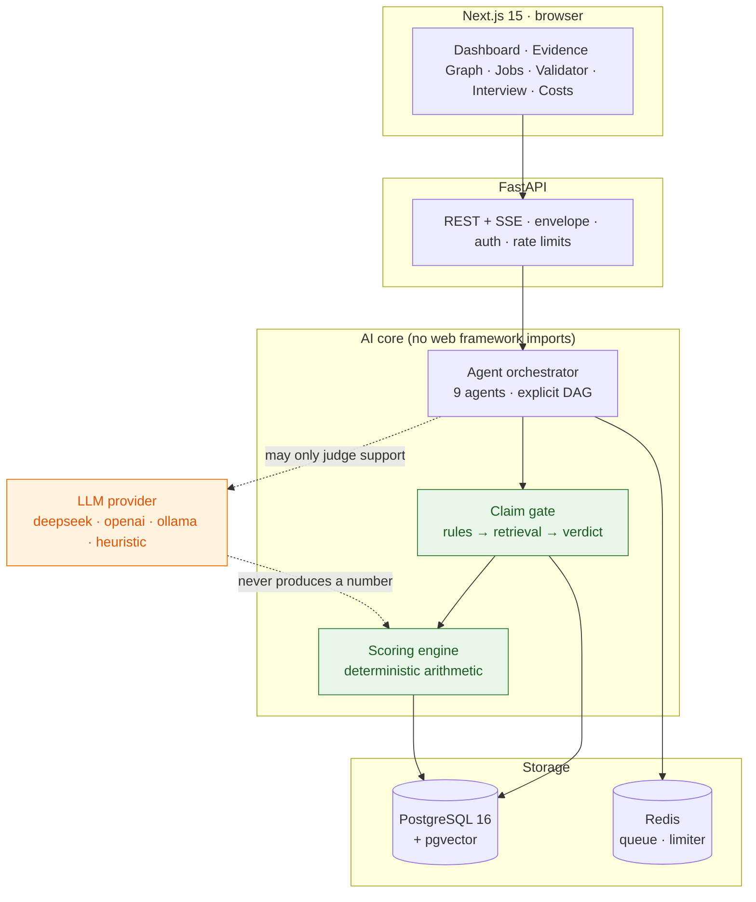
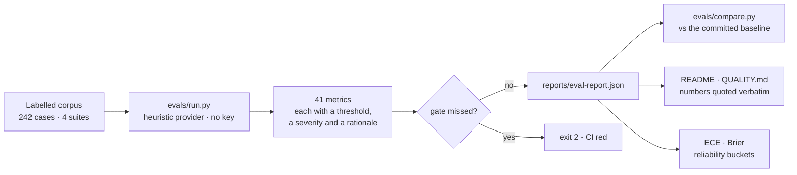

# Portfolio material

Written to be copied: résumé bullets, STAR stories, and two diagrams that fit on a slide. Every
number here is reproduced by the commands at the bottom and lives in a committed artefact — if a
figure is not in `reports/`, it is not in this file. Spoken versions of the same material are in
[`INTERVIEW.md`](./INTERVIEW.md).

---

## 1. One-line summary

> **CareerForge AI** — an evidence-first career platform: it assembles a candidate's own material into
> an evidence graph, then gates every AI-generated sentence against it, so a résumé cannot claim more
> than the evidence supports.

## 2. Résumé bullets

Pick four; each is either a capability or a measurement, never an adjective.

- Built a full-stack AI product from zero — **1,385 automated tests** (553 AI-core, 400 API, 365
  component, 45 browser end-to-end, 22 metric), **92.5%** core-domain coverage — on a stack of
  Next.js 15, FastAPI, PostgreSQL/pgvector and a framework-free Python AI core.
- Designed a **claim-verification gate** that decides supported / partially-supported / unsupported
  from rules plus retrieval, with the model allowed to judge only _support_: fabricated-number
  acceptance **0.000**, unsafe acceptance **0.050** (down from 0.100 measured before the evaluation
  found two policy defects).
- Built an **evaluation harness** (4 labelled suites, 242 cases, 41 metrics with declared gates and
  rationales) that runs on a deterministic zero-key provider — the whole suite and every end-to-end
  flow run in CI **without an API key or a paid token**.
- Made explainability structural rather than cosmetic: every score is deterministic arithmetic with
  a named formula version, every AI response carries its provider, degradation state and evidence
  trace, and cost accounting is a first-class surface (real token counts, with `null` rather than `0`
  where a vendor reports nothing).
- Ran the project as a **release process**: a 7-step release proof on the native path, a browser suite
  covering accessibility (0 critical / 0 serious, axe, 5 pages × 2 viewports) and horizontal overflow
  at 375/768/1440, and a published release record that names what could not be proved.

## 3. STAR stories

### S1 — The gate that refuses to write fiction

- **Situation.** An LLM writes convincing résumé bullets. The failure that matters is not a clumsy
  sentence; it is a well-written claim the candidate cannot back up, in their own voice, on a document
  they send to employers.
- **Task.** Make it impossible for the system to assert more than the evidence supports — and be able
  to _prove_ that, not assert it.
- **Action.** Built a deterministic decision layer: rule blockers (unquantified superlatives, numbers
  with no quantitative evidence, technologies absent from the taxonomy) run **before** the model is
  consulted; the model may only judge support; confidence is computed by arithmetic with a versioned
  formula. Built a 60-case hand-authored adversarial corpus (fabricated metrics, inflation, vague
  magnitude, out-of-scope claims) to measure it.
- **Result.** Fabricated-number acceptance **0.000**; unsafe acceptance **0.100 → 0.050**; unsupported
  recall **0.350 → 0.935**. The measurement itself found two real defects in the decision policy
  (scope-inflated claims granted _supported_; a model-reported blocker softened by the mere presence
  of retrieval hits), both fixed and regression-tested. The residual 5% is published with its two
  cases named.

### S2 — When the number was the bug

- **Situation.** The job-match score has an "evidence" dimension whose entire purpose is to measure
  how much of a posting the candidate's evidence covers.
- **Task.** Find out why a candidate who satisfied five requirements — each with evidence behind it —
  scored **0.00** on that dimension.
- **Action.** Traced it to the dimension being computed over _highlighted_ skills (those clearing a
  0.5 level) rather than over satisfied requirements; wrote a regression test for the ordinary shape
  (one piece of evidence, moderate level).
- **Result.** Evidence dimension **0.0 → 87.0**, total score **11.56 → 20.26**. The same pattern
  recurred twice more (a matcher reading a list it had already filtered; a decomposition being
  computed and then dropped from the response), and each time the fix was a test that fails without it.

### S3 — Four test layers, and the bugs only one of them could see

- **Situation.** The project passed a 25-check API smoke suite and hundreds of unit tests while the
  product was, in the browser, broken in ways no test could see.
- **Task.** Work out which layer can catch which class of defect, and put a gate where it counts.
- **Action.** Split the suite by _what only that layer can observe_: pure arithmetic (AI core),
  the contract as shipped (API integration), rendering rules (components), and the browser (Playwright
  with a real Chrome, real CORS, real session). Then made the browser checks gates rather than
  reports.
- **Result.** Each layer caught something the others structurally could not: CORS blocked every
  browser call while the Node smoke suite passed 25/25; a drawer rendered _below_ its own backdrop
  looked perfect in jsdom and swallowed every mobile tap; a table at 375 px pushed the columns the
  page existed for off-screen; and at release the browser suite found a rate limiter charging page
  _reads_ to the model-spend budget — 33 requests against a bucket of 20, ten of them reads.

### S4 — Shipping a release candidate, and refusing to fake the last step

- **Situation.** The project was code-complete and the temptation was to put a live demo URL in the
  README.
- **Task.** Release only what could be proved, on a machine with no container runtime, no PostgreSQL,
  no Redis and no cloud credentials.
- **Action.** Built a release proof that runs the whole free path end to end (fresh database →
  migrations → seed twice → production-mode API → built frontend → contract smoke → restart), with a
  `NOT RUN` table that names each step the machine cannot execute **and why**, and a release record
  that keeps that table intact. Wrote the release-readiness report as the artefact a reviewer reads:
  blockers found, proof, weaknesses, and an explicit `DEPLOYMENT BLOCKED` with the four commands that
  close it.
- **Result.** 7/7 proof steps, 45/45 browser flows, all four evaluation gates passing, coverage 92.5% —
  and no live URL claimed anywhere, because `docker compose up` has never run here.

## 4. Slide diagrams

**Architecture, one slide.** Deliberately six boxes: the point of the design is which arrow is
allowed to produce a number.



Green boxes produce numbers deterministically; the orange box never does. That single rule is
ADR-014, and it is what makes every figure on the dashboard reproducible.

**The evaluation loop, one slide.** What makes the claims checkable rather than assertable.



## 5. What I say about the weaknesses

Rehearsed, because an interviewer will ask and hedging reads worse than a fact:

> "Four things are weak and I know the numbers. The unsafe support rate is 5% against a target of 2% —
> two vague claims with no keyword to anchor a rule. Keyword-only retrieval beats my hybrid at Hit@5
> (0.983 vs 0.966) and I did not tune the fusion weights, because choosing them to win on 59 queries
> is fitting the corpus. There is no durable vector index and no load test. And deployment is blocked:
> the image path has never run, so the README has no live URL and the release is a candidate, not a
> release."

## 6. Reproducing every number here

```bash
python evals/run.py                      # → reports/eval-report.json, confidence-calibration.md
python scripts/coverage_report.py        # → reports/coverage-summary.md
python scripts/release_proof.py          # → reports/release-proof.json (7 steps)
pytest packages/ai apps/api evals -q     # 975 Python tests
pnpm --filter @careerforge/web test      # 365 component tests
pnpm --filter @careerforge/web test:e2e  # 45 browser flows
```
