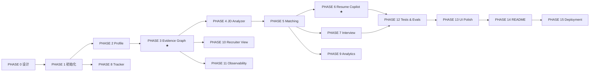

# CareerForge AI · 开发路线图

| 字段 | 值 |
|---|---|
| 文档版本 | v1.0 |
| 总阶段数 | 16（PHASE 0 – PHASE 15） |
| 关联 | [PRD.md](./PRD.md) · [ARCHITECTURE.md](./ARCHITECTURE.md) · [DECISIONS.md](./DECISIONS.md) |

---

## 0. 每阶段的 Definition of Done（强制门禁）

> 任何阶段未跑完以下 8 步，**不得**进入下一阶段。

| # | 门禁 | 具体动作 |
|---|---|---|
| 1 | **能跑** | 按 README 的 Quick Start 从零启动，无手工修补 |
| 2 | **类型干净** | `pnpm typecheck` 零错误；`mypy packages/ai apps/api` 零错误 |
| 3 | **Lint 干净** | `pnpm lint` + `ruff check` + `ruff format --check` 零告警 |
| 4 | **测试通过** | `pytest` 与 `vitest` 全绿；新增功能必须有测试 |
| 5 | **API 可验** | 关键端点用 `curl`/HTTP 文件实测，响应符合信封规范 |
| 6 | **页面可看** | 相关页面在 1440 / 1024 / 768 / 375 四档实际检查 |
| 7 | **文档同步** | README / 对应 docs 更新到与代码一致 |
| 8 | **提交** | `feat:`/`fix:`/`docs:`/`refactor:`/`test:` 规范化提交 |

**阶段汇报格式（固定）**

```
DONE    — 本阶段完成了什么（可验证的事实）
CHANGED — 新增/修改的关键文件与模块
TESTED  — 实际执行的命令与结果（真实输出，不臆造）
NEXT    — 下一阶段目标
```

---

## 1. 阶段总览

| Phase | 名称 | 核心产出 | 状态 |
|---|---|---|---|
| 0 | 产品设计 | 7 篇设计文档 + 目录树 + Git 仓库 | ✅ 完成 |
| 1 | 项目初始化 | Monorepo、FastAPI/Next 骨架、DB、迁移、Docker、Auth | 🔄 进行中 |
| 2 | Candidate Profile | 文件解析、结构化抽取、技能归一化、种子数据（Agent 层已完成） | 🔄 进行中 |
| 3 | **Evidence Graph** | 证据模型、置信度引擎、图谱 API 与可视化（RAG 核心已完成） | 🔄 进行中 |
| 4 | JD Analyzer | JD 结构化解析、技能树、解析基准 | ⬜ |
| 5 | Job Matching | 五维可解释评分 + Why 展开 + Gaps/Unknowns（引擎与 Agent 已完成） | 🔄 进行中 |
| 6 | Resume Copilot | 生成 + 验证门禁 + Diff + 版本管理（Agent 已完成） | 🔄 进行中 |
| 7 | Interview Simulator | 六模式、自适应难度、Scorecard、证据一致性（Agent 已完成） | 🔄 进行中 |
| 8 | Application Tracker | 看板、拖拽、事件历史、Timeline | ⬜ |
| 9 | Career Analytics | 漏斗、比率、技能相关性、类别表现 | ⬜ |
| 10 | Recruiter View | 公开页、证据交互、隐私控制、PII 脱敏（RecruiterAgent 待实现） | ⬜ |
| 11 | AI Observability | AI Runs、成本看板、缓存、Prompt Registry | ⬜ |
| 12 | Tests & Evals | 单测/集成/E2E + 评测框架与真实报告 | ⬜ |
| 13 | UI Polish | 四档响应式、A11y、动效、三态、Command Palette | ⬜ |
| 14 | README & 材料 | README、截图、GIF、面试材料包、社区文件 | ⬜ |
| 15 | Deployment | Docker 全链路、云端部署、Release v1.0.0 | ⬜ |

---

## 2. 阶段详细定义

### PHASE 0 · 产品设计 ✅

| 项 | 内容 |
|---|---|
| **产出** | `docs/PRD.md`、`docs/ARCHITECTURE.md`、`docs/DATABASE.md`、`docs/API.md`、`docs/UI.md`、`docs/ROADMAP.md`、`docs/DECISIONS.md`；完整目录树；Git 仓库初始化 |
| **退出标准** | 文档互相引用且术语一致（evidence / claim / confidence / match score）；32 张表与端点清单齐备；ADR 覆盖全部关键技术选型 |
| **风险** | 文档与实现漂移 → 每阶段结束必须回写文档（门禁 7） |

### PHASE 1 · 项目初始化

| 项 | 内容 |
|---|---|
| **产出** | pnpm workspace + Turborepo；`apps/web`（Next.js 15 + TS strict + Tailwind v4 + shadcn 基础件 + 主题切换 + AppShell）；`apps/api`（FastAPI 工厂 + 中间件链 + 信封 + 全局异常 + 配置 + 日志）；SQLAlchemy 2.0 async + Alembic 首版迁移；JWT 认证 + Demo 登录；`docker-compose.yml`（6 服务）；`/system/health`；CI 骨架 |
| **关键决策** | ADR-001/002/003/004/010/011/015/019/022 |
| **退出标准** | `docker compose up`（有 Docker）与零依赖本地路径（无 Docker）**双路径**都能启动；`POST /auth/demo` 返回 token；前端能登录进 AppShell；`/system/health` 全绿；CI 绿 |
| **验证命令** | `pnpm -r typecheck`、`pytest tests/api/test_health.py`、`alembic upgrade head`、`curl /api/v1/system/health` |

### PHASE 2 · Candidate Profile

| 项 | 内容 |
|---|---|
| **产出** | 文件上传（MIME+魔数校验）→ 解析（PDF/DOCX/MD/TXT）→ 分块 → `ProfileAgent` 结构化抽取 → 技能归一化 → 入库；`TaskProgressStream` 五阶段进度；Profile 页面（含内联编辑）；技能词典（`skill_taxonomy.py` + SQL 双源一致）；种子数据生成器（Alex Chen） |
| **关键决策** | ADR-009（heuristic provider 优先实现，保证零 Key 可跑）、ADR-020（种子自洽断言） |
| **退出标准** | 上传真实 PDF 简历能抽出教育/实习/项目/技能；抽取结果 100% 通过 Pydantic 校验；无 LLM Key 时走 heuristic 仍产出结构合法结果；`make seed` 后 Dashboard 有数据 |
| **验证命令** | `pytest tests/api/test_profile_import.py`、`python scripts/seed.py --reset` |

### PHASE 3 · Evidence Graph ★

| 项 | 内容 |
|---|---|
| **产出** | `evidence` / `evidence_links` 完整实现；`EvidenceAgent` + `graph` 模块；**置信度引擎**（五因子公式 + DB CHECK 约束）；图谱构建（含 GitHub 证据接入）；`GET /evidence-graph` 子图查询；React Flow 画布 + `EvidenceDrawer`（含置信度子项拆解）+ 过滤/布局/导出；移动端列表降级；`/app/evidence` 列表页 |
| **关键决策** | ADR-005（邻接表）、ADR-013（DB 级公式约束） |
| **退出标准** | 种子数据生成 ≥ 150 证据 / ≥ 400 边；图谱 1000 节点首屏 ≤ 2s；点击技能能展开到文件与 commit；置信度可由 SQL 公式复现；单测覆盖置信度全部分支 |
| **验证命令** | `pytest packages/ai/tests/test_evidence_confidence.py`、`curl "/evidence-graph?focus=skill:stm32&depth=2"` |
| **风险** | 图规模导致前端卡顿 → 服务端预聚合 + 节点上限 + 虚拟化 |

### PHASE 4 · JD Analyzer

| 项 | 内容 |
|---|---|
| **产出** | `JobAgent`；JD 结构化解析（含 HTML/脏文本清洗）；技能抽取 + 归一化 + 原文出处定位；`job_skills` 三层（required/preferred/bonus）；`JDSkillTree` 组件；`/app/jobs/new` 流式构建体验 |
| **退出标准** | 自建 **100+ 条标注 JD 数据集**（真实来源，含中文/英文/中英混排）；关键字段抽取准确率 ≥ 85% 并输出到 `reports/eval-report.json`；脏输入不崩且有降级路径 |
| **验证命令** | `python evals/run.py --suite jd_extraction` |

### PHASE 5 · Job Matching

| 项 | 内容 |
|---|---|
| **产出** | `scoring/` 五维引擎（skill/experience/project/education/evidence）；`MatchAgent`；`job_matches` 持久化（含 `why` 完整拆解）；`MatchScorePanel` + `WhyBreakdown` + `StrengthsGapsList`；`/app/jobs/[id]` 详情页 |
| **关键决策** | ADR-006（确定性评分，LLM 不参与数值） |
| **退出标准** | 同输入两次运行分数**完全一致**（有测试断言）；每个分数可展开到公式与证据 id；`unknown` 与 `gap` 语义分离且有测试；种子 12 个岗位分数分布合理（含 1 个低分案例） |
| **验证命令** | `pytest tests/api/test_job_match.py -k determinism` |

### PHASE 6 · Resume Copilot ★

| 项 | 内容 |
| --- | --- |
| **产出** | `ResumeAgent`（bullet 级改写）+ `ValidatorAgent`（Claim 验证）；**Hallucination Gate**（规则层 + LLM 层 + 门禁）；`resume_versions` / `resume_claims` / `claim_validations`；`ResumeDiffView`（接受/拒绝/仅接受 Supported）；`/app/validator` 独立页；导出 MD |
| **关键决策** | ADR-014（规则先于 LLM：数字断言无支撑直接拒绝） |
| **退出标准** | 数字断言（`70%` 类）在无量化证据时 **100% 被拒绝**（评测集断言）；`integrity_score` 与 claim 统计一致；Unsupported 必须给出安全改写；导出内容与页面一致 |
| **验证命令** | `python evals/run.py --suite claim_validation`、`pytest tests/api/test_resume_gate.py` |

### PHASE 7 · Interview Simulator

| 项 | 内容 |
|---|---|
| **产出** | `InterviewAgent`（六模式 + 难度状态机 L1→L2→L3）；出题计划基于 JD+证据图谱；SSE 流式；`interviews` / `interview_messages`；`ChatTranscript`（含层级徽章）；`InterviewScorecard` 七维雷达 + 逐题复盘 + **证据一致性检测**；`/app/interview/*` 三页 |
| **关键决策** | ADR-016（SSE） |
| **退出标准** | 一场完整技术面试可跑通并生成报告；难度确实随回答变化（`difficulty_start ≠ difficulty_end` 有测试）；题目包含项目/证据相关问题（非通用题库）；面试中断后可恢复（`in_progress` 状态） |
| **验证命令** | `pytest tests/integration/test_interview_flow.py` |

### PHASE 8 · Application Tracker

| 项 | 内容 |
|---|---|
| **产出** | `applications` / `application_events` CRUD；`KanbanBoard`（dnd-kit，乐观更新 + 回滚 + 键盘可操作）；`/app/applications`；`career_events` 写入；移动端列表视图 |
| **退出标准** | 拖拽后刷新状态持久；失败自动回滚且有 Toast；键盘可完成一次拖拽（a11y 断言）；状态变更全部有事件记录 |

### PHASE 9 · Career Analytics

| 项 | 内容 |
|---|---|
| **产出** | 漏斗（自定义 SVG）、核心比率、技能相关性（含样本量）、类别表现、时间趋势；`/app/analytics` |
| **退出标准** | 漏斗数字与 `applications`/`application_events` 实际数据**完全吻合**（有集成测试比对）；`n < 5` 显示"样本不足"；`range` 切换正确 |

### PHASE 10 · Recruiter View

| 项 | 内容 |
|---|---|
| **产出** | `public_profiles`；`RecruiterAgent`；`/candidate/[slug]` 公开页（无登录）；技能点击就地展开证据；隐私逐项开关；PII 扫描与脱敏；分享链接与卡片 |
| **退出标准** | 未登录可访问；公开页不含任何 PII（自动化断言：邮箱/手机号正则扫描通过）；未发布时返回 404；被设为私有的技能不出现 |

### PHASE 11 · AI Observability

| 项 | 内容 |
|---|---|
| **产出** | `agent_runs` / `llm_calls` 全链路落库；`/app/ai-runs` 表格 + 步骤链下钻；`/app/costs` 成本看板；三级缓存（LLM/Embedding/Tool）+ 命中率；**Prompt Registry**（加载 `prompts/` + 版本 + 哈希 + DB 同步）；预算护栏 + 自动降级 |
| **关键决策** | ADR-012（Prompt 外置版本化） |
| **退出标准** | 任一次 AI 操作都能在 AI Runs 页找到对应 trace，token/成本/延迟非零；缓存二次运行命中率可见；改 Prompt 内容后版本号递增且 run 记录能归因到具体版本 |

### PHASE 12 · Tests & Evals

| 项 | 内容 |
|---|---|
| **产出** | 后端单测 ≥ 120；集成测试覆盖 8 个关键流程；Vitest 组件测试；Playwright E2E 覆盖 5 条主链路；`evals/` 框架 + 4 个评测套件（JD 抽取 / Claim 验证 / 检索 Recall@5 / 面试题相关性）；`reports/eval-report.json` |
| **退出标准** | 全部测试本地通过；核心域行覆盖 ≥ 75%；**`no-llm` 任务**（关闭所有 Key）全绿；评测报告含真实样本量与指标，未达标项如实标注 |
| **验证命令** | `pytest --cov`、`pnpm test`、`pnpm e2e`、`python evals/run.py` |

### PHASE 13 · UI Polish

| 项 | 内容 |
|---|---|
| **产出** | 四档响应式全页验收并修复；A11y 审计（键盘/ARIA/对比度/焦点）；动效统一；三态覆盖检查；Command Palette + Global Search；Error Boundary；主题 Light/Dark 并行打磨 |
| **退出标准** | 每页 1440/1024/768/375 无横向滚动、无截断、无重叠；`axe` 无 critical 违规；`prefers-reduced-motion` 生效；灯光主题无对比度失败 |

### PHASE 14 · README & 材料

| 项 | 内容 |
|---|---|
| **产出** | README（含徽章、Live Demo、截图、GIF、架构、功能、Quick Start、API、Testing、Security、Roadmap、Engineering Decisions、Limitations、Contributing）；`docs/INTERVIEW.md`（面试讲法：60 秒 / 3 分钟 / 5 分钟 Deep Dive / HR 版 / 技术版 / 可能问题与参考答案）；简历项目描述（STAR，仅使用真实数据）；幻灯片友好版架构图 |
| **退出标准** | README 第一屏 30 秒内能看懂"这是什么 + 为什么不一样"；所有数字来自真实产物；GIF ≤ 3MB 且能展示核心交互 |

### PHASE 15 · Deployment

| 项 | 内容 |
|---|---|
| **产出** | 多阶段 Dockerfile（web/api）；`docker-compose.yml` 全链路实测；部署配置（Vercel / Render 或 Railway / Neon 或 Supabase / Upstash）；`docs/DEPLOYMENT.md`；CHANGELOG + Release `v1.0.0` + Release Notes；GitHub About / Topics |
| **退出标准** | 线上 Demo 可访问且 Demo 账号数据完整；`docker compose up` 在本机（若可用）成功；镜像构建进 CI；发布说明与实际功能一致 |

---

## 3. 依赖关系



**关键路径**：`PHASE 0 → 1 → 2 → 3 → 4 → 5 → 6 → 12 → 13 → 14 → 15`
**可并行**：PHASE 8（依赖 1）、PHASE 10 / 11（依赖 3）

---

## 4. 全局风险登记

| 风险 | 概率 | 影响 | 缓解 |
|---|---|---|---|
| 无 Docker / 无 PostgreSQL 环境 | 高 | 部署路径无法本地验证 | 双路径架构（ADR-004/010）；CI 用 service container 验证 Postgres 路径 |
| 无 LLM API Key | 高 | AI 功能无法演示 | heuristic provider 一等公民；`no-llm` CI 任务 |
| GitHub API 限流 | 中 | GitHub 模块不可用 | 缓存 + 退避 + 内置离线快照 fixture |
| 范围过大导致半成品 | 中 | 交付不完整 | 严格 Phase 门禁；每阶段必须可运行可测试 |
| 文档与实现漂移 | 中 | 面试翻车 | 门禁 7：每阶段回写文档；CI 校验 OpenAPI 契约漂移 |
| 数值指标无法达标 | 中 | 简历/README 数据不实 | 如实标注未达标项；优化迭代而非编造 |
| 前端图谱性能 | 中 | 演示卡顿 | 服务端预聚合 + 节点上限 + 虚拟化 + 移动端降级 |
| 时间不足 | 中 | 后期阶段压缩 | 优先级：PHASE 3/5/6/7 为不可裁剪核心；PHASE 8–11 可简化；P2 加分项随时可弃 |

---

## 5. 明确的可裁剪项（时间不足时）

| 优先级 | 项 |
|---|---|
| **不可裁剪** | Evidence Graph、JD 分析、可解释匹配、Claim Validator、Resume Copilot 门禁、面试 Simulator、Docker、README、测试与评测 |
| **可简化** | Analytics 高级图表（保留漏斗与比率）、AI 成本看板（保留 AI Runs）、Recruiter View 视觉打磨、Project Deep Dive 深度 |
| **可放弃** | FR-19 全部加分项（浏览器插件 / VS Code 插件 / GitHub App / Career Memory）、PDF 导出、i18n 完整实现、`agent_runs` 分区 |

---

## 6. 进度日志

> 日期与提交均取自 `git log`；「关键结果」只写可复现的实测数字。

| 日期 | 阶段 | 提交 | 关键结果 |
|---|---|---|---|
| 2026-09-24 | PHASE 0 | `docs: add phase 0 product and architecture design` | 7 篇设计文档（PRD / 架构 / 数据库 / API / UI / 路线图 / 22 条 ADR）+ 仓库骨架 |
| 2026-09-24 | PHASE 1a | `feat(ai): add deterministic AI core (orchestrator, providers, scoring)` | `packages/ai` 62 文件：自研 DAG 编排器 + 4 个 Provider 实现（含零 Key 的 heuristic）+ 确定性评分引擎 + 10 个版本化 Prompt |
| 2026-09-24 | PHASE 1b | `refactor(ai): split oversized modules; add architecture guard scripts` | 三个守卫脚本（分层 / 500 行 / 设计令牌）进入 pre-commit 与 CI；CI 双路径（SQLite + PostgreSQL）；docker-compose 六服务 |
| 2026-09-24 | PHASE 1c | `feat(web,evals): scaffold Next.js app and add a measured benchmark` | 前端 83 文件 typecheck / lint / build 全绿；评测框架实测出 100% distractor 泄漏与 13.3% 断言误判，修复后均为 0 |
| 2026-09-24 | PHASE 3a | `feat(rag): hybrid retrieval with RRF, and a third measured suite` | 标题感知分块 + BM25 + RRF(k=60) + 精确向量检索；Recall@5 **0.966**、MRR **0.901**（59 条标注查询） |
| 2026-09-24 | PHASE 3b | `feat(graph): evidence graph builder, subgraph queries and provenance tracing` | 证据图谱引擎（两遍置信度、独立来源 corroboration、子图查询、断言溯源）；修复「文件扩展名被当作技能」的真实缺陷 |
| 2026-09-24 | PHASE 4a | `feat(agents): JobAgent and ValidatorAgent, plus the shared claim-rule layer` | WF-03 JD 解析 + WF-06 断言门禁；抽出共享 claim 规则层；修复空输入时「从 prompt 模板里提取技能」的静默错误 |
| 2026-09-24 | PHASE 5a | `feat(agents): MatchAgent with a narrative that cannot alter the score` | WF-04 可解释匹配；叙述 schema 不含任何数值字段，结构上无法篡改分数 |
| 2026-09-24 | PHASE 2a | `feat(agents): ProfileAgent and EvidenceAgent complete the ingest path` | WF-01 简历导入、WF-02 材料转证据；修复标题行残余被当作正文的缺陷；重装可编辑安装以消除陈旧副本 |
| 2026-09-24 | PHASE 6a | `feat(agents): ResumeAgent — every generated bullet passes the gate` | WF-05 简历 Copilot：每条 bullet 过门禁，被拦截的断言附具体补证建议；修复「无检索器时全部判为无证据」与「verdict 忽略直接传入证据」两个缺陷 |
| 2026-09-24 | PHASE 8a | `feat(agents): CoachAgent — every gap ends in a provable artefact` | WF-08 技能缺口 → 学习计划；每个缺口必须产出可验证的 mini project；修复 horizon 未通过结构化通道传递的缺陷 |
| 2026-09-24 | PHASE 7a | `feat(agents): InterviewAgent — adaptive interview with a measured scorecard` | WF-07 三段工作流；难度阶梯为纯函数可边界测试；证据一致性由集合比较得出；修复 7 处真实缺陷 |
| 2026-09-24 | PHASE 7b | `refactor(agents): split interview into a package` | `interview.py` 854 行超限 → 拆为 plan / turns / scorecard / agent；用行为断言替换了一个读取源码文本的假测试 |
| 2026-09-24 | PHASE 10a | `feat(agents): RecruiterAgent and the PII layer — the public evidence page` | 公开页只链接陌生人可打开的material；PII 在投影时脱敏而非入库时 |
| 2026-09-24 | PHASE 1d | `feat(api): FastAPI application — contract, auth, middleware and persistence` | 信封 / 错误码 / 请求 ID / 限流 / 幂等队列；170 测试通过；ruff 与 mypy 全绿 |
| 2026-09-24 | PHASE 1e | `feat(api): expose the agent layer over HTTP` | 9 个 Agent 全部经 HTTP 暴露；真实启动服务并 curl 验证信封 / 404 / 401 / Demo 登录 / 面试会话全链路 |
| 2026-09-24 | PHASE 7c | `fix(ai): stop the interviewer repeating its opening question` | 真实 HTTP 请求暴露三处缺陷：追问复读开场问题、confidence 维度恒为 0、改写后残留悬空的度量动词；`safer_rewrite_rate` 实测由 **0.489 → 0.622** |
| 2026-09-24 | PHASE 12a | `fix(ai): make mypy --strict pass across the AI core` | 默认配置 51 个类型错误 + strict 专属 8 个全部清零；顺带修掉 3 个潜在缺陷（`Mapping`/`dict` 逆变、naive datetime 静默强制转换、不可达回退分支）；`ci` 提交移除 `continue-on-error` |
| 2026-09-24 | PHASE 2b | `feat(api): persist uploaded documents and parse them in the worker` | 见下方「PHASE 2 实测问题记录」 |
| 2026-09-24 | PHASE 3c | `fix(graph,scoring): three defects that only a persisted graph exposed` | 首次把图谱落库即暴露三处缺陷：手工证据被按「已上传文档」计分（0.80→0.55 自述档）、五类关系只有边没有可存储的 link（持久化后根节点整片丢失）、`include_orphans` 在传 `GraphQuery` 时被静默忽略 |
| 2026-09-24 | PHASE 3d | `feat(api): persist the evidence graph and serve it` | `evidence` / `evidence_links` + 迁移 `0003`；置信度公式成为数据库 CHECK；7 个端点（含同步的 `/documents/{id}/analyze`，幂等）；修掉 locator 蛇形命名与「摘要说 129 个节点、画布只有 10 个」两处契约缺陷 |
| 2026-09-24 | PHASE 4a | `feat(api): persist job postings and explainable matches` | `jobs` / `job_skills` / `job_matches` + 迁移 `0004`；7 个端点（解析、列表、详情、技能树、删除、匹配 POST/GET）；匹配五维加权之和等于总分（有断言），每次匹配留一行历史 |
| 2026-09-24 | PHASE 4b | `fix(scoring): measure the evidence dimension over met requirements` | 证据强度维度此前按**被高亮的技能**（effective ≥ 0.5）计算，导致「5 项要求命中、每项都有证据」的候选人该维度得 **0.00**；改为按命中的要求计算，实测 11.56 → 20.26 分（证据维度 0.0 → 87.0） |
| 2026-09-24 | PHASE 5a | `feat(api): implement GET /dashboard for the frozen client contract` | 前端自 PHASE 0 冻结的 `DashboardResponse` 契约终于有实现：六项指标全部由已存行推导；数据源尚不存在的三项（投递/面试/Offer）在 `meta.unavailable` 中具名而非静默为零；`meta.definitions` 随数字给出真实口径；`profileStrength` 来自确定性引擎 |
| 2026-09-24 | PHASE 5b | `test(web): run the real client against a live API` | 前端**首次真正连上后端**：`smoke:api` 用 `@careerforge/shared` 的真实客户端 + 运行时守卫打真实服务，7/7 通过（登录、dashboard 守卫、健康状态归一、证据图谱、岗位、匹配、404 信封）；`next build` 全绿并逐页 200；仪表盘新增「尚未接入」渲染 |
| 2026-09-24 | PHASE 2c | `feat(api): persist the career entities and read the real profile everywhere` | `educations` / `experiences` / `projects` / `achievements` / `profile_skills` + 迁移 `0005`；`POST /profile/import` 与 `GET /profile`；三个下游（图谱、匹配、仪表盘）改为读取真实画像。实测（全新库）：图 16 节点、**0 个占位节点**（此前 project/experience 全是 `project:de6dd367` 这类占位）；匹配 `skill` 0.0 → **39.16**、`evidence` 0.0 → **87.0**、总分 16.4 → **40.76**，缺口从 `['stm32','free_rtos','can']`（三个假缺口）修正为 `['autosar']` |
| 2026-09-24 | PHASE 6b | `feat(api): persist resume versions and claims; give the gate a retriever` | `resume_versions` / `resume_claims` / `claim_evidence` + 迁移 `0006`；`POST /resume/optimize`、`GET /resume/versions[/{id}]`、`POST /evidence/validate` 与 `/batch`（≤20）。真实服务实测：支持的句子 `partially_supported`（1 条来源，按设计不足以 corroborate）、编造的句子 `contradicted` 并给出 3 条规则依据与降级改写、每次改写逐条 gate 并落库 `integrity=0.5` |

> 后续每阶段完成后在此追加一行（时间 / 阶段 / 提交信息 / 关键可验证结果）。

### PHASE 1 实测问题记录（发现 → 修复）

| # | 问题 | 发现方式 | 结果 |
|---|---|---|---|
| 1 | 中文断言验证完全失效（分词被长度过滤清空） | 单元测试 | 修复 |
| 2 | 复合别名吞掉相邻技能（`UART DMA` 丢 UART） | 单元测试 | 修复 |
| 3 | 单字母技能 `c` 在 `balance`/`docker` 内误命中 | 单元测试 | 修复（词边界） |
| 4 | `Achievement.date` 字段名遮蔽 `date` 类型 | 导入即崩 | 修复 |
| 5 | `PromptRegistry.render(name=...)` 与变量 `name` 冲突 | 单元测试 | 修复（positional-only） |
| 6 | `compute_job_match` 重复累加权重 | 代码审查 | 修复 |
| 7 | 公司简介里的技术词被当作岗位要求 | **评测实测：泄漏率 100%** | 修复 → 0% |
| 8 | 一句话中缺失的技术名词未被当作硬约束 | **评测实测：误判率 13.3%** | 修复 → 0% |
| 9 | `C++11` 被判为"证据中不存在 C++" | 新回归测试 | 修复（版本后缀归一化） |
| 10 | 公司简介里的早期提及吞掉任职要求里的合法提及 | 新回归测试 | 修复（`dedupe=False`） |
| 11 | fresh clone 的首次 `pnpm install` 失败 | 前端构建者报告 | 修复（显式批准 1 个依赖构建脚本） |
| 12 | 我自己写的三个文件超过 500 行 | 自建守卫脚本 | 拆分而非豁免 |

### PHASE 2 实测问题记录（发现 → 修复）

上传一份真实简历、经队列解析、再读回证据链，这条路径上暴露的问题：

| # | 问题 | 发现方式 | 结果 |
|---|---|---|---|
| 1 | 请求事务未提交就入队，worker 读不到刚写入的 `documents` 行；SQLite 上第二个连接直接 `database is locked` | 端到端 HTTP 测试 | 修复：入队前显式提交，并在注释中写明两个原因 |
| 2 | 任务处理器在**自己的写事务持有锁期间**再次上报进度，同样 `database is locked` | 端到端 HTTP 测试 | 修复：进度只在上报点之前写，`report` 自带独立连接 |
| 3 | 无法解析的文件类型被接受（202）后才在 worker 里失败 | 端到端 HTTP 测试 | 修复：`stage_upload` 先做格式校验 → 400 `UNSUPPORTED_FILE_TYPE` |
| 4 | `DELETE` 返回 204 却带 JSON 信封体（违反 RFC 9110 §6.4.1） | 端到端 HTTP 测试 | 修复：204/304 一律不套信封 |
| 5 | PDF 夹具用 latin-1 `replace` 编码，中文静默变成 `???`，会让断言假通过 | 自建夹具时发现 | 修复：夹具对非 ASCII 直接报错，中文覆盖交给 DOCX/TXT 路径 |
| 6 | `utf-8-sig` 解码无 BOM 的文件也自称 `utf-8-sig`（声称了一个不存在的 BOM） | 单元测试 | 修复：按实际字节报告编码 |
| 7 | 列表的 `status` 过滤在 `LIMIT` 之后做，页码与总数会互相矛盾 | 自查 | 修复：过滤下推到 SQL，`byKind` 改为一次 GROUP BY |
| 8 | 夹具字节在同一 session 的共享数据库里重复，导致第二个测试的上传被去重成空操作 | 测试间互相污染 | 修复：夹具字节每次唯一，并在文件头说明原因 |

### PHASE 3 实测问题记录（发现 → 修复）

把内存里的图谱第一次真正落库、并真实启动服务遍历它，暴露的问题：

| # | 问题 | 发现方式 | 结果 |
|---|---|---|---|
| 1 | 手工添加的证据被按 `UPLOADED_DOCUMENT` 档计分（0.80）——用户随手打字即可获得接近文档级的置信度，正是本产品要防的事 | 端到端 HTTP 测试 | 修复：改为自述档 0.55，并用「与上传文档的差值恰等于权威权重×档位差」的量化断言钉住 |
| 2 | 五类关系只 append 了 `GraphEdge` 而没有对应的 `EvidenceLink`：内存图看着完整，落库后根节点与全部教育/经历/成果节点消失 | 端到端 HTTP 测试（候选节点未出现） | 修复：补齐 5 处 link，并加不变量测试（边集合 == link 集合）防止再犯 |
| 3 | `include_orphans` 在传入 `GraphQuery` 时被静默忽略（该分支唯独漏了这个字段），而每次 API 调用都传 `GraphQuery` | 真实服务对照实验 | 修复：转发该字段；测试显式构造一个 build 不会产生的孤立节点 |
| 4 | `stats` 按全图计算，`nodes` 却是子图：UI 会在 10 个节点的画布上方显示「129 个节点」 | 真实服务对照实验 | 修复：`stats` 描述本次返回，`totals` 描述全图 |
| 5 | locator 把存储层的蛇形键（`char_start`）直接透出，其余字段全是 camelCase | 端到端 HTTP 测试 | 修复：显式建模 `LocatorResponse` 并在响应中归一 |
| 6 | 迁移里 `confidence` 与 `corroboration_count` 的列顺序与模型不一致 | 结构等价测试 | 修复：按 §3 DDL 的顺序显式声明 |
| 7 | 引擎按内容派生证据 id，数据库自己生成主键：只把 item.id 改写会让所有边指向无法 join 的节点 | 端到端 HTTP 测试（图缺边） | 修复：按 content_hash 建立映射并同时改写 link 两端与 edge 两端 |

### PHASE 4 实测问题记录（发现 → 修复）

| # | 问题 | 发现方式 | 结果 |
|---|---|---|---|
| 1 | 证据强度维度按**被高亮的技能**（effective level ≥ 0.5）计算，而不是按命中的要求：一个满足 5 项要求、且每项都有证据的候选人，在这个「专门用来衡量证据」的维度上得 0.00 | 真实服务端到端跑分（11.56 分，与 `evidenceUsed=1` 自相矛盾） | 修复：按命中要求计算；实测证据维度 0.0 → **87.0**，总分 11.56 → **20.26**；新增回归测试（单条证据 + MODERATE 等级这一最常见形态） |
| 2 | `_profile_of` 里写了 `if False else` 与一个未实现的 `select_profile` 桩函数 | 自查（写完后立即回看） | 重写：直接查询 `profiles`，技能声明由证据图反推 |
| 3 | 新插入的 `Job` 上读取 `skills` 关系会触发同步惰性加载，异步 ORM 直接抛 `MissingGreenlet`（500） | 端到端 HTTP 测试 | 修复：写入要求行后显式 `refresh(job, ["skills"])`，并在注释里写明原因 |
| 4 | 响应里的 `strengths`/`gaps`/`unknowns` 直接透出引擎的 snake_case 字典，与其余 camelCase 字段不一致（与 PHASE 3 的 locator 同类） | 端到端 HTTP 测试（KeyError: canonicalId） | 修复：改为三个显式响应模型 |
| 5 | `test_models.py` 因逐阶段追加断言而超过 500 行守卫 | 自建守卫脚本 | 拆分而非豁免：新的 `test_schema_inventory.py` 负责「模式声明了什么」，`test_models.py` 负责「数据库实际拦住了什么」 |
| 6 | 新加的租户键测试立刻抓到 `ai_caches` / `llm_calls` / `agent_runs` / `background_jobs` 的 `user_id` 可空 | 新测试 | 不是缺陷而是文档化例外（§2.11 系统级行）：把例外连同理由写进测试，而不是放宽断言 |

### PHASE 2b 实测问题记录（发现 → 修复）

结构化职业实体落库后，真实服务立刻暴露出两处**会给出错误结论**的缺陷：

| # | 问题 | 发现方式 | 结果 |
|---|---|---|---|
| 1 | **文档化的 CHECK 写不出抽取器自己的词汇**：§2.2 的 `origin` 只允许 `llm`/`user_corrected`/`import`，而 AI 核心的 `Origin` 枚举还包含 `heuristic`——零 Key 路径的产出来源。按文档写约束，heuristic 抽取的每一行都会违反约束；把它记成 `llm` 则是对来源的谎报 | 写服务时对照枚举发现 | 修复：三处（模型 / 迁移 / 文档）一致地加入 `heuristic` 并写明理由 |
| 2 | **「已声明且有证据」的技能被判为缺口**：声明行来自简历抽取，其 `evidence_count` 为 0，引擎的规则 2（声明但无证据 → 缺口）因此把 STM32/FreeRTOS/CAN 全部报成缺口——而图谱里它们各有 8 条证据。等于告诉候选人他们缺三样自己明明有的东西 | 真实服务端到端跑分（`gaps=['stm32','free_rtos','can']` 与 EVIDENCED_BY 边自相矛盾） | 修复：声明技能与证据图谱**并集合并**（保留声明等级、补上真实计数、补上有证据但未声明的技能）；实测 `skill` 0.0 → 39.16、`evidence` 0.0 → 87.0、总分 16.4 → 40.76，缺口修正为 `['autosar']` |
| 3 | **重复导入会重建实体行**：`_replace_*` 用 delete+insert，行的 UUID 随之改变，图谱中指向旧 UUID 的边全部失联，画布上出现 `project:de6dd367` 这种打不开的占位节点——而 `dedupe_key` 的存在意义正是跨导入识别同一实体 | 真实服务连续两次导入 + 图谱对照 | 修复：改为按 `dedupe_key` 就地更新（行身份稳定，边继续有效）；真被删除的实体连同其边一起删除。实测：第二次导入后图与分数与第一次**完全一致**、占位节点 0 |
| 4 | `profile_service.py` 触及 500 行守卫（两次：529 行、501 行） | 自建守卫脚本 | 两次都拆分而非豁免：行→schema 映射独立为 `profile_mapping.py`；`node_id_for_row` 归入同一模块（那里已是「行如何映射到身份」的归属地） |

### PHASE 6 实测问题记录（发现 → 修复）

| # | 问题 | 发现方式 | 结果 |
|---|---|---|---|
| 1 | **没有检索器时门禁不是降级而是全盘拒绝**：验证器缺 retriever 时检索阶段返回零命中，规则阶段读到空的 `evidence_text`，于是「使用 STM32 与 FreeRTOS 开发电机控制固件」被判 `skill_not_in_graph`——而图谱里这两个技能各有 8 条证据 | 真实服务端到端验证 | 修复：API 侧为门禁构建本项目自己的混合检索器（BM25 + 向量 + RRF，逐个用户按请求建立索引） |
| 2 | **规则阶段早于检索阶段**，且读的是调用方传入的 `evidence_text`。API 未传 → 每个技术名词都被判「证据中未出现」。协议本意是「持有材料的调用方直接提供」，API 没有履行 | 真实服务端到端验证（同一句同时出现「有引用」与「未出现该技能」的自相矛盾） | 修复：单条校验路径传入候选人材料（标题+片段，按置信度截断）。实测：该矛盾理由消失 |
| 3 | **API 的 bullet 字段名与引擎不符**：API 用 `original`（候选人原话，响应里回 `originalText`），引擎读 `text`。字段名不匹配使每个 bullet 在引擎眼中都是空文本，于是「没有可供改写的要点」——这是静默失败而非报错 | 单元级复现 + 真实服务 | 修复：服务层显式映射；并在注释里写明这是静默失败 |
| 4 | `integrity_score` / `claim_stats` 直接抄引擎字段，而该字段可能为空：版本摘要显示 `{}`，旁边却列着一串 claim | 端到端 HTTP 测试 | 修复：两个数字都由**本次实际落库的 claims** 计算，摘要与其内容不可能互相矛盾 |

### 已知限制（记录而未修复）

| # | 现象 | 判断 |
|---|---|---|
| 1 | 降级改写去掉谓词后，该分句只剩名词短语（`响应时间缩短了 40%，并完成了压测` → `响应时间，并完成了压测`） | 度量动词必须随数字一起删除（否则是断句），而规则无法诚实重建被删谓词的语法；保留分句交给候选人补完。**已修复**的是「残留悬空动词」，此项是修复后的残留观感 |
| 2 | 启发式抽取器对中文自由格式简历的分段不准确（`项目经历` 的第二行被当成第二个项目，描述行被当成一段经历） | 由 `origin=heuristic` 显式标注、可在 UI 上人工修正；分段器改进属于独立工作 |

### PHASE 6 第二轮：三条已知限制的处理结果

| # | 上一轮记录的限制 | 处理 |
|---|---|---|
| 1 | 降级改写把度量动词留在句中：`…提升了 300%，并主导了…` → `…提升了 ，并主导了…` | **修复**：`_DANGLING_MEASURE_RE` 的锚点由 `$` 改为 `(?=[，,；;、]|$)`，并在两个改写分支共用同一套清理（去掉悬空动词、动词留下的空格、重复标点）。同时新增规则：**若去掉数字后句子里仍残留证据无法支撑的技术名词，则不提供改写**——保留 Kubernetes/TensorFlow 两个名字、只删掉数字，等于断言同样无法支撑的内容，而且读者还看不出删了什么 |
| 2 | 编造的句子被判 `contradicted`，而没有任何证据反驳它 | **修复**：`contradicted` 现在只用于「证据确实与之冲突」（`timeline_conflict` 或模型报告的 `contradicting_evidence`）。规则层 blocker（无同类量化数据、技术名词缺失、最高级措辞）判为 `unsupported`——被拒绝，但不被诬指为已被反驳。附带效果：blocker 不再被 hits 软化（此前有命中时会退化成 `partially_supported`，等于给编造的数字贴一个更温和的标签），而 blocker 现在**允许**提供降级改写（删掉数字正是不支持数字的正确修法），`contradicted` 仍然不给 |
| 3 | 单条来源降级没有理由 | **修复**：状态为 `partially_supported` 且独立来源不足时，写入 `single_source_only` 理由（`目前只有 1 条独立来源；达到 2 条独立来源才能判为 supported。`） |

实测（全新库，真实服务）：编造句子的状态由 `contradicted` 变为 **`unsupported`** 且三条理由完整；受支持句子多出 `single_source_only` 说明；编造句子**不再提供**降级改写。评测指标**全部不变**：`numeric_rejection_rate 1.0000`、`over_support_rate 0.0000`、`safer_rewrite_rate 0.6222`、`support_recall 1.0000`——即三处修复只改变了「怎么说」，没有放松任何一条门槛。
