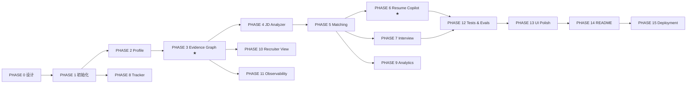

# CareerForge AI · 开发路线图

| 字段 | 值 |
|---|---|
| 文档版本 | v1.0 |
| 总阶段数 | 16（PHASE 0 – PHASE 15） |
| 关联 | [PRD.md](./PRD.md) · [ARCHITECTURE.md](./ARCHITECTURE.md) · [DECISIONS.md](./DECISIONS.md) |

---

## 0. 每阶段的 Definition of Done（强制门禁）

> 任何阶段未跑完以下 8 步，**不得**进入下一阶段。

| # | 门禁 | 具体动作 |
|---|---|---|
| 1 | **能跑** | 按 README 的 Quick Start 从零启动，无手工修补 |
| 2 | **类型干净** | `pnpm typecheck` 零错误；`mypy packages/ai apps/api` 零错误 |
| 3 | **Lint 干净** | `pnpm lint` + `ruff check` + `ruff format --check` 零告警 |
| 4 | **测试通过** | `pytest` 与 `vitest` 全绿；新增功能必须有测试 |
| 5 | **API 可验** | 关键端点用 `curl`/HTTP 文件实测，响应符合信封规范 |
| 6 | **页面可看** | 相关页面在 1440 / 1024 / 768 / 375 四档实际检查 |
| 7 | **文档同步** | README / 对应 docs 更新到与代码一致 |
| 8 | **提交** | `feat:`/`fix:`/`docs:`/`refactor:`/`test:` 规范化提交 |

**阶段汇报格式（固定）**

```
DONE    — 本阶段完成了什么（可验证的事实）
CHANGED — 新增/修改的关键文件与模块
TESTED  — 实际执行的命令与结果（真实输出，不臆造）
NEXT    — 下一阶段目标
```

---

## 1. 阶段总览

| Phase | 名称 | 核心产出 | 状态 |
|---|---|---|---|
| 0 | 产品设计 | 7 篇设计文档 + 目录树 + Git 仓库 | ✅ 完成 |
| 1 | 项目初始化 | Monorepo、FastAPI/Next 骨架、DB、迁移、Docker、Auth | 🔄 进行中 |
| 2 | Candidate Profile | 文件解析、结构化抽取、技能归一化、种子数据（Agent 层已完成） | 🔄 进行中 |
| 3 | **Evidence Graph** | 证据模型、置信度引擎、图谱 API 与可视化（RAG 核心已完成） | 🔄 进行中 |
| 4 | JD Analyzer | JD 结构化解析、技能树、解析基准 | ⬜ |
| 5 | Job Matching | 五维可解释评分 + Why 展开 + Gaps/Unknowns（引擎与 Agent 已完成） | 🔄 进行中 |
| 6 | Resume Copilot | 生成 + 验证门禁 + Diff + 版本管理（Agent 已完成） | 🔄 进行中 |
| 7 | Interview Simulator | 六模式、自适应难度、Scorecard、证据一致性（Agent 已完成） | 🔄 进行中 |
| 8 | Application Tracker | 看板、拖拽、事件历史、Timeline | ⬜ |
| 9 | Career Analytics | 漏斗、比率、技能相关性、类别表现 | ⬜ |
| 10 | Recruiter View | 公开页、证据交互、隐私控制、PII 脱敏（RecruiterAgent 待实现） | ⬜ |
| 11 | AI Observability | AI Runs、成本看板、缓存、Prompt Registry | ⬜ |
| 12 | Tests & Evals | 单测/集成/E2E + 评测框架与真实报告 | ⬜ |
| 13 | UI Polish | 四档响应式、A11y、动效、三态、Command Palette | ⬜ |
| 14 | README & 材料 | README、截图、GIF、面试材料包、社区文件 | ⬜ |
| 15 | Deployment | Docker 全链路、云端部署、Release v1.0.0 | ⬜ |

---

## 2. 阶段详细定义

### PHASE 0 · 产品设计 ✅

| 项 | 内容 |
|---|---|
| **产出** | `docs/PRD.md`、`docs/ARCHITECTURE.md`、`docs/DATABASE.md`、`docs/API.md`、`docs/UI.md`、`docs/ROADMAP.md`、`docs/DECISIONS.md`；完整目录树；Git 仓库初始化 |
| **退出标准** | 文档互相引用且术语一致（evidence / claim / confidence / match score）；32 张表与端点清单齐备；ADR 覆盖全部关键技术选型 |
| **风险** | 文档与实现漂移 → 每阶段结束必须回写文档（门禁 7） |

### PHASE 1 · 项目初始化

| 项 | 内容 |
|---|---|
| **产出** | pnpm workspace + Turborepo；`apps/web`（Next.js 15 + TS strict + Tailwind v4 + shadcn 基础件 + 主题切换 + AppShell）；`apps/api`（FastAPI 工厂 + 中间件链 + 信封 + 全局异常 + 配置 + 日志）；SQLAlchemy 2.0 async + Alembic 首版迁移；JWT 认证 + Demo 登录；`docker-compose.yml`（6 服务）；`/system/health`；CI 骨架 |
| **关键决策** | ADR-001/002/003/004/010/011/015/019/022 |
| **退出标准** | `docker compose up`（有 Docker）与零依赖本地路径（无 Docker）**双路径**都能启动；`POST /auth/demo` 返回 token；前端能登录进 AppShell；`/system/health` 全绿；CI 绿 |
| **验证命令** | `pnpm -r typecheck`、`pytest tests/api/test_health.py`、`alembic upgrade head`、`curl /api/v1/system/health` |

### PHASE 2 · Candidate Profile

| 项 | 内容 |
|---|---|
| **产出** | 文件上传（MIME+魔数校验）→ 解析（PDF/DOCX/MD/TXT）→ 分块 → `ProfileAgent` 结构化抽取 → 技能归一化 → 入库；`TaskProgressStream` 五阶段进度；Profile 页面（含内联编辑）；技能词典（`skill_taxonomy.py` + SQL 双源一致）；种子数据生成器（Alex Chen） |
| **关键决策** | ADR-009（heuristic provider 优先实现，保证零 Key 可跑）、ADR-020（种子自洽断言） |
| **退出标准** | 上传真实 PDF 简历能抽出教育/实习/项目/技能；抽取结果 100% 通过 Pydantic 校验；无 LLM Key 时走 heuristic 仍产出结构合法结果；`make seed` 后 Dashboard 有数据 |
| **验证命令** | `pytest tests/api/test_profile_import.py`、`python scripts/seed.py --reset` |

### PHASE 3 · Evidence Graph ★

| 项 | 内容 |
|---|---|
| **产出** | `evidence` / `evidence_links` 完整实现；`EvidenceAgent` + `graph` 模块；**置信度引擎**（五因子公式 + DB CHECK 约束）；图谱构建（含 GitHub 证据接入）；`GET /evidence-graph` 子图查询；React Flow 画布 + `EvidenceDrawer`（含置信度子项拆解）+ 过滤/布局/导出；移动端列表降级；`/app/evidence` 列表页 |
| **关键决策** | ADR-005（邻接表）、ADR-013（DB 级公式约束） |
| **退出标准** | 种子数据生成 ≥ 150 证据 / ≥ 400 边；图谱 1000 节点首屏 ≤ 2s；点击技能能展开到文件与 commit；置信度可由 SQL 公式复现；单测覆盖置信度全部分支 |
| **验证命令** | `pytest packages/ai/tests/test_evidence_confidence.py`、`curl "/evidence-graph?focus=skill:stm32&depth=2"` |
| **风险** | 图规模导致前端卡顿 → 服务端预聚合 + 节点上限 + 虚拟化 |

### PHASE 4 · JD Analyzer

| 项 | 内容 |
|---|---|
| **产出** | `JobAgent`；JD 结构化解析（含 HTML/脏文本清洗）；技能抽取 + 归一化 + 原文出处定位；`job_skills` 三层（required/preferred/bonus）；`JDSkillTree` 组件；`/app/jobs/new` 流式构建体验 |
| **退出标准** | 自建 **100+ 条标注 JD 数据集**（真实来源，含中文/英文/中英混排）；关键字段抽取准确率 ≥ 85% 并输出到 `reports/eval-report.json`；脏输入不崩且有降级路径 |
| **验证命令** | `python evals/run.py --suite jd_extraction` |

### PHASE 5 · Job Matching

| 项 | 内容 |
|---|---|
| **产出** | `scoring/` 五维引擎（skill/experience/project/education/evidence）；`MatchAgent`；`job_matches` 持久化（含 `why` 完整拆解）；`MatchScorePanel` + `WhyBreakdown` + `StrengthsGapsList`；`/app/jobs/[id]` 详情页 |
| **关键决策** | ADR-006（确定性评分，LLM 不参与数值） |
| **退出标准** | 同输入两次运行分数**完全一致**（有测试断言）；每个分数可展开到公式与证据 id；`unknown` 与 `gap` 语义分离且有测试；种子 12 个岗位分数分布合理（含 1 个低分案例） |
| **验证命令** | `pytest tests/api/test_job_match.py -k determinism` |

### PHASE 6 · Resume Copilot ★

| 项 | 内容 |
| --- | --- |
| **产出** | `ResumeAgent`（bullet 级改写）+ `ValidatorAgent`（Claim 验证）；**Hallucination Gate**（规则层 + LLM 层 + 门禁）；`resume_versions` / `resume_claims` / `claim_validations`；`ResumeDiffView`（接受/拒绝/仅接受 Supported）；`/app/validator` 独立页；导出 MD |
| **关键决策** | ADR-014（规则先于 LLM：数字断言无支撑直接拒绝） |
| **退出标准** | 数字断言（`70%` 类）在无量化证据时 **100% 被拒绝**（评测集断言）；`integrity_score` 与 claim 统计一致；Unsupported 必须给出安全改写；导出内容与页面一致 |
| **验证命令** | `python evals/run.py --suite claim_validation`、`pytest tests/api/test_resume_gate.py` |

### PHASE 7 · Interview Simulator

| 项 | 内容 |
|---|---|
| **产出** | `InterviewAgent`（六模式 + 难度状态机 L1→L2→L3）；出题计划基于 JD+证据图谱；SSE 流式；`interviews` / `interview_messages`；`ChatTranscript`（含层级徽章）；`InterviewScorecard` 七维雷达 + 逐题复盘 + **证据一致性检测**；`/app/interview/*` 三页 |
| **关键决策** | ADR-016（SSE） |
| **退出标准** | 一场完整技术面试可跑通并生成报告；难度确实随回答变化（`difficulty_start ≠ difficulty_end` 有测试）；题目包含项目/证据相关问题（非通用题库）；面试中断后可恢复（`in_progress` 状态） |
| **验证命令** | `pytest tests/integration/test_interview_flow.py` |

### PHASE 8 · Application Tracker

| 项 | 内容 |
|---|---|
| **产出** | `applications` / `application_events` CRUD；`KanbanBoard`（dnd-kit，乐观更新 + 回滚 + 键盘可操作）；`/app/applications`；`career_events` 写入；移动端列表视图 |
| **退出标准** | 拖拽后刷新状态持久；失败自动回滚且有 Toast；键盘可完成一次拖拽（a11y 断言）；状态变更全部有事件记录 |

### PHASE 9 · Career Analytics

| 项 | 内容 |
|---|---|
| **产出** | 漏斗（自定义 SVG）、核心比率、技能相关性（含样本量）、类别表现、时间趋势；`/app/analytics` |
| **退出标准** | 漏斗数字与 `applications`/`application_events` 实际数据**完全吻合**（有集成测试比对）；`n < 5` 显示"样本不足"；`range` 切换正确 |

### PHASE 10 · Recruiter View

| 项 | 内容 |
|---|---|
| **产出** | `public_profiles`；`RecruiterAgent`；`/candidate/[slug]` 公开页（无登录）；技能点击就地展开证据；隐私逐项开关；PII 扫描与脱敏；分享链接与卡片 |
| **退出标准** | 未登录可访问；公开页不含任何 PII（自动化断言：邮箱/手机号正则扫描通过）；未发布时返回 404；被设为私有的技能不出现 |

### PHASE 11 · AI Observability

| 项 | 内容 |
|---|---|
| **产出** | `agent_runs` / `llm_calls` 全链路落库；`/app/ai-runs` 表格 + 步骤链下钻；`/app/costs` 成本看板；三级缓存（LLM/Embedding/Tool）+ 命中率；**Prompt Registry**（加载 `prompts/` + 版本 + 哈希 + DB 同步）；预算护栏 + 自动降级 |
| **关键决策** | ADR-012（Prompt 外置版本化） |
| **退出标准** | 任一次 AI 操作都能在 AI Runs 页找到对应 trace，token/成本/延迟非零；缓存二次运行命中率可见；改 Prompt 内容后版本号递增且 run 记录能归因到具体版本 |

### PHASE 12 · Tests & Evals

| 项 | 内容 |
|---|---|
| **产出** | 后端单测 ≥ 120；集成测试覆盖 8 个关键流程；Vitest 组件测试；Playwright E2E 覆盖 5 条主链路；`evals/` 框架 + 4 个评测套件（JD 抽取 / Claim 验证 / 检索 Recall@5 / 面试题相关性）；`reports/eval-report.json` |
| **退出标准** | 全部测试本地通过；核心域行覆盖 ≥ 75%；**`no-llm` 任务**（关闭所有 Key）全绿；评测报告含真实样本量与指标，未达标项如实标注 |
| **验证命令** | `pytest --cov`、`pnpm test`、`pnpm e2e`、`python evals/run.py` |

### PHASE 13 · UI Polish

| 项 | 内容 |
|---|---|
| **产出** | 四档响应式全页验收并修复；A11y 审计（键盘/ARIA/对比度/焦点）；动效统一；三态覆盖检查；Command Palette + Global Search；Error Boundary；主题 Light/Dark 并行打磨 |
| **退出标准** | 每页 1440/1024/768/375 无横向滚动、无截断、无重叠；`axe` 无 critical 违规；`prefers-reduced-motion` 生效；灯光主题无对比度失败 |

### PHASE 14 · README & 材料

| 项 | 内容 |
|---|---|
| **产出** | README（含徽章、Live Demo、截图、GIF、架构、功能、Quick Start、API、Testing、Security、Roadmap、Engineering Decisions、Limitations、Contributing）；`docs/INTERVIEW.md`（面试讲法：60 秒 / 3 分钟 / 5 分钟 Deep Dive / HR 版 / 技术版 / 可能问题与参考答案）；简历项目描述（STAR，仅使用真实数据）；幻灯片友好版架构图 |
| **退出标准** | README 第一屏 30 秒内能看懂"这是什么 + 为什么不一样"；所有数字来自真实产物；GIF ≤ 3MB 且能展示核心交互 |

### PHASE 15 · Deployment

| 项 | 内容 |
|---|---|
| **产出** | 多阶段 Dockerfile（web/api）；`docker-compose.yml` 全链路实测；部署配置（Vercel / Render 或 Railway / Neon 或 Supabase / Upstash）；`docs/DEPLOYMENT.md`；CHANGELOG + Release `v1.0.0` + Release Notes；GitHub About / Topics |
| **退出标准** | 线上 Demo 可访问且 Demo 账号数据完整；`docker compose up` 在本机（若可用）成功；镜像构建进 CI；发布说明与实际功能一致 |

---

## 3. 依赖关系



**关键路径**：`PHASE 0 → 1 → 2 → 3 → 4 → 5 → 6 → 12 → 13 → 14 → 15`
**可并行**：PHASE 8（依赖 1）、PHASE 10 / 11（依赖 3）

---

## 4. 全局风险登记

| 风险 | 概率 | 影响 | 缓解 |
|---|---|---|---|
| 无 Docker / 无 PostgreSQL 环境 | 高 | 部署路径无法本地验证 | 双路径架构（ADR-004/010）；CI 用 service container 验证 Postgres 路径 |
| 无 LLM API Key | 高 | AI 功能无法演示 | heuristic provider 一等公民；`no-llm` CI 任务 |
| GitHub API 限流 | 中 | GitHub 模块不可用 | 缓存 + 退避 + 内置离线快照 fixture |
| 范围过大导致半成品 | 中 | 交付不完整 | 严格 Phase 门禁；每阶段必须可运行可测试 |
| 文档与实现漂移 | 中 | 面试翻车 | 门禁 7：每阶段回写文档；CI 校验 OpenAPI 契约漂移 |
| 数值指标无法达标 | 中 | 简历/README 数据不实 | 如实标注未达标项；优化迭代而非编造 |
| 前端图谱性能 | 中 | 演示卡顿 | 服务端预聚合 + 节点上限 + 虚拟化 + 移动端降级 |
| 时间不足 | 中 | 后期阶段压缩 | 优先级：PHASE 3/5/6/7 为不可裁剪核心；PHASE 8–11 可简化；P2 加分项随时可弃 |

---

## 5. 明确的可裁剪项（时间不足时）

| 优先级 | 项 |
|---|---|
| **不可裁剪** | Evidence Graph、JD 分析、可解释匹配、Claim Validator、Resume Copilot 门禁、面试 Simulator、Docker、README、测试与评测 |
| **可简化** | Analytics 高级图表（保留漏斗与比率）、AI 成本看板（保留 AI Runs）、Recruiter View 视觉打磨、Project Deep Dive 深度 |
| **可放弃** | FR-19 全部加分项（浏览器插件 / VS Code 插件 / GitHub App / Career Memory）、PDF 导出、i18n 完整实现、`agent_runs` 分区 |

---

## 6. 进度日志

| 日期 | 阶段 | 提交 | 关键结果 |
|---|---|---|---|
| 2026-02-11 | PHASE 0 | `docs: add phase 0 product and architecture design` | 7 篇设计文档 + 目录树 + 仓库初始化（47 文件） |
| 2026-02-11 | PHASE 1a | `feat(ai): add deterministic AI core` | `packages/ai` 9,165 行 / 62 文件；10 个版本化 Prompt；173 → 201 测试通过 |
| 2026-02-11 | PHASE 1b | `refactor(ai): split oversized modules; add architecture guard scripts` | 三个守卫脚本（分层 / 500 行 / 设计令牌）；CI 双路径（SQLite + PostgreSQL）；docker-compose 全栈 |
| 2026-02-11 | PHASE 1c | `feat(web): scaffold Next.js app; feat(evals): labeled benchmark` | 前端 83 文件全部 typecheck/lint/build 通过；评测框架实测出 100% distractor 泄漏与 13.3% 误判并修复为 0 |
| 2026-02-11 | PHASE 3a | `feat(rag): hybrid retrieval with RRF fusion` | `rag/` 分块 + BM25 + RRF + 精确向量检索 + 混合检索器（40 测试）；Recall@5 评测 0.966；共享分词层抽取；评测工具链拆分至全部 < 500 行 |
| 2026-02-11 | PHASE 3b | `feat(graph): evidence graph builder, subgraph queries and provenance tracing` | 证据图谱引擎（两遍置信度 + 独立来源corroboration + 子图查询 + 断言溯源）；修复文件扩展名被当作技能的真实缺陷；279 测试通过 |
| 2026-02-11 | PHASE 2a | eat(agents): JobAgent and ValidatorAgent | Agent 层建立：WF-03 JD 解析、WF-06 断言门禁；抽出共享 claim 规则层；修复空输入时「从 prompt 模板里提取技能」的静默错误 |
| 2026-02-11 | PHASE 5a | eat(agents): MatchAgent | WF-04 可解释匹配；叙述 schema 无任何数值字段，结构上无法改动分数 |
| 2026-02-11 | PHASE 2b | 
| 2026-02-11 | PHASE 6a | eat(agents): ResumeAgent | WF-05 简历 Copilot：每条 bullet 过门禁；被拦截的断言附具体补证建议；修复「无检索器时全部判为无证据」与「verdict 忽略直接传入的证据文本」两个真实缺陷 |
| 2026-02-11 | PHASE 8a | 
| 2026-02-11 | PHASE 7a | `feat(agents): InterviewAgent` | WF-07 自适应面试：三条工作流（start/turn/finish）；难度阶梯为纯函数可边界测试；证据一致性由集合比较得出；修复 7 处真实缺陷（起始问题读取未赋值计划、评估器把答案当问题、三个维度是推导而非测量等） |
| 2026-02-11 | PHASE 7b | `refactor(agents): split interview into a package` | interview.py 854 行超限 → 拆为 plan/turns/scorecard/agent；并用行为断言替换了一个读取源码文本的假测试 |eat(agents): CoachAgent | WF-08 技能缺口 → 30 天计划；每个缺口必须产出 mini project；修复 horizon 未通过结构化通道传递的缺陷 |
| 2026-02-11 | PHASE 1d | 待提交（API 层） | 独立验证：apps/api 142 测试通过；实际启动服务并 curl 验证信封 / 404 / 401 / Demo 登录 / refresh / system.info 全部符合契约 |eat(agents): ProfileAgent and EvidenceAgent | WF-01 简历导入、WF-02 材料转证据图谱；修复标题行残余被当作正文的真实缺陷；reinstall 可编辑安装以消除陈旧副本 |

> 后续每阶段完成后在此追加一行（时间 / 阶段 / 提交信息 / 关键可验证结果）。

### PHASE 1 实测问题记录（发现 → 修复）

| # | 问题 | 发现方式 | 结果 |
|---|---|---|---|
| 1 | 中文断言验证完全失效（分词被长度过滤清空） | 单元测试 | 修复 |
| 2 | 复合别名吞掉相邻技能（`UART DMA` 丢 UART） | 单元测试 | 修复 |
| 3 | 单字母技能 `c` 在 `balance`/`docker` 内误命中 | 单元测试 | 修复（词边界） |
| 4 | `Achievement.date` 字段名遮蔽 `date` 类型 | 导入即崩 | 修复 |
| 5 | `PromptRegistry.render(name=...)` 与变量 `name` 冲突 | 单元测试 | 修复（positional-only） |
| 6 | `compute_job_match` 重复累加权重 | 代码审查 | 修复 |
| 7 | 公司简介里的技术词被当作岗位要求 | **评测实测：泄漏率 100%** | 修复 → 0% |
| 8 | 一句话中缺失的技术名词未被当作硬约束 | **评测实测：误判率 13.3%** | 修复 → 0% |
| 9 | `C++11` 被判为"证据中不存在 C++" | 新回归测试 | 修复（版本后缀归一化） |
| 10 | 公司简介里的早期提及吞掉任职要求里的合法提及 | 新回归测试 | 修复（`dedupe=False`） |
| 11 | fresh clone 的首次 `pnpm install` 失败 | 前端构建者报告 | 修复（显式批准 1 个依赖构建脚本） |
| 12 | 我自己写的三个文件超过 500 行 | 自建守卫脚本 | 拆分而非豁免 |
