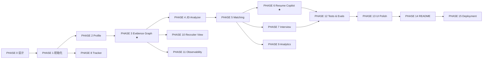

# CareerForge AI · 开发路线图

| 字段     | 值                                                                                         |
| -------- | ------------------------------------------------------------------------------------------ |
| 文档版本 | v1.0                                                                                       |
| 总阶段数 | 16（PHASE 0 – PHASE 15）                                                                   |
| 关联     | [PRD.md](./PRD.md) · [ARCHITECTURE.md](./ARCHITECTURE.md) · [DECISIONS.md](./DECISIONS.md) |

---

## 0. 每阶段的 Definition of Done（强制门禁）

> 任何阶段未跑完以下 8 步，**不得**进入下一阶段。

| #   | 门禁          | 具体动作                                                    |
| --- | ------------- | ----------------------------------------------------------- |
| 1   | **能跑**      | 按 README 的 Quick Start 从零启动，无手工修补               |
| 2   | **类型干净**  | `pnpm typecheck` 零错误；`mypy packages/ai apps/api` 零错误 |
| 3   | **Lint 干净** | `pnpm lint` + `ruff check` + `ruff format --check` 零告警   |
| 4   | **测试通过**  | `pytest` 与 `vitest` 全绿；新增功能必须有测试               |
| 5   | **API 可验**  | 关键端点用 `curl`/HTTP 文件实测，响应符合信封规范           |
| 6   | **页面可看**  | 相关页面在 1440 / 1024 / 768 / 375 四档实际检查             |
| 7   | **文档同步**  | README / 对应 docs 更新到与代码一致                         |
| 8   | **提交**      | `feat:`/`fix:`/`docs:`/`refactor:`/`test:` 规范化提交       |

**阶段汇报格式（固定）**

```
DONE    — 本阶段完成了什么（可验证的事实）
CHANGED — 新增/修改的关键文件与模块
TESTED  — 实际执行的命令与结果（真实输出，不臆造）
NEXT    — 下一阶段目标
```

---

## 1. 阶段总览

| Phase | 名称                | 核心产出                                                         | 状态      |
| ----- | ------------------- | ---------------------------------------------------------------- | --------- |
| 0     | 产品设计            | 7 篇设计文档 + 目录树 + Git 仓库                                 | ✅ 完成   |
| 1     | 项目初始化          | Monorepo、FastAPI/Next 骨架、DB、迁移、Docker、Auth              | 🔄 进行中 |
| 2     | Candidate Profile   | 文件解析、结构化抽取、技能归一化、种子数据（Agent 层已完成）     | 🔄 进行中 |
| 3     | **Evidence Graph**  | 证据模型、置信度引擎、图谱 API 与可视化（RAG 核心已完成）        | 🔄 进行中 |
| 4     | JD Analyzer         | JD 结构化解析、技能树、解析基准                                  | ⬜        |
| 5     | Job Matching        | 五维可解释评分 + Why 展开 + Gaps/Unknowns（引擎与 Agent 已完成） | 🔄 进行中 |
| 6     | Resume Copilot      | 生成 + 验证门禁 + Diff + 版本管理（Agent 已完成）                | 🔄 进行中 |
| 7     | Interview Simulator | 六模式、自适应难度、Scorecard、证据一致性（Agent 已完成）        | 🔄 进行中 |
| 8     | Application Tracker | 看板、拖拽、事件历史、Timeline                                   | ⬜        |
| 9     | Career Analytics    | 漏斗、比率、技能相关性、类别表现                                 | ⬜        |
| 10    | Recruiter View      | 公开页、证据交互、隐私控制、PII 脱敏（RecruiterAgent 待实现）    | ⬜        |
| 11    | AI Observability    | AI Runs、成本看板、缓存、Prompt Registry                         | ⬜        |
| 12    | Tests & Evals       | 单测/集成/E2E + 评测框架与真实报告                               | ⬜        |
| 13    | UI Polish           | 四档响应式、A11y、动效、三态、Command Palette                    | ⬜        |
| 14    | README & 材料       | README、截图、GIF、面试材料包、社区文件                          | ⬜        |
| 15    | Deployment          | Docker 全链路、云端部署、Release v1.0.0                          | ⬜        |

---

## 2. 阶段详细定义

### PHASE 0 · 产品设计 ✅

| 项           | 内容                                                                                                                                                       |
| ------------ | ---------------------------------------------------------------------------------------------------------------------------------------------------------- |
| **产出**     | `docs/PRD.md`、`docs/ARCHITECTURE.md`、`docs/DATABASE.md`、`docs/API.md`、`docs/UI.md`、`docs/ROADMAP.md`、`docs/DECISIONS.md`；完整目录树；Git 仓库初始化 |
| **退出标准** | 文档互相引用且术语一致（evidence / claim / confidence / match score）；32 张表与端点清单齐备；ADR 覆盖全部关键技术选型                                     |
| **风险**     | 文档与实现漂移 → 每阶段结束必须回写文档（门禁 7）                                                                                                          |

### PHASE 1 · 项目初始化

| 项           | 内容                                                                                                                                                                                                                                                                                                                  |
| ------------ | --------------------------------------------------------------------------------------------------------------------------------------------------------------------------------------------------------------------------------------------------------------------------------------------------------------------- |
| **产出**     | pnpm workspace + Turborepo；`apps/web`（Next.js 15 + TS strict + Tailwind v4 + shadcn 基础件 + 主题切换 + AppShell）；`apps/api`（FastAPI 工厂 + 中间件链 + 信封 + 全局异常 + 配置 + 日志）；SQLAlchemy 2.0 async + Alembic 首版迁移；JWT 认证 + Demo 登录；`docker-compose.yml`（6 服务）；`/system/health`；CI 骨架 |
| **关键决策** | ADR-001/002/003/004/010/011/015/019/022                                                                                                                                                                                                                                                                               |
| **退出标准** | `docker compose up`（有 Docker）与零依赖本地路径（无 Docker）**双路径**都能启动；`POST /auth/demo` 返回 token；前端能登录进 AppShell；`/system/health` 全绿；CI 绿                                                                                                                                                    |
| **验证命令** | `pnpm -r typecheck`、`pytest tests/api/test_health.py`、`alembic upgrade head`、`curl /api/v1/system/health`                                                                                                                                                                                                          |

### PHASE 2 · Candidate Profile

| 项           | 内容                                                                                                                                                                                                                                               |
| ------------ | -------------------------------------------------------------------------------------------------------------------------------------------------------------------------------------------------------------------------------------------------- |
| **产出**     | 文件上传（MIME+魔数校验）→ 解析（PDF/DOCX/MD/TXT）→ 分块 → `ProfileAgent` 结构化抽取 → 技能归一化 → 入库；`TaskProgressStream` 五阶段进度；Profile 页面（含内联编辑）；技能词典（`skill_taxonomy.py` + SQL 双源一致）；种子数据生成器（Alex Chen） |
| **关键决策** | ADR-009（heuristic provider 优先实现，保证零 Key 可跑）、ADR-020（种子自洽断言）                                                                                                                                                                   |
| **退出标准** | 上传真实 PDF 简历能抽出教育/实习/项目/技能；抽取结果 100% 通过 Pydantic 校验；无 LLM Key 时走 heuristic 仍产出结构合法结果；`make seed` 后 Dashboard 有数据                                                                                        |
| **验证命令** | `pytest tests/api/test_profile_import.py`、`python scripts/seed.py --reset`                                                                                                                                                                        |

### PHASE 3 · Evidence Graph ★

| 项           | 内容                                                                                                                                                                                                                                                                                                 |
| ------------ | ---------------------------------------------------------------------------------------------------------------------------------------------------------------------------------------------------------------------------------------------------------------------------------------------------- |
| **产出**     | `evidence` / `evidence_links` 完整实现；`EvidenceAgent` + `graph` 模块；**置信度引擎**（五因子公式 + DB CHECK 约束）；图谱构建（含 GitHub 证据接入）；`GET /evidence-graph` 子图查询；React Flow 画布 + `EvidenceDrawer`（含置信度子项拆解）+ 过滤/布局/导出；移动端列表降级；`/app/evidence` 列表页 |
| **关键决策** | ADR-005（邻接表）、ADR-013（DB 级公式约束）                                                                                                                                                                                                                                                          |
| **退出标准** | 种子数据生成 ≥ 150 证据 / ≥ 400 边；图谱 1000 节点首屏 ≤ 2s；点击技能能展开到文件与 commit；置信度可由 SQL 公式复现；单测覆盖置信度全部分支                                                                                                                                                          |
| **验证命令** | `pytest packages/ai/tests/test_evidence_confidence.py`、`curl "/evidence-graph?focus=skill:stm32&depth=2"`                                                                                                                                                                                           |
| **风险**     | 图规模导致前端卡顿 → 服务端预聚合 + 节点上限 + 虚拟化                                                                                                                                                                                                                                                |

### PHASE 4 · JD Analyzer

| 项           | 内容                                                                                                                                                                               |
| ------------ | ---------------------------------------------------------------------------------------------------------------------------------------------------------------------------------- |
| **产出**     | `JobAgent`；JD 结构化解析（含 HTML/脏文本清洗）；技能抽取 + 归一化 + 原文出处定位；`job_skills` 三层（required/preferred/bonus）；`JDSkillTree` 组件；`/app/jobs/new` 流式构建体验 |
| **退出标准** | 自建 **100+ 条标注 JD 数据集**（真实来源，含中文/英文/中英混排）；关键字段抽取准确率 ≥ 85% 并输出到 `reports/eval-report.json`；脏输入不崩且有降级路径                             |
| **验证命令** | `python evals/run.py --suite jd_extraction`                                                                                                                                        |

### PHASE 5 · Job Matching

| 项           | 内容                                                                                                                                                                                                           |
| ------------ | -------------------------------------------------------------------------------------------------------------------------------------------------------------------------------------------------------------- |
| **产出**     | `scoring/` 五维引擎（skill/experience/project/education/evidence）；`MatchAgent`；`job_matches` 持久化（含 `why` 完整拆解）；`MatchScorePanel` + `WhyBreakdown` + `StrengthsGapsList`；`/app/jobs/[id]` 详情页 |
| **关键决策** | ADR-006（确定性评分，LLM 不参与数值）                                                                                                                                                                          |
| **退出标准** | 同输入两次运行分数**完全一致**（有测试断言）；每个分数可展开到公式与证据 id；`unknown` 与 `gap` 语义分离且有测试；种子 12 个岗位分数分布合理（含 1 个低分案例）                                                |
| **验证命令** | `pytest tests/api/test_job_match.py -k determinism`                                                                                                                                                            |

### PHASE 6 · Resume Copilot ★

| 项           | 内容                                                                                                                                                                                                                                                          |
| ------------ | ------------------------------------------------------------------------------------------------------------------------------------------------------------------------------------------------------------------------------------------------------------- |
| **产出**     | `ResumeAgent`（bullet 级改写）+ `ValidatorAgent`（Claim 验证）；**Hallucination Gate**（规则层 + LLM 层 + 门禁）；`resume_versions` / `resume_claims` / `claim_validations`；`ResumeDiffView`（接受/拒绝/仅接受 Supported）；`/app/validator` 独立页；导出 MD |
| **关键决策** | ADR-014（规则先于 LLM：数字断言无支撑直接拒绝）                                                                                                                                                                                                               |
| **退出标准** | 数字断言（`70%` 类）在无量化证据时 **100% 被拒绝**（评测集断言）；`integrity_score` 与 claim 统计一致；Unsupported 必须给出安全改写；导出内容与页面一致                                                                                                       |
| **验证命令** | `python evals/run.py --suite claim_validation`、`pytest tests/api/test_resume_gate.py`                                                                                                                                                                        |

### PHASE 7 · Interview Simulator

| 项           | 内容                                                                                                                                                                                                                                              |
| ------------ | ------------------------------------------------------------------------------------------------------------------------------------------------------------------------------------------------------------------------------------------------- |
| **产出**     | `InterviewAgent`（六模式 + 难度状态机 L1→L2→L3）；出题计划基于 JD+证据图谱；SSE 流式；`interviews` / `interview_messages`；`ChatTranscript`（含层级徽章）；`InterviewScorecard` 七维雷达 + 逐题复盘 + **证据一致性检测**；`/app/interview/*` 三页 |
| **关键决策** | ADR-016（SSE）                                                                                                                                                                                                                                    |
| **退出标准** | 一场完整技术面试可跑通并生成报告；难度确实随回答变化（`difficulty_start ≠ difficulty_end` 有测试）；题目包含项目/证据相关问题（非通用题库）；面试中断后可恢复（`in_progress` 状态）                                                               |
| **验证命令** | `pytest tests/integration/test_interview_flow.py`                                                                                                                                                                                                 |

### PHASE 8 · Application Tracker

| 项           | 内容                                                                                                                                                                                                                                                                                                  |
| ------------ | ----------------------------------------------------------------------------------------------------------------------------------------------------------------------------------------------------------------------------------------------------------------------------------------------------- |
| **产出**     | `applications` / `application_events` CRUD；`KanbanBoard`（dnd-kit，乐观更新 + 回滚 + 键盘可操作）；`/app/applications`；`career_events` 写入；移动端列表视图                                                                                                                                         |
| **退出标准** | 拖拽后刷新状态持久；失败自动回滚且有 Toast；键盘可完成一次拖拽（a11y 断言）；状态变更全部有事件记录                                                                                                                                                                                                   |
| **进度**     | **8b 已完成**（后端 + 仪表盘指标）：迁移 `0007`、9 个端点、事件与时间线、位置由服务端推导、`career_events` 里程碑去重。**8c 已完成**（前端）：`/app/applications` 七列看板、指针与键盘拖拽（自写坐标解析，见 ADR-018）、乐观更新 + 失败回滚 + Toast、移动端列表、Vitest 32 项（含键盘拖拽与回滚断言） |
| **验证命令** | `pnpm --filter @careerforge/web test`、`pnpm --filter @careerforge/web smoke:api`、`pytest tests/test_applications.py tests/test_application_moves.py tests/test_dashboard.py`                                                                                                                        |

### PHASE 9 · Career Analytics

| 项           | 内容                                                                                                                                                                                                                                                                        |
| ------------ | --------------------------------------------------------------------------------------------------------------------------------------------------------------------------------------------------------------------------------------------------------------------------- |
| **产出**     | 漏斗（自定义 SVG）、核心比率、技能相关性（含样本量）、类别表现、时间趋势；`/app/analytics`                                                                                                                                                                                  |
| **退出标准** | 漏斗数字与 `applications`/`application_events` 实际数据**完全吻合**（有集成测试比对）；`n < 5` 显示"样本不足"；`range` 切换正确                                                                                                                                             |
| **进度**     | **已完成**：`careerforge_ai/analytics/*`（纯函数：Wilson 区间、对照比较、月份跨度）、5 个端点、`/app/analytics`；AI 侧 28 项、API 侧 16 项、前端 21 项测试。真机实测：6 张卡片（1 张仍是 wishlist）→ 漏斗 5/3/2/1/1，`cohortSize=6` 而 `applications=5`（口径差异如实呈现） |
| **验证命令** | `python evals/run.py`、`pytest tests/test_analytics.py`、`pnpm --filter @careerforge/web test`、`pnpm --filter @careerforge/web smoke:api`                                                                                                                                  |

### PHASE 10 · Recruiter View

| 项           | 内容                                                                                                                                                                                                                                                                                                                                                 |
| ------------ | ---------------------------------------------------------------------------------------------------------------------------------------------------------------------------------------------------------------------------------------------------------------------------------------------------------------------------------------------------- |
| **产出**     | `public_profiles`；`RecruiterAgent`；`/candidate/[slug]` 公开页（无登录）；技能点击就地展开证据；隐私逐项开关；PII 扫描与脱敏；分享链接与卡片                                                                                                                                                                                                        |
| **退出标准** | 未登录可访问；公开页不含任何 PII（自动化断言：邮箱/手机号正则扫描通过）；未发布时返回 404；被设为私有的技能不出现                                                                                                                                                                                                                                    |
| **进度**     | **已完成**：`/public/candidate/{slug}`（**服务端渲染**的公开页，无需登录）、`/evidence/{skillId}`、发布与设置端点、所有者面板 `/app/settings`；迁移 `0008`。真机实测：脚本**先断言源材料确实含邮箱**（避免「无 PII」空过），随后公开页 HTML（23 KB，含候选人姓名与真实技能）与接口响应均不含邮箱与手机号；未发布 404；隐藏技能后下一次匿名读取即为 0 |
| **验证命令** | `pytest tests/test_public.py`、`pnpm --filter @careerforge/web test`、`pnpm --filter @careerforge/web smoke:api`                                                                                                                                                                                                                                     |

### PHASE 11 · AI Observability

| 项           | 内容                                                                                                                                                                                                                                                                                                                                                                                                                                                                                                                                                                                                                                                                                                                                                                                                                                                                                                                            |
| ------------ | ------------------------------------------------------------------------------------------------------------------------------------------------------------------------------------------------------------------------------------------------------------------------------------------------------------------------------------------------------------------------------------------------------------------------------------------------------------------------------------------------------------------------------------------------------------------------------------------------------------------------------------------------------------------------------------------------------------------------------------------------------------------------------------------------------------------------------------------------------------------------------------------------------------------------------- |
| **产出**     | `agent_runs` / `llm_calls` 全链路落库；`/app/ai-runs` 表格 + 步骤链下钻；`/app/costs` 成本看板；三级缓存（LLM/Embedding/Tool）+ 命中率；**Prompt Registry**（加载 `prompts/` + 版本 + 哈希 + DB 同步）；预算护栏 + 自动降级                                                                                                                                                                                                                                                                                                                                                                                                                                                                                                                                                                                                                                                                                                     |
| **关键决策** | ADR-012（Prompt 外置版本化）                                                                                                                                                                                                                                                                                                                                                                                                                                                                                                                                                                                                                                                                                                                                                                                                                                                                                                    |
| **退出标准** | 任一次 AI 操作都能在 AI Runs 页找到对应 trace，token/成本/延迟非零；缓存二次运行命中率可见；改 Prompt 内容后版本号递增且 run 记录能归因到具体版本                                                                                                                                                                                                                                                                                                                                                                                                                                                                                                                                                                                                                                                                                                                                                                               |
| **进度**     | **11a + 11b 已完成**。11a（后端）：`llm_calls` 与 `ai_caches` **首次有了写入方**；7 个端点（`/ai-runs`、`/{id}`、`/ai-costs`、`by-agent`、`by-feature`、`/cache/stats`、`/prompts`）；预算护栏接线；向量健康状态修正。11b（前端）：`/app/ai-runs`（9 列表格 + 行内步骤链下钻 + 状态/时间/workflow/agent 筛选）、`/app/costs`（窗口总量、日预算护栏、每日成本折线、每 Agent / 每功能成本、缓存命中率、提示词注册表）；侧边栏与命令面板两处入口由 `PHASE 10` 未上线标记改为可用。真机实测：`smoke:api` **25/25**——run `latency=2ms`、4 步链路 `[clean,extract,normalise,assess]`、1 次调用、`prompt=jd_analysis@v1`；`/ai-costs/by-agent+by-feature` → `agents=[job,recruiter]`、`features=[JD 分析[jd_analysis], 公开页生成[recruiter_publish]]`；缓存 `rate=0.3333`（1 命中 / 2 未命中）。**最重要的一项**：smoke 现在把 7 个端点的响应喂给**前端页面用的同一组 runtime guard**，因此「页面能渲染」与「契约没漂移」是同一次检查 |
| **验证命令** | `pytest tests/test_observability.py tests/test_observability_cache.py`、`pnpm --filter @careerforge/web test`、`pnpm --filter @careerforge/web smoke:api`                                                                                                                                                                                                                                                                                                                                                                                                                                                                                                                                                                                                                                                                                                                                                                       |

### PHASE 12 · Tests & Evals

| 项           | 内容                                                                                                                                                                                                        |
| ------------ | ----------------------------------------------------------------------------------------------------------------------------------------------------------------------------------------------------------- |
| **产出**     | 后端单测 ≥ 120；集成测试覆盖 8 个关键流程；Vitest 组件测试；Playwright E2E 覆盖 5 条主链路；`evals/` 框架 + 4 个评测套件（JD 抽取 / Claim 验证 / 检索 Recall@5 / 面试题相关性）；`reports/eval-report.json` |
| **退出标准** | 全部测试本地通过；核心域行覆盖 ≥ 75%；**`no-llm` 任务**（关闭所有 Key）全绿；评测报告含真实样本量与指标，未达标项如实标注                                                                                   |
| **验证命令** | `pytest --cov`、`pnpm test`、`pnpm e2e`、`python evals/run.py`                                                                                                                                              |

### PHASE 13 · UI Polish

| 项           | 内容                                                                                                                                                            |
| ------------ | --------------------------------------------------------------------------------------------------------------------------------------------------------------- |
| **产出**     | 四档响应式全页验收并修复；A11y 审计（键盘/ARIA/对比度/焦点）；动效统一；三态覆盖检查；Command Palette + Global Search；Error Boundary；主题 Light/Dark 并行打磨 |
| **退出标准** | 每页 1440/1024/768/375 无横向滚动、无截断、无重叠；`axe` 无 critical 违规；`prefers-reduced-motion` 生效；灯光主题无对比度失败                                  |

### PHASE 14 · README & 材料

| 项           | 内容                                                                                                                                                                                                                                                                                                                   |
| ------------ | ---------------------------------------------------------------------------------------------------------------------------------------------------------------------------------------------------------------------------------------------------------------------------------------------------------------------- |
| **产出**     | README（含徽章、Live Demo、截图、GIF、架构、功能、Quick Start、API、Testing、Security、Roadmap、Engineering Decisions、Limitations、Contributing）；`docs/INTERVIEW.md`（面试讲法：60 秒 / 3 分钟 / 5 分钟 Deep Dive / HR 版 / 技术版 / 可能问题与参考答案）；简历项目描述（STAR，仅使用真实数据）；幻灯片友好版架构图 |
| **退出标准** | README 第一屏 30 秒内能看懂"这是什么 + 为什么不一样"；所有数字来自真实产物；GIF ≤ 3MB 且能展示核心交互                                                                                                                                                                                                                 |

### PHASE 15 · Deployment

| 项           | 内容                                                                                                                                                                                                                          |
| ------------ | ----------------------------------------------------------------------------------------------------------------------------------------------------------------------------------------------------------------------------- |
| **产出**     | 多阶段 Dockerfile（web/api）；`docker-compose.yml` 全链路实测；部署配置（Vercel / Render 或 Railway / Neon 或 Supabase / Upstash）；`docs/DEPLOYMENT.md`；CHANGELOG + Release `v1.0.0` + Release Notes；GitHub About / Topics |
| **退出标准** | 线上 Demo 可访问且 Demo 账号数据完整；`docker compose up` 在本机（若可用）成功；镜像构建进 CI；发布说明与实际功能一致                                                                                                         |

---

## 3. 依赖关系



**关键路径**：`PHASE 0 → 1 → 2 → 3 → 4 → 5 → 6 → 12 → 13 → 14 → 15`
**可并行**：PHASE 8（依赖 1）、PHASE 10 / 11（依赖 3）

---

## 4. 全局风险登记

| 风险                           | 概率 | 影响                 | 缓解                                                                       |
| ------------------------------ | ---- | -------------------- | -------------------------------------------------------------------------- |
| 无 Docker / 无 PostgreSQL 环境 | 高   | 部署路径无法本地验证 | 双路径架构（ADR-004/010）；CI 用 service container 验证 Postgres 路径      |
| 无 LLM API Key                 | 高   | AI 功能无法演示      | heuristic provider 一等公民；`no-llm` CI 任务                              |
| GitHub API 限流                | 中   | GitHub 模块不可用    | 缓存 + 退避 + 内置离线快照 fixture                                         |
| 范围过大导致半成品             | 中   | 交付不完整           | 严格 Phase 门禁；每阶段必须可运行可测试                                    |
| 文档与实现漂移                 | 中   | 面试翻车             | 门禁 7：每阶段回写文档；CI 校验 OpenAPI 契约漂移                           |
| 数值指标无法达标               | 中   | 简历/README 数据不实 | 如实标注未达标项；优化迭代而非编造                                         |
| 前端图谱性能                   | 中   | 演示卡顿             | 服务端预聚合 + 节点上限 + 虚拟化 + 移动端降级                              |
| 时间不足                       | 中   | 后期阶段压缩         | 优先级：PHASE 3/5/6/7 为不可裁剪核心；PHASE 8–11 可简化；P2 加分项随时可弃 |

---

## 5. 明确的可裁剪项（时间不足时）

| 优先级       | 项                                                                                                                     |
| ------------ | ---------------------------------------------------------------------------------------------------------------------- |
| **不可裁剪** | Evidence Graph、JD 分析、可解释匹配、Claim Validator、Resume Copilot 门禁、面试 Simulator、Docker、README、测试与评测  |
| **可简化**   | Analytics 高级图表（保留漏斗与比率）、AI 成本看板（保留 AI Runs）、Recruiter View 视觉打磨、Project Deep Dive 深度     |
| **可放弃**   | FR-19 全部加分项（浏览器插件 / VS Code 插件 / GitHub App / Career Memory）、PDF 导出、i18n 完整实现、`agent_runs` 分区 |

---

## 6. 进度日志

> 日期与提交均取自 `git log`；「关键结果」只写可复现的实测数字。

| 日期       | 阶段      | 提交                                                                           | 关键结果                                                                                                                                                                                                                                                                                                                                                                                                                                                |
| ---------- | --------- | ------------------------------------------------------------------------------ | ------------------------------------------------------------------------------------------------------------------------------------------------------------------------------------------------------------------------------------------------------------------------------------------------------------------------------------------------------------------------------------------------------------------------------------------------------- |
| 2026-09-24 | PHASE 0   | `docs: add phase 0 product and architecture design`                            | 7 篇设计文档（PRD / 架构 / 数据库 / API / UI / 路线图 / 22 条 ADR）+ 仓库骨架                                                                                                                                                                                                                                                                                                                                                                           |
| 2026-09-24 | PHASE 1a  | `feat(ai): add deterministic AI core (orchestrator, providers, scoring)`       | `packages/ai` 62 文件：自研 DAG 编排器 + 4 个 Provider 实现（含零 Key 的 heuristic）+ 确定性评分引擎 + 10 个版本化 Prompt                                                                                                                                                                                                                                                                                                                               |
| 2026-09-24 | PHASE 1b  | `refactor(ai): split oversized modules; add architecture guard scripts`        | 三个守卫脚本（分层 / 500 行 / 设计令牌）进入 pre-commit 与 CI；CI 双路径（SQLite + PostgreSQL）；docker-compose 六服务                                                                                                                                                                                                                                                                                                                                  |
| 2026-09-24 | PHASE 1c  | `feat(web,evals): scaffold Next.js app and add a measured benchmark`           | 前端 83 文件 typecheck / lint / build 全绿；评测框架实测出 100% distractor 泄漏与 13.3% 断言误判，修复后均为 0                                                                                                                                                                                                                                                                                                                                          |
| 2026-09-24 | PHASE 3a  | `feat(rag): hybrid retrieval with RRF, and a third measured suite`             | 标题感知分块 + BM25 + RRF(k=60) + 精确向量检索；Recall@5 **0.966**、MRR **0.901**（59 条标注查询）                                                                                                                                                                                                                                                                                                                                                      |
| 2026-09-24 | PHASE 3b  | `feat(graph): evidence graph builder, subgraph queries and provenance tracing` | 证据图谱引擎（两遍置信度、独立来源 corroboration、子图查询、断言溯源）；修复「文件扩展名被当作技能」的真实缺陷                                                                                                                                                                                                                                                                                                                                          |
| 2026-09-24 | PHASE 4a  | `feat(agents): JobAgent and ValidatorAgent, plus the shared claim-rule layer`  | WF-03 JD 解析 + WF-06 断言门禁；抽出共享 claim 规则层；修复空输入时「从 prompt 模板里提取技能」的静默错误                                                                                                                                                                                                                                                                                                                                               |
| 2026-09-24 | PHASE 5a  | `feat(agents): MatchAgent with a narrative that cannot alter the score`        | WF-04 可解释匹配；叙述 schema 不含任何数值字段，结构上无法篡改分数                                                                                                                                                                                                                                                                                                                                                                                      |
| 2026-09-24 | PHASE 2a  | `feat(agents): ProfileAgent and EvidenceAgent complete the ingest path`        | WF-01 简历导入、WF-02 材料转证据；修复标题行残余被当作正文的缺陷；重装可编辑安装以消除陈旧副本                                                                                                                                                                                                                                                                                                                                                          |
| 2026-09-24 | PHASE 6a  | `feat(agents): ResumeAgent — every generated bullet passes the gate`           | WF-05 简历 Copilot：每条 bullet 过门禁，被拦截的断言附具体补证建议；修复「无检索器时全部判为无证据」与「verdict 忽略直接传入证据」两个缺陷                                                                                                                                                                                                                                                                                                              |
| 2026-09-24 | PHASE 8a  | `feat(agents): CoachAgent — every gap ends in a provable artefact`             | WF-08 技能缺口 → 学习计划；每个缺口必须产出可验证的 mini project；修复 horizon 未通过结构化通道传递的缺陷                                                                                                                                                                                                                                                                                                                                               |
| 2026-09-24 | PHASE 7a  | `feat(agents): InterviewAgent — adaptive interview with a measured scorecard`  | WF-07 三段工作流；难度阶梯为纯函数可边界测试；证据一致性由集合比较得出；修复 7 处真实缺陷                                                                                                                                                                                                                                                                                                                                                               |
| 2026-09-24 | PHASE 7b  | `refactor(agents): split interview into a package`                             | `interview.py` 854 行超限 → 拆为 plan / turns / scorecard / agent；用行为断言替换了一个读取源码文本的假测试                                                                                                                                                                                                                                                                                                                                             |
| 2026-09-24 | PHASE 10a | `feat(agents): RecruiterAgent and the PII layer — the public evidence page`    | 公开页只链接陌生人可打开的material；PII 在投影时脱敏而非入库时                                                                                                                                                                                                                                                                                                                                                                                          |
| 2026-09-24 | PHASE 1d  | `feat(api): FastAPI application — contract, auth, middleware and persistence`  | 信封 / 错误码 / 请求 ID / 限流 / 幂等队列；170 测试通过；ruff 与 mypy 全绿                                                                                                                                                                                                                                                                                                                                                                              |
| 2026-09-24 | PHASE 1e  | `feat(api): expose the agent layer over HTTP`                                  | 9 个 Agent 全部经 HTTP 暴露；真实启动服务并 curl 验证信封 / 404 / 401 / Demo 登录 / 面试会话全链路                                                                                                                                                                                                                                                                                                                                                      |
| 2026-09-24 | PHASE 7c  | `fix(ai): stop the interviewer repeating its opening question`                 | 真实 HTTP 请求暴露三处缺陷：追问复读开场问题、confidence 维度恒为 0、改写后残留悬空的度量动词；`safer_rewrite_rate` 实测由 **0.489 → 0.622**                                                                                                                                                                                                                                                                                                            |
| 2026-09-24 | PHASE 12a | `fix(ai): make mypy --strict pass across the AI core`                          | 默认配置 51 个类型错误 + strict 专属 8 个全部清零；顺带修掉 3 个潜在缺陷（`Mapping`/`dict` 逆变、naive datetime 静默强制转换、不可达回退分支）；`ci` 提交移除 `continue-on-error`                                                                                                                                                                                                                                                                       |
| 2026-09-24 | PHASE 2b  | `feat(api): persist uploaded documents and parse them in the worker`           | 见下方「PHASE 2 实测问题记录」                                                                                                                                                                                                                                                                                                                                                                                                                          |
| 2026-09-24 | PHASE 3c  | `fix(graph,scoring): three defects that only a persisted graph exposed`        | 首次把图谱落库即暴露三处缺陷：手工证据被按「已上传文档」计分（0.80→0.55 自述档）、五类关系只有边没有可存储的 link（持久化后根节点整片丢失）、`include_orphans` 在传 `GraphQuery` 时被静默忽略                                                                                                                                                                                                                                                           |
| 2026-09-24 | PHASE 3d  | `feat(api): persist the evidence graph and serve it`                           | `evidence` / `evidence_links` + 迁移 `0003`；置信度公式成为数据库 CHECK；7 个端点（含同步的 `/documents/{id}/analyze`，幂等）；修掉 locator 蛇形命名与「摘要说 129 个节点、画布只有 10 个」两处契约缺陷                                                                                                                                                                                                                                                 |
| 2026-09-24 | PHASE 4a  | `feat(api): persist job postings and explainable matches`                      | `jobs` / `job_skills` / `job_matches` + 迁移 `0004`；7 个端点（解析、列表、详情、技能树、删除、匹配 POST/GET）；匹配五维加权之和等于总分（有断言），每次匹配留一行历史                                                                                                                                                                                                                                                                                  |
| 2026-09-24 | PHASE 4b  | `fix(scoring): measure the evidence dimension over met requirements`           | 证据强度维度此前按**被高亮的技能**（effective ≥ 0.5）计算，导致「5 项要求命中、每项都有证据」的候选人该维度得 **0.00**；改为按命中的要求计算，实测 11.56 → 20.26 分（证据维度 0.0 → 87.0）                                                                                                                                                                                                                                                              |
| 2026-09-24 | PHASE 5a  | `feat(api): implement GET /dashboard for the frozen client contract`           | 前端自 PHASE 0 冻结的 `DashboardResponse` 契约终于有实现：六项指标全部由已存行推导；数据源尚不存在的三项（投递/面试/Offer）在 `meta.unavailable` 中具名而非静默为零；`meta.definitions` 随数字给出真实口径；`profileStrength` 来自确定性引擎                                                                                                                                                                                                            |
| 2026-09-24 | PHASE 5b  | `test(web): run the real client against a live API`                            | 前端**首次真正连上后端**：`smoke:api` 用 `@careerforge/shared` 的真实客户端 + 运行时守卫打真实服务，7/7 通过（登录、dashboard 守卫、健康状态归一、证据图谱、岗位、匹配、404 信封）；`next build` 全绿并逐页 200；仪表盘新增「尚未接入」渲染                                                                                                                                                                                                             |
| 2026-09-24 | PHASE 2c  | `feat(api): persist the career entities and read the real profile everywhere`  | `educations` / `experiences` / `projects` / `achievements` / `profile_skills` + 迁移 `0005`；`POST /profile/import` 与 `GET /profile`；三个下游（图谱、匹配、仪表盘）改为读取真实画像。实测（全新库）：图 16 节点、**0 个占位节点**（此前 project/experience 全是 `project:de6dd367` 这类占位）；匹配 `skill` 0.0 → **39.16**、`evidence` 0.0 → **87.0**、总分 16.4 → **40.76**，缺口从 `['stm32','free_rtos','can']`（三个假缺口）修正为 `['autosar']` |
| 2026-09-24 | PHASE 6b  | `feat(api): persist resume versions and claims; give the gate a retriever`     | `resume_versions` / `resume_claims` / `claim_evidence` + 迁移 `0006`；`POST /resume/optimize`、`GET /resume/versions[/{id}]`、`POST /evidence/validate` 与 `/batch`（≤20）。真实服务实测：支持的句子 `partially_supported`（1 条来源，按设计不足以 corroborate）、编造的句子 `contradicted` 并给出 3 条规则依据与降级改写、每次改写逐条 gate 并落库 `integrity=0.5`                                                                                     |
| 2026-09-24 | PHASE 6c  | `fix(ai): refuse an unsupported claim instead of calling it contradicted`      | 关闭 PHASE 6b 记录的三条限制：无支撑断言判 `unsupported` 而非 `contradicted`、规则 blocker 不再被检索命中软化、单来源降级写入 `single_source_only` 理由、删数字后仍残留无支撑技术名词时**不提供**降级改写。评测指标全部不变（`numeric_rejection_rate 1.0000`、`over_support_rate 0.0000`、`safer_rewrite_rate 0.6222`、`support_recall 1.0000`）——说明改的是「怎么说」而不是「有多严」                                                                  |
| 2026-09-24 | PHASE 8b  | `feat(api): the application tracker — board, events and a real dashboard`      | `applications` / `application_events` / `career_events` + 迁移 `0007`；9 个端点（含 FR-13.5 一键加入）；仪表盘三项指标由**真实计数**取代 PHASE 5 的具名零值（`meta.unavailable` 由 3 项变为 `{}`）。真实服务实测见下方「PHASE 8 实测问题记录」                                                                                                                                                                                                          |
| 2026-09-24 | PHASE 8c  | `feat(web): the application board — drag, keyboard and rollback`               | `/app/applications` 七列看板（dnd-kit 指针 + 自写键盘坐标解析）；乐观更新在响应前生效、失败回滚并 Toast；窄屏分组列表；前端首次有测试运行器（Vitest + Testing Library，**32 项**）。真实服务 `smoke:api` 由 7 项扩到 **11 项**（含看板创建 / 七列顺序 / 重排留痕 / 删除后 404）                                                                                                                                                                         |

| 2026-09-24 | PHASE 9 | `feat(analytics): the funnel, and the discipline of a small sample` | 分析引擎落在零依赖核心（`careerforge_ai/analytics`）：Wilson 95% 区间、两组对照、月份跨度；5 个端点 + `/app/analytics`。**漏斗数「到达过」而非「现在在哪」**：投递→面试→被拒的卡片在看板是 `rejected`、在漏斗是进过面试。真机实测 6 张卡片 → 5/3/2/1/1，`cohortSize=6`（含 1 张 wishlist）而 `applications=5`；`smoke:api` 由 11 项扩到 **16 项**（分析五端点全部断言形状与关键数字） |

| 2026-09-24 | PHASE 10 | `feat(public): the recruiter view, and two layers of redaction` | `public_profiles` 补 `public_payload` / `pii_findings`（迁移 `0008`）；公开页**服务端渲染**、无需登录、点击技能就地取证据；隐私开关**在读取时**套用（关掉立刻生效，不必重新发布）；PII 扫两遍（构建时 + 即将返回的响应上）。真机实测：源材料确实含邮箱 → 公开页 HTML 与接口响应均不含邮箱/手机号；未发布与未知 slug 都 404；`smoke:api` 16 → **19 项** |

| 2026-09-24 | PHASE 11a | `feat(api): meter every model call, and give the cache a durable layer` | `llm_calls` / `ai_caches` 自 PHASE 1 起只有表、**没有写入方**——本阶段补上：`MeteredProvider` 逐次调用落库、`DatabaseCacheStore` 事件化持久化、`RunRecorder` 在请求结束时统一写入；7 个端点 + 预算护栏接线 + 向量健康状态修正。真机实测：run 有 4 步链路与 93ms 延迟、`prompt=jd_analysis@v1`、两次相同请求命中率 **0.6**；`smoke:api` 19 → **24 项** |

| 2026-09-24 | PHASE 11b | `feat(web): the AI Runs table and the cost dashboard` | 11a 的 7 个端点接上页面：`/app/ai-runs`（9 列、行内展开步骤链与模型调用、四种筛选全部下发到 API）、`/app/costs`（窗口总量、日预算护栏、每日成本折线、每 Agent / 每功能成本、缓存命中率、提示词注册表）；`packages/shared` 增 `types-observability.ts` + 7 个 runtime guard。真机实测 `smoke:api` **25/25**：`/ai-costs/by-agent+by-feature` → `agents=[job,recruiter]`、`features=[JD 分析[jd_analysis], 公开页生成[recruiter_publish]]`、`rate=0.3333`。**前端测试 61 → 106 项** |

### PHASE 11 实测问题记录（发现 → 修复）

| #   | 问题                                                                                                                                                                                                                                                                                                                                                    | 发现方式                                              | 结果                                                                                                                                                                                                                                                          |
| --- | ------------------------------------------------------------------------------------------------------------------------------------------------------------------------------------------------------------------------------------------------------------------------------------------------------------------------------------------------------- | ----------------------------------------------------- | ------------------------------------------------------------------------------------------------------------------------------------------------------------------------------------------------------------------------------------------------------------- |
| 1   | **计量装饰器把「降级」吞掉了**：`MeteredProvider` 只转发协议上的成员，而编排器是在 `structured()` 之后读 **`provider.last_chain_info`** 判断降级的。于是零 Key 路径的 run 从 `degraded` 变成 `succeeded`，并顺带触发一个**潜伏 bug**：`job_service` 里的 `executor.provider.name` 只在「未降级」分支执行，此前从未跑过，一跑就是 `AttributeError` → 500 | 全量套件（8 个 500）                                  | 修复：`MeteredProvider.__getattr__` 把未定义属性透传给被包装的 provider（**做计量的装饰器不该改变被测对象**）；`job_service` 改读 `outcome.record.model/provider` 这一公开来源                                                                                |
| 2   | **一次 flush 里同一个 cache key 插了两行**：`set` 与随后的 `get` 产生两条事件，逐事件查库时第二次看不见第一次刚 add、尚未 flush 的行，于是重复插入 → `UNIQUE constraint failed: ai_caches.cache_key`                                                                                                                                                    | 集成测试                                              | 修复：**一次** `WHERE cache_key IN (...)` 取回全部，再在内存里更新。「逐条查询」与「先批量建映射」的差别                                                                                                                                                      |
| 3   | **`_NOTES` 是字符串不是元组**：`list("…")` 把一条说明拆成一串单字符，`/ai-costs` 的 `notes[0]` 变成 `"t"`                                                                                                                                                                                                                                               | 集成测试断言 `"heuristic" in notes[0]`                | 修复：改成单元素元组，并把「括号包住的字符串不是元组」写进注释                                                                                                                                                                                                |
| 4   | **环境故障伪装成代码回归**：C: 盘被占满（0 字节可用），pytest 无法创建 `tmp_path` → `OSError: could not create numbered dir … after 10 tries`，连带 16 个 error 与 15 个失败                                                                                                                                                                            | 全量套件的大面积 ERROR                                | 处置：清理可再生缓存（pip cache / pytest 临时目录 / node 编译缓存），并把 pytest basetemp 指向 D:（169 GB 可用）。**先看环境再看代码**——否则会在磁盘已满的机器上调试一个不存在的 bug                                                                          |
| 5   | **`structured_output` 路径没有 token 可记**：多数 Agent 走结构化通道，provider 只回解析后的 schema、丢掉用量信封                                                                                                                                                                                                                                        | 真机 `tokens=0` + 读核心代码确认                      | 记录而非掩盖：该路径仍记 provider / 延迟 / prompt 版本，`chat` 路径的 token 有测试覆盖，`/ai-costs` 的 `notes` 说明零 Key 路径为何是 0。真正补上需要改核心接口（返回用量信封）                                                                                |
| 6   | **`vector` 健康状态仍写着 PHASE 1 的 `not_implemented`**，而混合检索自 PHASE 3 起就在服务                                                                                                                                                                                                                                                               | 本阶段核对健康页                                      | 修复：改为 `in_memory_index`，detail 同时说明「由进程内混合索引提供」与「持久化索引仍缺」。**低报与高报一样是错的**                                                                                                                                           |
| 7   | **run 说未命中、缓存页说命中**：run 的 `cache_hit` 只反映执行器的步骤缓存，provider 缓存命中不进这个字段                                                                                                                                                                                                                                                | 真机两次相同请求后对照两处输出                        | 修复：任一命中都把它置真；两种缓存的区别写进 `docs/API.md` §2.12，而不是留给读者去猜                                                                                                                                                                          |
| 8   | **时间戳被静默平移 8 小时**：后端存的是 naive UTC（`utcnow()`），而 `new Date('2026-09-24T10:00:00')` 在浏览器里按**本地时区**解析。UTC+8 的读者看到的每个时间都是错的，且错误是"看起来很正常"的那种                                                                                                                                                    | 写 `parseApiInstant` 的测试时对照 ISO 输出            | 修复：`parseApiInstant` 给无时区串补 `Z`，页面列头写明 **UTC**；「timezone-less 字符串会被当成本地时间」写进注释。这类 bug 不会崩、不会报错，只会让所有排查建立在错误的时刻上                                                                                 |
| 9   | **测试里有一条永远为真的断言**：缓存命中标志那处写成 `assert any(...) or not any(...)`——无论功能好坏都通过，等于没有测试                                                                                                                                                                                                                                | 拆分测试文件时重读断言                                | 修复：改成断言可检查的性质（每一行都带布尔 `cacheHit`，包括为 False 时）。**空过的测试比没有测试更危险**，与 PHASE 10 第 2 条同类                                                                                                                             |
| 10  | **两分钟的墙钟时间显示成 `120.00 s`**：`formatDuration` 复用了 `formatLatency` 的阈值，而延迟（毫秒级）与运行耗时（分钟级）不是同一个量级                                                                                                                                                                                                               | 写测试时期望值与实际不符（我原本以为会显示 `2.00 s`） | 修复：`formatDuration` 自己分档（ms / s / min / h），并补一条「时钟倒退不显示负时长」的断言。**期望值写错时先确认是哪一侧错了**                                                                                                                               |
| 11  | **零 token 的说明会重复 50 次**：初版把「为什么是 0」放在每行下面，而零 Key 部署下每一行都是 0——表格高度翻倍、信息量为零                                                                                                                                                                                                                                | 自审渲染结构                                          | 修复：改为整页聚合一句（`zeroSpendSummary`），混合场景则什么都不说、让数字自己说话                                                                                                                                                                            |
| 12  | **页面把「没有上限」画成了 0%**：`dailyBudgetUsd=0` 的语义是「未配置护栏」，不是「额度为零」，进度条与文案都必须区分                                                                                                                                                                                                                                    | 写预算护栏组件时反问语义                              | 修复：`budgetUsage` 在无上限时返回 `ratio: null` + 「未配置日预算上限」；`hitRate: null` 同理显示「尚未服务」而不是 0%。**`null` 与 `0` 是两句话**                                                                                                            |
| 13  | **每日成本没有零填充**：`/ai-costs` 只返回有运行记录的日期（后端 `GROUP BY date(started_at)`，未补空日），折线图因此可能把「三个月空窗」画成两点之间的直线                                                                                                                                                                                              | 读 `cost_summary` 的 SQL 实现                         | 处置：图下写明「窗口 7 天中 2 天有运行记录（接口只返回有活动的日期，不做零填充）」；**全为 0 时不画图**（一条贴在 0 的线看起来像测量结果，而实际是没有可测量的东西）。后端零填充仍待补 —— 见下表限制 2                                                        |
| 14  | **375px 下表格把关键列推到屏幕外**：`overflow-x-auto` 让 Cost / Status / 时间 / 步骤 全部落在可视区右侧，且没有任何提示说明它们存在 —— 而这个页面存在的理由正是这些列                                                                                                                                                                                   | **真机截图**（CDP 驱动 Chrome，375×812）              | 修复：`sm` 以下改用卡片列表（同一份事实、同一个展开面板），`sm` 以上保留 9 列表格；测试分别断言两种布局。**这是 jsdom 测试永远发现不了的一类问题**——jsdom 没有布局                                                                                            |
| 15  | **页面在非默认端口上完全取不到数据**：浏览器从 `127.0.0.1:3317` 调 `127.0.0.1:8317`，后端 `CORS_ORIGINS` 默认只有 `http://localhost:3000`，于是每个请求都被浏览器拦掉；Node 里的 `smoke:api` 完全不受影响，因此**只有真的用浏览器看才会暴露**                                                                                                           | 首次真机截图：页面渲染出全部筛选器但「0 条运行」      | 处置：启动 API 时带上 `CORS_ORIGINS`（并先用 OPTIONS 预检确认 `Access-Control-Allow-Origin` 回的是该来源）。不是产品缺陷而是开发配置口径：默认值对应 README 的 :3000，换端口必须显式声明。已写进本文件与 UI.md 的取证流程                                     |
| 16  | **截图脚本差点把「空壳」当成成功**：初版只等 `load` 事件，页面骨架（Skeleton）也算加载完成，于是能截出一张漂亮的空页面并报 ok                                                                                                                                                                                                                           | 设计脚本时反问「什么才算渲染好了」                    | 修复：每个页面声明一个**只有拿到数据才会存在**的选择器（`[data-run]` / `[data-total]`），并断言页面上必须出现的文字（窄屏用 `expectText`，宽屏另有 `wideOnlyText`，因为卡片布局没有表头）。同时把 `document.body.innerText` 打进日志，让"渲染了什么"可被 grep |

### PHASE 11 未修复限制（记录而非掩盖）

| #   | 限制                                                                                                                                                                               | 为什么没有在这一阶段修                                                                                                                                                                                        |
| --- | ---------------------------------------------------------------------------------------------------------------------------------------------------------------------------------- | ------------------------------------------------------------------------------------------------------------------------------------------------------------------------------------------------------------- |
| 1   | **`structured_output` 路径没有 token 可记**：多数 Agent 走结构化通道，而核心接口只回解析后的 schema、丢掉 provider 的用量信封 —— 于是这些 run 的 `llm_calls.total_tokens` 只能是 0 | 要补必须改 `packages/ai` 的 `structured_output` 返回类型（返回用量信封），会动到全部 Agent 的调用点；11a 的处置是先如实记录（`notes` + 测试覆盖 `chat` 路径），并在该路径仍保留 provider / 延迟 / prompt 版本 |
| 2   | **`/ai-costs` 不补空日**：窗口内的零活动日期不出现在 `days` 里，前端只能说明「N 天中 M 天有活动」，无法画出真正的连续时间轴                                                        | 零填充属于后端查询（Python 侧生成日期序列再左连接），而前端已经在文案里如实说明；留作后端改进项，避免在展示层用浏览器时区猜日期                                                                               |
| 3   | **运行列表只显示第一页**：接口支持 `limit`/`offset`，页面固定 `limit=50` 并在页脚写明「本次返回 N 条」，没有「加载更多」或游标翻页                                                 | 当前数据量下不需要，而一个假的"无限滚动"（静默丢数据）比一句诚实的说明更糟；分页控件与 PHASE 13 的列表交互一起做                                                                                              |
| 4   | **没有自动刷新**：运行页与成本页都是手动刷新，没有轮询间隔                                                                                                                         | 轮询会在无人注视时持续打库，且会让「我看到的这一刻」变得含糊；`refetchInterval` 留作可配置项，等有真实运维需求再加                                                                                            |
| 5   | **预算护栏比较的是「最近一个有记录的 UTC 日期」，不是读者本地的「今天」**                                                                                                          | 后端按 `date(started_at)`（UTC）分桶，前端若用浏览器时区推算"今天"会在 UTC+8 的清晨给出错误的一天；因此页面直接打印所比较的日期并标注 UTC                                                                     |

### PHASE 10 实测问题记录（发现 → 修复）

| #   | 问题                                                                                                                                                                  | 发现方式                                          | 结果                                                                                                                                                                                                                                               |
| --- | --------------------------------------------------------------------------------------------------------------------------------------------------------------------- | ------------------------------------------------- | -------------------------------------------------------------------------------------------------------------------------------------------------------------------------------------------------------------------------------------------------- |
| 1   | **公开端点 500**：`row.user` 是懒加载关系，在异步会话里访问触发 `MissingGreenlet`——一个只影响「陌生人唯一能访问的那个端点」的崩溃                                     | 集成测试（16 项里 9 项同时 500）                  | 修复：查询加 `selectinload(PublicProfile.user)`，原因写进 docstring。这类缺陷在登录态下自测很容易漏掉，因为它只在匿名路径上触发                                                                                                                    |
| 2   | **「无 PII」曾经是空过的**：真机第一次跑通时公开页是 0 技能、0 高亮——因为只上传并分析了文档，**没有把简历导入为画像**，于是公开页没有任何候选人材料，脱敏断言自然通过 | 真机脚本打印 `skills: 0` 时反问「那到底测了什么」 | 修复：脚本先 `POST /profile/import` 让画像有技能与项目，**并先断言源材料确实含邮箱**，再断言公开页里没有。**空过的安全测试比没有测试更危险**，因为它给出的是虚假的信心                                                                             |
| 3   | **迁移的列顺序与模型不一致**：`ALTER TABLE ADD COLUMN` 只能追加到末尾，而模型把新列声明在 mixin 列之前，「迁移 == 模型」的守卫因此失败                                | `test_alembic_baseline_matches_the_models`        | 处置：该守卫的列比较改为**集合**比较（名称/类型/可空/主键元组），索引、唯一、外键、CHECK 仍全量比对；并在 docstring 写明「顺序是迁移唯一无法保留的东西，而没有任何查询依赖它」。这是**有意的收窄而非放水**：保留的四项仍覆盖所有会真正出问题的漂移 |
| 4   | **公开页的浏览次数恒为 0**：计数写在行的 `view_count` 上，而页面 meta 从未读到它，页脚永远显示「浏览 0 次」                                                           | 真机输出自相矛盾：设置页 3、页面 0                | 修复：`public_profile()` 返回 `PublicView(summary, view_count)`，计数取自行而非投影——投影是 agent 的产物，不该携带浏览计数                                                                                                                         |
| 5   | **`packages/shared/src/api/types.ts` 超 500 行**（552）                                                                                                               | 文件长度守卫                                      | 修复：按域拆为 `types-applications.ts` / `types-analytics.ts` / `types-public.ts`；`types.ts` 保留信封与核心类型并 `export *` 转发，所有既有导入路径不变                                                                                           |

> 后续每阶段完成后在此追加一行（时间 / 阶段 / 提交信息 / 关键可验证结果）。

### PHASE 1 实测问题记录（发现 → 修复）

| #   | 问题                                                 | 发现方式                   | 结果                              |
| --- | ---------------------------------------------------- | -------------------------- | --------------------------------- |
| 1   | 中文断言验证完全失效（分词被长度过滤清空）           | 单元测试                   | 修复                              |
| 2   | 复合别名吞掉相邻技能（`UART DMA` 丢 UART）           | 单元测试                   | 修复                              |
| 3   | 单字母技能 `c` 在 `balance`/`docker` 内误命中        | 单元测试                   | 修复（词边界）                    |
| 4   | `Achievement.date` 字段名遮蔽 `date` 类型            | 导入即崩                   | 修复                              |
| 5   | `PromptRegistry.render(name=...)` 与变量 `name` 冲突 | 单元测试                   | 修复（positional-only）           |
| 6   | `compute_job_match` 重复累加权重                     | 代码审查                   | 修复                              |
| 7   | 公司简介里的技术词被当作岗位要求                     | **评测实测：泄漏率 100%**  | 修复 → 0%                         |
| 8   | 一句话中缺失的技术名词未被当作硬约束                 | **评测实测：误判率 13.3%** | 修复 → 0%                         |
| 9   | `C++11` 被判为"证据中不存在 C++"                     | 新回归测试                 | 修复（版本后缀归一化）            |
| 10  | 公司简介里的早期提及吞掉任职要求里的合法提及         | 新回归测试                 | 修复（`dedupe=False`）            |
| 11  | fresh clone 的首次 `pnpm install` 失败               | 前端构建者报告             | 修复（显式批准 1 个依赖构建脚本） |
| 12  | 我自己写的三个文件超过 500 行                        | 自建守卫脚本               | 拆分而非豁免                      |

### PHASE 2 实测问题记录（发现 → 修复）

上传一份真实简历、经队列解析、再读回证据链，这条路径上暴露的问题：

| #   | 问题                                                                                                     | 发现方式         | 结果                                                            |
| --- | -------------------------------------------------------------------------------------------------------- | ---------------- | --------------------------------------------------------------- |
| 1   | 请求事务未提交就入队，worker 读不到刚写入的 `documents` 行；SQLite 上第二个连接直接 `database is locked` | 端到端 HTTP 测试 | 修复：入队前显式提交，并在注释中写明两个原因                    |
| 2   | 任务处理器在**自己的写事务持有锁期间**再次上报进度，同样 `database is locked`                            | 端到端 HTTP 测试 | 修复：进度只在上报点之前写，`report` 自带独立连接               |
| 3   | 无法解析的文件类型被接受（202）后才在 worker 里失败                                                      | 端到端 HTTP 测试 | 修复：`stage_upload` 先做格式校验 → 400 `UNSUPPORTED_FILE_TYPE` |
| 4   | `DELETE` 返回 204 却带 JSON 信封体（违反 RFC 9110 §6.4.1）                                               | 端到端 HTTP 测试 | 修复：204/304 一律不套信封                                      |
| 5   | PDF 夹具用 latin-1 `replace` 编码，中文静默变成 `???`，会让断言假通过                                    | 自建夹具时发现   | 修复：夹具对非 ASCII 直接报错，中文覆盖交给 DOCX/TXT 路径       |
| 6   | `utf-8-sig` 解码无 BOM 的文件也自称 `utf-8-sig`（声称了一个不存在的 BOM）                                | 单元测试         | 修复：按实际字节报告编码                                        |
| 7   | 列表的 `status` 过滤在 `LIMIT` 之后做，页码与总数会互相矛盾                                              | 自查             | 修复：过滤下推到 SQL，`byKind` 改为一次 GROUP BY                |
| 8   | 夹具字节在同一 session 的共享数据库里重复，导致第二个测试的上传被去重成空操作                            | 测试间互相污染   | 修复：夹具字节每次唯一，并在文件头说明原因                      |

### PHASE 3 实测问题记录（发现 → 修复）

把内存里的图谱第一次真正落库、并真实启动服务遍历它，暴露的问题：

| #   | 问题                                                                                                                   | 发现方式                           | 结果                                                                               |
| --- | ---------------------------------------------------------------------------------------------------------------------- | ---------------------------------- | ---------------------------------------------------------------------------------- |
| 1   | 手工添加的证据被按 `UPLOADED_DOCUMENT` 档计分（0.80）——用户随手打字即可获得接近文档级的置信度，正是本产品要防的事      | 端到端 HTTP 测试                   | 修复：改为自述档 0.55，并用「与上传文档的差值恰等于权威权重×档位差」的量化断言钉住 |
| 2   | 五类关系只 append 了 `GraphEdge` 而没有对应的 `EvidenceLink`：内存图看着完整，落库后根节点与全部教育/经历/成果节点消失 | 端到端 HTTP 测试（候选节点未出现） | 修复：补齐 5 处 link，并加不变量测试（边集合 == link 集合）防止再犯                |
| 3   | `include_orphans` 在传入 `GraphQuery` 时被静默忽略（该分支唯独漏了这个字段），而每次 API 调用都传 `GraphQuery`         | 真实服务对照实验                   | 修复：转发该字段；测试显式构造一个 build 不会产生的孤立节点                        |
| 4   | `stats` 按全图计算，`nodes` 却是子图：UI 会在 10 个节点的画布上方显示「129 个节点」                                    | 真实服务对照实验                   | 修复：`stats` 描述本次返回，`totals` 描述全图                                      |
| 5   | locator 把存储层的蛇形键（`char_start`）直接透出，其余字段全是 camelCase                                               | 端到端 HTTP 测试                   | 修复：显式建模 `LocatorResponse` 并在响应中归一                                    |
| 6   | 迁移里 `confidence` 与 `corroboration_count` 的列顺序与模型不一致                                                      | 结构等价测试                       | 修复：按 §3 DDL 的顺序显式声明                                                     |
| 7   | 引擎按内容派生证据 id，数据库自己生成主键：只把 item.id 改写会让所有边指向无法 join 的节点                             | 端到端 HTTP 测试（图缺边）         | 修复：按 content_hash 建立映射并同时改写 link 两端与 edge 两端                     |

### PHASE 4 实测问题记录（发现 → 修复）

| #   | 问题                                                                                                                                                                  | 发现方式                                                     | 结果                                                                                                                              |
| --- | --------------------------------------------------------------------------------------------------------------------------------------------------------------------- | ------------------------------------------------------------ | --------------------------------------------------------------------------------------------------------------------------------- |
| 1   | 证据强度维度按**被高亮的技能**（effective level ≥ 0.5）计算，而不是按命中的要求：一个满足 5 项要求、且每项都有证据的候选人，在这个「专门用来衡量证据」的维度上得 0.00 | 真实服务端到端跑分（11.56 分，与 `evidenceUsed=1` 自相矛盾） | 修复：按命中要求计算；实测证据维度 0.0 → **87.0**，总分 11.56 → **20.26**；新增回归测试（单条证据 + MODERATE 等级这一最常见形态） |
| 2   | `_profile_of` 里写了 `if False else` 与一个未实现的 `select_profile` 桩函数                                                                                           | 自查（写完后立即回看）                                       | 重写：直接查询 `profiles`，技能声明由证据图反推                                                                                   |
| 3   | 新插入的 `Job` 上读取 `skills` 关系会触发同步惰性加载，异步 ORM 直接抛 `MissingGreenlet`（500）                                                                       | 端到端 HTTP 测试                                             | 修复：写入要求行后显式 `refresh(job, ["skills"])`，并在注释里写明原因                                                             |
| 4   | 响应里的 `strengths`/`gaps`/`unknowns` 直接透出引擎的 snake_case 字典，与其余 camelCase 字段不一致（与 PHASE 3 的 locator 同类）                                      | 端到端 HTTP 测试（KeyError: canonicalId）                    | 修复：改为三个显式响应模型                                                                                                        |
| 5   | `test_models.py` 因逐阶段追加断言而超过 500 行守卫                                                                                                                    | 自建守卫脚本                                                 | 拆分而非豁免：新的 `test_schema_inventory.py` 负责「模式声明了什么」，`test_models.py` 负责「数据库实际拦住了什么」               |
| 6   | 新加的租户键测试立刻抓到 `ai_caches` / `llm_calls` / `agent_runs` / `background_jobs` 的 `user_id` 可空                                                               | 新测试                                                       | 不是缺陷而是文档化例外（§2.11 系统级行）：把例外连同理由写进测试，而不是放宽断言                                                  |

### PHASE 2b 实测问题记录（发现 → 修复）

结构化职业实体落库后，真实服务立刻暴露出两处**会给出错误结论**的缺陷：

| #   | 问题                                                                                                                                                                                                                                                       | 发现方式                                                                            | 结果                                                                                                                                                                                       |
| --- | ---------------------------------------------------------------------------------------------------------------------------------------------------------------------------------------------------------------------------------------------------------- | ----------------------------------------------------------------------------------- | ------------------------------------------------------------------------------------------------------------------------------------------------------------------------------------------ |
| 1   | **文档化的 CHECK 写不出抽取器自己的词汇**：§2.2 的 `origin` 只允许 `llm`/`user_corrected`/`import`，而 AI 核心的 `Origin` 枚举还包含 `heuristic`——零 Key 路径的产出来源。按文档写约束，heuristic 抽取的每一行都会违反约束；把它记成 `llm` 则是对来源的谎报 | 写服务时对照枚举发现                                                                | 修复：三处（模型 / 迁移 / 文档）一致地加入 `heuristic` 并写明理由                                                                                                                          |
| 2   | **「已声明且有证据」的技能被判为缺口**：声明行来自简历抽取，其 `evidence_count` 为 0，引擎的规则 2（声明但无证据 → 缺口）因此把 STM32/FreeRTOS/CAN 全部报成缺口——而图谱里它们各有 8 条证据。等于告诉候选人他们缺三样自己明明有的东西                       | 真实服务端到端跑分（`gaps=['stm32','free_rtos','can']` 与 EVIDENCED_BY 边自相矛盾） | 修复：声明技能与证据图谱**并集合并**（保留声明等级、补上真实计数、补上有证据但未声明的技能）；实测 `skill` 0.0 → 39.16、`evidence` 0.0 → 87.0、总分 16.4 → 40.76，缺口修正为 `['autosar']` |
| 3   | **重复导入会重建实体行**：`_replace_*` 用 delete+insert，行的 UUID 随之改变，图谱中指向旧 UUID 的边全部失联，画布上出现 `project:de6dd367` 这种打不开的占位节点——而 `dedupe_key` 的存在意义正是跨导入识别同一实体                                          | 真实服务连续两次导入 + 图谱对照                                                     | 修复：改为按 `dedupe_key` 就地更新（行身份稳定，边继续有效）；真被删除的实体连同其边一起删除。实测：第二次导入后图与分数与第一次**完全一致**、占位节点 0                                   |
| 4   | `profile_service.py` 触及 500 行守卫（两次：529 行、501 行）                                                                                                                                                                                               | 自建守卫脚本                                                                        | 两次都拆分而非豁免：行→schema 映射独立为 `profile_mapping.py`；`node_id_for_row` 归入同一模块（那里已是「行如何映射到身份」的归属地）                                                      |

### PHASE 8 实测问题记录（发现 → 修复）

| #   | 问题                                                                                                                                                                                                                                                                                                             | 发现方式                                      | 结果                                                                                                                                                                       |
| --- | ---------------------------------------------------------------------------------------------------------------------------------------------------------------------------------------------------------------------------------------------------------------------------------------------------------------- | --------------------------------------------- | -------------------------------------------------------------------------------------------------------------------------------------------------------------------------- |
| 1   | **JD 解析读不出公司名**：`_COMPANY_RE` 要求 `公司：` 这类标签，而中文 JD 最常见的排版是**首行直接写公司名**（`智远科技\n嵌入式软件工程师`）。结果每张卡片公司为空、`parse_confidence` 白丢 15% 的 `company_found` 权重。评测语料里 120 条 JD 全都带 `company` 金标准，却**没有任何指标在消费它**——金标准是死数据 | 看板卡片公司为空 → 追到解析器，再核对评测语料 | 修复：新增标题块识别（首行无标签公司名 / `Company — Role` 同行 / `公司：X` 标签），并要求名字形状、长度 ≤ 24 字、不含叙述词（`我们                                         | 一家 | 专注 | …`）、不是角色行或章节标题；`我们是一家专注于工业智能化的公司`这类句子因此不会被误读为公司。同时新增指标`jd.company_accuracy`，实测 **1.0000**（120 条），`required_skill_f1`与`distractor_leakage_rate` 保持不变 |
| 2   | **`career_events` 没有写入方**：PHASE 8a 之前它只是一张被文档承诺、实际没人写的表                                                                                                                                                                                                                                | 实现投递看板时对照 §2.11                      | 修复：状态变更的**里程碑**（投递/面试/Offer/被拒）写入时间线；中间态（`oa`/`final`）只留在事件表。新增 `dedupe_key` + 唯一约束：卡片拖来拖去同一个里程碑只写一次（有测试） |
| 3   | **拖拽数据的顺序不可信**：客户端会在一次手势里送来重复位置、跳号位置，或整列重排                                                                                                                                                                                                                                 | 设计 reorder 端点时枚举                       | 处置：位置**不由客户端定义**——服务端按「插入到第 index 位、其余顺延」重建整列顺序再密集写回；`position` 只是渲染顺序的输入，不是事实来源                                   |
| 4   | **测试断言跨账号计数**：会话级共享 SQLite 让「本用户事件数」被写成全表计数，单独跑过、全量跑挂（`assert 2 == 1`）                                                                                                                                                                                                | 全量套件                                      | 修复：三处统计断言全部按 `user_id` 限定。这类缺陷只在全量运行时出现，正是「每阶段跑全量」的价值                                                                            |

### PHASE 9 实测问题记录（发现 → 修复）

| #   | 问题                                                                                                                                                                                  | 发现方式                                            | 结果                                                                                                                                           |
| --- | ------------------------------------------------------------------------------------------------------------------------------------------------------------------------------------- | --------------------------------------------------- | ---------------------------------------------------------------------------------------------------------------------------------------------- |
| 1   | **趋势图的月份前缀循环是个死循环**：从最早月份**往前**补到窗口起点时，每往前一个月都仍然小于窗口起点，循环永不退出（烧了 36 秒 CPU 才被察觉）。跑到那条测试时 pytest 挂住且无任何输出 | AI 单元测试挂起 → 逐层打印定位到该函数              | 修复：改为**从最早月份向后**走到窗口起点，并加 `max_extension=60` 兜底。教训写进函数 docstring：朝错误方向逼近边界的循环必须显式设上限         |
| 2   | **`?range=` 被静默忽略**：路由函数形参名为 `range_key`，FastAPI 用形参名作查询参数名，于是 `?range=7d` 未被识别、永远取默认 30d，而 `?range=1y` 也「成功」返回 200                    | 集成测试断言 400，实际拿到 200 与 range=30d         | 修复：`Query(alias="range")`。这类缺陷不报错，只是让每个窗口返回同一个答案                                                                     |
| 3   | **同一份投递在时间线上出现两次**：看板在「创建卡片」和「真正投出去」各写了一条 `career_events` 里程碑，趋势图因此把每次投递数了两遍                                                   | 集成测试比对月度趋势（期望 1、实际 2）              | 修复：`wishlist` 不再是里程碑——加书签不是一次投递。两条 PHASE 8b 测试同步更新并注明原因：审计仍在 `application_events`，时间线只记真正发生的事 |
| 4   | **`Counter` 装不下小数权重**：类别判定按技能权重加权，而 `Counter[str]` 的值类型是 `int`，mypy 报错的同时也说明偏好技能的权重会被截断                                                 | `mypy --strict`                                     | 修复：改 `defaultdict(float)`，并列时按类别名取最大，结果稳定可复现                                                                            |
| 5   | **`cohortSize` 的注释与实现不符**：schema 写「漏斗与所有比率的分母」，实现里分母是第一个阶段（离开 wishlist 的卡片数）——一张 wishlist 卡片就让两者差 1                                | 真机输出 `cohortSize=6 / applications=5` 时对照注释 | 修复：注释改为如实描述并附实测数字。**一条错的口径注释比没有注释更危险**，因为它看起来像已经核对过                                             |

### PHASE 8c 实测问题记录（前端，发现 → 修复）

| #   | 问题                                                                                                                                                                                                                       | 发现方式                                 | 结果                                                                                                                                                                  |
| --- | -------------------------------------------------------------------------------------------------------------------------------------------------------------------------------------------------------------------------- | ---------------------------------------- | --------------------------------------------------------------------------------------------------------------------------------------------------------------------- |
| 1   | **pnpm 的构建脚本白名单里存着占位符**：`pnpm-workspace.yaml` 的 `allowBuilds.esbuild` 字面值就是 pnpm 报错信息里那句 `set this to true or false`。装 vitest 时 esbuild 的 postinstall 被拒，报的还是同一条错误             | `pnpm add -D vitest` 失败                | 修复：改为 `true` 并写明两个需要编译的依赖（`esbuild` / `unrs-resolver`）各自的来路                                                                                   |
| 2   | **dnd-kit 自带键盘坐标解析无法跨列**：`sortableKeyboardCoordinates` 只在起始容器内游走，键盘用户在列内可以重排、**永远换不了列**——而换列正是看板的功能                                                                     | 读 dnd-kit 源码 + 写第一版测试           | 修复：自写 `lib/keyboard-coordinates.ts`（以当前拖拽矩形为原点，取按键方向最近的 droppable；列本身也是 droppable，空列因此可达）。沉淀为 ADR-018 的一条后果           |
| 3   | **一次 `→` 落到第四列**：jsdom 没有布局（所有矩形 0×0），dnd-kit 又把键盘位移钳制在滚动祖先矩形内、并用 `DragOverlay` 包裹节点做碰撞测量                                                                                   | 三条键盘用例全挂，逐层打印 getter 上下文 | 修复：测试自带布局（`src/test/layout.ts`）——看板容器必须有尺寸，overlay 包裹节点必须按卡片尺寸，否则碰撞检测会挑"屏幕中央那一列"。两条踩坑都写进了该文件的注释        |
| 4   | **包内值导入在 Node 直跑路径上炸**：给 `guards.ts` 加了 `isApplicationBoard` 后，它从 `./types` 的**类型**导入变成**值**导入（要 `APPLICATION_STATUSES`），冒烟脚本随即 `ERR_MODULE_NOT_FOUND`——而 Next 与 Vitest 一切正常 | `smoke:api` 报错，堆栈指向 shared 包内部 | 修复：包内显式 `.ts` 后缀 + `allowImportingTsExtensions`（ADR-023）。这是"只在一条路径上炸"的故障，值得写成决策而不是打补丁                                           |
| 5   | **README 声称 demo 账号预置了完整数据**（"3 projects, 9 skills, ~180 evidence, 12 jobs, 16 applications, 5 interviews. No page is ever empty."），而全新库里 demo 账号是空的（仪表盘实测 evidence=0、match=0）             | 本轮真机冒烟时顺带核对                   | 修复：README 改为如实描述——种子只建账号、提示词镜像与技能词典；富数据集是独立的自洽种子脚本，随其填充的界面一起落地。**文档里最危险的不是缺失，是看起来像事实的承诺** |
| 6   | 仪表盘本地兜底文案与 API 口径不一致（`interviews` 兜底写成"已进入面试阶段的投递数量"，而 API 的 `interviews` 是看板快照）                                                                                                  | 写 §2.9 文档时对照                       | 修复：兜底文案与 API 口径对齐，并注明"API 随数字下发口径，本地只是兜底"                                                                                               |

### PHASE 6 实测问题记录（发现 → 修复）

| #   | 问题                                                                                                                                                                                                                           | 发现方式                                                                   | 结果                                                                                      |
| --- | ------------------------------------------------------------------------------------------------------------------------------------------------------------------------------------------------------------------------------ | -------------------------------------------------------------------------- | ----------------------------------------------------------------------------------------- |
| 1   | **没有检索器时门禁不是降级而是全盘拒绝**：验证器缺 retriever 时检索阶段返回零命中，规则阶段读到空的 `evidence_text`，于是「使用 STM32 与 FreeRTOS 开发电机控制固件」被判 `skill_not_in_graph`——而图谱里这两个技能各有 8 条证据 | 真实服务端到端验证                                                         | 修复：API 侧为门禁构建本项目自己的混合检索器（BM25 + 向量 + RRF，逐个用户按请求建立索引） |
| 2   | **规则阶段早于检索阶段**，且读的是调用方传入的 `evidence_text`。API 未传 → 每个技术名词都被判「证据中未出现」。协议本意是「持有材料的调用方直接提供」，API 没有履行                                                            | 真实服务端到端验证（同一句同时出现「有引用」与「未出现该技能」的自相矛盾） | 修复：单条校验路径传入候选人材料（标题+片段，按置信度截断）。实测：该矛盾理由消失         |
| 3   | **API 的 bullet 字段名与引擎不符**：API 用 `original`（候选人原话，响应里回 `originalText`），引擎读 `text`。字段名不匹配使每个 bullet 在引擎眼中都是空文本，于是「没有可供改写的要点」——这是静默失败而非报错                  | 单元级复现 + 真实服务                                                      | 修复：服务层显式映射；并在注释里写明这是静默失败                                          |
| 4   | `integrity_score` / `claim_stats` 直接抄引擎字段，而该字段可能为空：版本摘要显示 `{}`，旁边却列着一串 claim                                                                                                                    | 端到端 HTTP 测试                                                           | 修复：两个数字都由**本次实际落库的 claims** 计算，摘要与其内容不可能互相矛盾              |

### 已知限制（记录而未修复）

| #   | 现象                                                                                                    | 判断                                                                                                                                                       |
| --- | ------------------------------------------------------------------------------------------------------- | ---------------------------------------------------------------------------------------------------------------------------------------------------------- |
| 1   | 降级改写去掉谓词后，该分句只剩名词短语（`响应时间缩短了 40%，并完成了压测` → `响应时间，并完成了压测`） | 度量动词必须随数字一起删除（否则是断句），而规则无法诚实重建被删谓词的语法；保留分句交给候选人补完。**已修复**的是「残留悬空动词」，此项是修复后的残留观感 |
| 2   | 启发式抽取器对中文自由格式简历的分段不准确（`项目经历` 的第二行被当成第二个项目，描述行被当成一段经历） | 由 `origin=heuristic` 显式标注、可在 UI 上人工修正；分段器改进属于独立工作                                                                                 |

### PHASE 6 第二轮：三条已知限制的处理结果

| #   | 上一轮记录的限制                                                              | 处理                                                                                                                                                                                                                                                                                                                                                                                                                                                     |
| --- | ----------------------------------------------------------------------------- | -------------------------------------------------------------------------------------------------------------------------------------------------------------------------------------------------------------------------------------------------------------------------------------------------------------------------------------------------------------------------------------------------------------------------------------------------------- |
| 1   | 降级改写把度量动词留在句中：`…提升了 300%，并主导了…` → `…提升了 ，并主导了…` | **修复**：`_DANGLING_MEASURE_RE` 的锚点由 `$` 改为 `(?=[，,；;、]                                                                                                                                                                                                                                                                                                                                                                                        | $)`，并在两个改写分支共用同一套清理（去掉悬空动词、动词留下的空格、重复标点）。同时新增规则：**若去掉数字后句子里仍残留证据无法支撑的技术名词，则不提供改写**——保留 Kubernetes/TensorFlow 两个名字、只删掉数字，等于断言同样无法支撑的内容，而且读者还看不出删了什么 |
| 2   | 编造的句子被判 `contradicted`，而没有任何证据反驳它                           | **修复**：`contradicted` 现在只用于「证据确实与之冲突」（`timeline_conflict` 或模型报告的 `contradicting_evidence`）。规则层 blocker（无同类量化数据、技术名词缺失、最高级措辞）判为 `unsupported`——被拒绝，但不被诬指为已被反驳。附带效果：blocker 不再被 hits 软化（此前有命中时会退化成 `partially_supported`，等于给编造的数字贴一个更温和的标签），而 blocker 现在**允许**提供降级改写（删掉数字正是不支持数字的正确修法），`contradicted` 仍然不给 |
| 3   | 单条来源降级没有理由                                                          | **修复**：状态为 `partially_supported` 且独立来源不足时，写入 `single_source_only` 理由（`目前只有 1 条独立来源；达到 2 条独立来源才能判为 supported。`）                                                                                                                                                                                                                                                                                                |

实测（全新库，真实服务）：编造句子的状态由 `contradicted` 变为 **`unsupported`** 且三条理由完整；受支持句子多出 `single_source_only` 说明；编造句子**不再提供**降级改写。评测指标**全部不变**：`numeric_rejection_rate 1.0000`、`over_support_rate 0.0000`、`safer_rewrite_rate 0.6222`、`support_recall 1.0000`——即三处修复只改变了「怎么说」，没有放松任何一条门槛。
